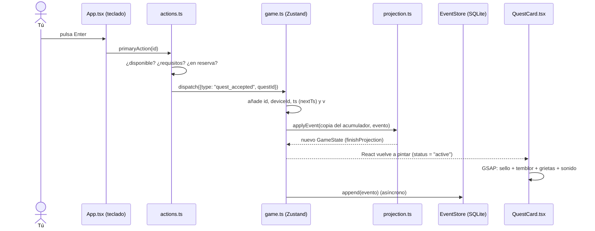

# Cómo funciona Quests por dentro

Los mecanismos generales de la app, tal como funcionan hoy, para leerlos con el código al lado: cada sección dice los archivos implicados. Lo propio de cada funcionalidad está en su README; la arquitectura, la deuda y la hoja de ruta, en el [informe técnico](INFORME-TECNICO.md); cómo se llegó hasta aquí y los fallos ya resueltos, en el [changelog técnico](history/CHANGELOG-TECNICO.md).

---

## Índice

1. [La idea en un minuto: qué pasa al pulsar Enter](#1-la-idea-en-un-minuto-qué-pasa-al-pulsar-enter)
2. [Dónde está cada mecanismo](#2-dónde-está-cada-mecanismo)
3. [Tauri por dentro: dos procesos y un puente](#3-tauri-por-dentro-dos-procesos-y-un-puente)
4. [Event sourcing: guardar hechos, no estado](#4-event-sourcing-guardar-hechos-no-estado)
5. [Niveles y rangos](#5-niveles-y-rangos)
6. [Almacenamiento: SQLite y su sustituto en el navegador](#6-almacenamiento-sqlite-y-su-sustituto-en-el-navegador)
7. [El estado global con Zustand](#7-el-estado-global-con-zustand)
8. [La interfaz: secciones, selección y teclado](#8-la-interfaz-secciones-selección-y-teclado)
9. [Las animaciones por dentro](#9-las-animaciones-por-dentro)
10. [El sonido: sintetizado, sin archivos](#10-el-sonido-sintetizado-sin-archivos)
11. [Estilos y fuentes](#11-estilos-y-fuentes)
12. [Idiomas: español y japonés](#12-idiomas-español-y-japonés)
13. [Tests: qué protege cada archivo](#13-tests-qué-protege-cada-archivo)
14. [Dónde se ajusta el equilibrio del juego](#14-dónde-se-ajusta-el-equilibrio-del-juego)
15. [Glosario](#15-glosario)

---

## 1. La idea en un minuto: qué pasa al pulsar Enter

Toda la app sigue un único ciclo. Por ejemplo, al aceptar una quest:



La regla de oro: **nadie modifica el estado directamente**. Solo se emiten eventos, y el estado se *calcula* a partir de ellos. Las animaciones *observan* los cambios de estado; nunca los provocan.

---

## 2. Dónde está cada mecanismo

| Mecanismo | Archivos | Sección |
|---|---|---|
| Ventana nativa, plugins, permisos y CSP | `src-tauri/src/lib.rs`, `src-tauri/tauri.conf.json`, `src-tauri/capabilities/default.json` | [3](#3-tauri-por-dentro-dos-procesos-y-un-puente) |
| Eventos, versión, orden y proyección | `src/domain/events.ts`, `upcast.ts`, `projection.ts` | [4](#4-event-sourcing-guardar-hechos-no-estado) |
| Curva de XP y rangos | `src/domain/leveling.ts` | [5](#5-niveles-y-rangos) |
| Eventos y binarios en disco | `src/storage/eventStore.ts`, `blobStore.ts` | [6](#6-almacenamiento-sqlite-y-su-sustituto-en-el-navegador) |
| Store, `dispatch`, snapshot y deshacer | `src/store/game.ts`, `src/features/snapshot/`, `src/features/undo/` | [7](#7-el-estado-global-con-zustand) |
| Secciones, teclado y avisos | `src/App.tsx`, `src/components/*` | [8](#8-la-interfaz-secciones-selección-y-teclado) |
| Animaciones, partículas y sacudidas | `src/components/QuestCard.tsx`, `ClearOverlay.tsx`, `src/lib/fx.ts`, `src/lib/motion.ts` | [9](#9-las-animaciones-por-dentro) |
| Sonido | `src/lib/sfx.ts` | [10](#10-el-sonido-sintetizado-sin-archivos) |
| Idiomas | `src/i18n/` | [12](#12-idiomas-español-y-japonés) |
| Sincronización con Google Drive | `src/features/sync/`, `src-tauri/src/sync/` | [README de sync](../src/features/sync/README.md) |
| Interfaz de teléfono | `src/features/mobile/` | [README de mobile](../src/features/mobile/README.md) |

---

## 3. Tauri por dentro: dos procesos y un puente

Una app Tauri son **dos programas que se hablan**:

| Proceso | Qué es | Qué hace en Quests |
|---|---|---|
| **Núcleo nativo (Rust)** | Un ejecutable compilado | Abre la ventana, carga los plugins, accede a disco y al llavero, y hace todas las llamadas a Google |
| **WebView** | El motor web del sistema: WKWebView en macOS e iOS, WebView2 en Windows | Ejecuta React, las animaciones y toda la lógica de la app |

Tauri **no empaqueta un navegador**: usa el del sistema. Por eso la app ocupa megas en lugar de cientos de megas, y por eso hay que probar en los dos motores.

### El puente (IPC)

```ts
const db = await Database.load("sqlite:quests.db");
await db.execute("INSERT OR IGNORE INTO events ...", [id, ...]);
```

Esto no toca SQLite directamente: `@tauri-apps/plugin-sql` serializa la llamada y la envía por IPC al proceso Rust, donde `tauri-plugin-sql` (sobre `sqlx`) ejecuta la consulta. El lado Rust registra los plugins y los comandos propios de la sincronización:

```rust
tauri::Builder::default()
    .plugin(tauri_plugin_sql::Builder::default().build())
    .plugin(tauri_plugin_opener::init())       // contactos: tel:, mailto:, https:
    .plugin(tauri_plugin_notification::init()) // avisos del sistema
    .plugin(tauri_plugin_web_auth::init())     // inicio de sesión de Google en iOS
    .manage(sync::SyncState::default())
    .invoke_handler(tauri::generate_handler![sync::sync_sign_in, sync::drive_list, /* … */])
    .run(tauri::generate_context!())
```

Los comandos propios se llaman con `invoke("drive_list", { kind })` (`@tauri-apps/api/core`). Los argumentos van en camelCase (`fileId` llega a Rust como `file_id`). Un error de Rust llega al JavaScript como el objeto que serializa (`{ code, status, detail }` en `SyncError`). Para devolver binarios sin pasar por JSON, el comando devuelve un `tauri::ipc::Response`, que llega como `ArrayBuffer`.

### Permisos (capabilities)

Tauri 2 deniega todo por defecto. El WebView solo puede llamar a lo que declara `src-tauri/capabilities/default.json`, que es la fuente (aquí, solo para qué sirve cada grupo):

| Permisos | Para qué | Dónde se explica |
|---|---|---|
| `core:default`, `core:window:allow-destroy` | Lo básico de la ventana; cerrarla desde el JavaScript tras sincronizar al salir | [sync](../src/features/sync/README.md) |
| `sql:default`, `sql:allow-execute` | Abrir la base y leer (`SELECT`); escribir | Esta sección |
| `notification:allow-*` (cinco) | Pedir permiso, avisar y, en iOS, programar y cancelar avisos; nada de canales ni acciones | [notifications](../src/features/notifications/README.md) |
| `opener:allow-open-url` con `tel:*`, `mailto:*` y `https://*` | Abrir los contactos con la app del sistema; sin `file:` ni `revealItemInDir` (que trae `opener:default`) | [contacts](../src/features/contacts/README.md) |

Un plugin nuevo necesita su permiso aquí, lo mínimo posible, y su registro en `src-tauri/src/lib.rs`.

### Content Security Policy (CSP)

La segunda barrera es la CSP de `tauri.conf.json` (`app.security.csp`): qué puede cargar el WebView. Solo lo de la propia app, sin nada de internet:

| Directiva | Valor | Por qué |
|---|---|---|
| `default-src`, `script-src` | `'self'` | Ningún script de fuera ni `eval`. Tauri añade los *nonces* de sus propios scripts |
| `style-src` | `'self' 'unsafe-inline'` | Motion, GSAP y React escriben estilos en línea. Por eso `dangerousDisableAssetCspModification: ["style-src"]`: un *nonce* aquí anularía `'unsafe-inline'` |
| `img-src` | `'self' data: blob:` | Miniaturas, objetos y arte SVG de serie (`data:`); adjuntos, fondo del menú y personajes añadidos (`blob:`) |
| `media-src` | `'self' blob:` | Música y el vídeo de Hu Tao, reproducidos desde memoria (`blob:`) |
| `font-src` | `'self' data:` | Fontsource; Vite puede incrustar fuentes pequeñas como `data:` |
| `frame-src`, `object-src` | `blob:` | El visor de PDF de los adjuntos (un `<iframe>` con el PDF en `blob:`, que hereda la CSP y cuenta como `object`) |
| `connect-src` | `'self' ipc: http://ipc.localhost` | El puente con Rust y `fetch` de los archivos propios |
| `base-uri`, `form-action` | `'none'` | No hay `<base>` ni formularios que se envíen |

`devCsp` es la misma para `pnpm tauri dev`, más lo que necesita Vite: scripts en línea (el preámbulo de React) y el WebSocket de la recarga en caliente. Google Drive no aparece porque todas sus llamadas las hace Rust. Si algo tuviera que cargar de otro origen, se añadiría aquí, en la directiva exacta y en las dos políticas ([ADR-26](decisions/ADR-26-csp-estricta.md)).

### Base de datos y modos

- Tauri resuelve `sqlite:quests.db` en la carpeta de datos de la app, según el `identifier` (`com.quests.app`): `~/Library/Application Support/com.quests.app/` en macOS y `%APPDATA%\com.quests.app\` en Windows.
- `pnpm tauri dev` arranca Vite en `localhost:1420` y abre la ventana nativa apuntando a él. `pnpm tauri build` compila el frontend a `dist/`, lo incrusta en el ejecutable y genera el instalador.

---

## 4. Event sourcing: guardar hechos, no estado

**Archivos:** `src/domain/events.ts`, `src/domain/upcast.ts`, `src/domain/projection.ts`

### La idea

Una app tradicional guardaría «nivel = 4, XP = 1150». Quests guarda **lo que pasó**:

```
1. quest_created    «Recado del Mercado»
2. quest_accepted   «Recado del Mercado»
3. progress_added   Fruta +1
   …
9. quest_completed  «Recado del Mercado», recompensa {xp: 85, gold: 1560}
```

El estado se obtiene **reproduciendo** esa lista. Es un libro de contabilidad: el saldo no se apunta, se calcula sumando los movimientos. Por eso **sincronizar es unir listas** (sin «quién tiene la versión buena»), el historial sale gratis (la crónica, deshacer) y el dominio es una función pura: misma lista, mismo resultado.

### Anatomía de un evento

```ts
type GameEvent = EventMeta & EventBody;

interface EventMeta {
  id: string;       // UUID: permite deduplicar al fusionar
  deviceId: string; // qué equipo lo generó
  ts: number;       // reloj lógico híbrido, en milisegundos
  v?: number;       // versión del formato (EVENT_VERSION); falta en los anteriores a la 1
}

type EventBody =
  | { type: "quest_created"; quest: QuestDef }
  | { type: "quest_accepted"; questId: string }
  | { type: "progress_added"; questId: string; conditionId: string; amount: number }
  | { type: "quest_completed"; questId: string; reward: RewardDef; drops?: Drop[] }
  | /* quest_deleted, quest_abandoned y los de cada funcionalidad (PomodoroEventBody, TemporalEventBody…) */
```

`EventBody` es una *unión discriminada*: dentro de un `switch (e.type)`, TypeScript sabe qué campos tiene cada caso. Los seis eventos del núcleo están en el [informe técnico](INFORME-TECNICO.md#modelo-de-eventos-y-persistencia); los de cada funcionalidad, en su README (la lista completa, generada, en [INDEX.md](INDEX.md#eventos--funcionalidad)).

### Versión de los eventos

Cada evento nuevo lleva `v: EVENT_VERSION` (`src/domain/events.ts`); los anteriores no la llevan y cuentan como versión 0. `applyEvent` pasa cada evento por `upcastEvent` (`src/domain/upcast.ts`), que lo sube paso a paso con `UPCASTERS[n]` (de `n` a `n + 1`) sin tocar el original. Los formatos de antes de versionar (el pomodoro único, el objeto de texto) los convierten por su forma los `legacy.ts` de cada funcionalidad.

Un evento de una versión **más nueva** que la app (de un equipo ya actualizado) se **ignora**: la proyección no sabe interpretarlo. Al actualizar, `PROJECTION_VERSION` habrá subido, el snapshot se descarta y el evento se aplica. Cómo cambiar un formato: [runbooks/migrar-evento.md](runbooks/migrar-evento.md).

### La proyección

`project(events)` recorre los eventos en orden y construye el estado. Por dentro son tres funciones: `newProjectionAcc()` crea un acumulador vacío, `applyEvent(acc, e)` aplica **un** evento y `finishProjection(acc)` calcula lo que depende del conjunto (nivel, rango, el encargo de cada quest, las quests en reserva, la recompensa de los encargos pendientes). Antes de recorrer, `project()` aparta los eventos deshechos (`undoneIn`, [undo](../src/features/undo/README.md)). Simplificado:

```ts
for (const e of events) {
  const q = "questId" in e ? quests.get(e.questId) : undefined;
  switch (e.type) {
    case "quest_accepted":
      if (q && (q.status === "available" || (q.status === "cooldown" && e.ts >= q.availableAt))) {
        q.status = "active";
        q.progress = {};
      }
      break;
    case "quest_completed":
      if (q?.status === "active") {
        xp += e.reward.xp;
        // …
      }
      break;
  }
}
```

Las **guardas** (`if (q?.status === "active")`) hacen que los eventos imposibles se ignoren en lugar de romper nada: si dos equipos completan la misma quest sin conexión, al fusionar habrá dos `quest_completed`; el primero la pasa a `done` y el segundo ya no la encuentra activa, así que **la XP no se duplica**.

Tres decisiones finas:

1. **El progreso es un delta** (`amount: +1`), no un valor: si dos equipos suman +1 cada uno, el total es +2.
2. **La recompensa se copia dentro de `quest_completed`**: si la fórmula o la quest cambian, lo ya ganado no.
3. **La espera de las que se repiten no genera eventos**: la proyección guarda `availableAt` y `effectiveStatus(q, now)` decide al pintar (`if (q.status === "cooldown" && now >= q.availableAt) return "available"`). Una quest vuelve sola aunque la app esté cerrada. Cualquier quest que se repita (`recurs(q)`, [complex](../src/features/complex/README.md)) funciona igual.

### Guardas que miran otras entidades

Algunas guardas dependen del estado de otras entidades **en ese punto de la reproducción**. Como se evalúan en el orden de los eventos, el resultado es el mismo en todos los equipos.

| Evento | Se ignora si… | Función |
|---|---|---|
| `quest_accepted` | Faltan requisitos, o la quest está en reserva (su encargo no está aceptado) | `prerequisitesMet` (`features/complex`), `inReserve` (`features/temporal`) |
| `temporal_completed` | El encargo no está aceptado o alguna quest enlazada no está terminada | `linkDone(questId, since)`, que `project()` pasa a `applyTemporalEvent` |
| `gear_purchased`, `collectible_purchased` | El oro no llega en ese punto, el artículo no existe o ya es tuyo | `applyMerchantEvent`, `applyCollectibleEvent` (devuelven el oro gastado) |
| `gear_equipped` | La pieza no es tuya | `applyEquipmentEvent` |
| `quest_failed`, `temporal_failed` | No ha acabado el día de su fecha, o ya está terminado | `failsAt` (`features/failure`) |

Lo que puede cambiar al fusionar (el escaparate de esa semana, el rango) **no** se comprueba en la guarda sino en la acción: si no, una compra legítima podría desaparecer. Además, `quest_completed` suma su XP al **atributo** del área ([attributes](../src/features/attributes/README.md)), avanza la **racha** ([streaks](../src/features/streaks/README.md)) y apunta la **crónica** ([chronicle](../src/features/chronicle/README.md)); ninguno es un evento propio, así que también salen para lo completado antes de que existieran.

### Lo que depende de la hora, en la interfaz

El plazo de una quest ([horizon](../src/features/horizon/README.md)), la urgencia de un encargo, el escaparate de la semana, el coleccionable de la semana y el personaje del día se calculan al pintar con `now`. Nada de eso genera eventos.

### El azar también se guarda

Los drops son aleatorios, pero la proyección no puede tirar dados: dos equipos reproducirían botines distintos. El azar se resuelve **en la acción** (`reportQuest` llama a `rollDrops(…, Math.random)`) y el resultado viaja **dentro** de `quest_completed.drops`; la proyección solo lo lee. Al ir dentro de `quest_completed`, los drops heredan su guarda: el botín tampoco se duplica ([items](../src/features/items/README.md)).

### El orden

Los eventos se ordenan por `ts` y, en caso de empate, por `id` (`compareEvents`): todos los equipos reproducen exactamente la misma secuencia.

`ts` no es el reloj tal cual, sino un **reloj lógico híbrido** (HLC): `dispatch` lo calcula con `nextTs(now, último)`, donde «último» es el último evento aplicado, de este equipo o fusionado de otro ([ADR-25](decisions/ADR-25-reloj-hibrido.md)):

- **max(reloj, último + 1).** Lo que se hace después de ver un evento va siempre detrás de él. Así, una acción que emite varios eventos en el mismo milisegundo no los deja en el orden de su `id` aleatorio, y un equipo con el reloj atrasado no puede abandonar una quest «antes» de que otro la aceptara.
- **Deriva máxima de 1 minuto** (`MAX_DRIFT_MS`). Si «último» va más de un minuto por delante del reloj (un equipo con la hora mal), no se le sigue: el evento lleva la hora del reloj, cae en medio del historial y se recalcula todo. Así un reloj del año 2099 no arrastra a los demás.

Un HLC clásico guarda la hora física y un contador por separado. Aquí van juntos en los milisegundos (el contador «se come» 1 ms por evento), y así el formato de los eventos, las consultas de SQLite y el snapshot no cambian.

---

## 5. Niveles y rangos

**Archivo:** `src/domain/leveling.ts`

La XP para pasar de un nivel al siguiente crece algo más rápido que lineal:

```ts
xpToNext(level) = Math.round(100 * level ** 1.4)
```

Los rangos van por umbrales de nivel: F (1), E (3), D (5), C (8), B (12), A (17) y S (24). El rango es también el requisito de las piezas del mercader. **No hay límite de quests en curso** ([ADR-33](decisions/ADR-33-sin-limite-de-quests.md)).

| Nivel | XP para subir | XP total al llegar | Rango |
|---:|---:|---:|:---:|
| 1 | 100 | 0 | F |
| 2 | 264 | 100 | F |
| 3 | 466 | 364 | E |
| 4 | 696 | 830 | E |
| 5 | 952 | 1.526 | D |
| 6 | 1.229 | 2.478 | D |
| 8 | 1.838 | 5.232 | C |
| 10 | 2.512 | 9.237 | C |
| 12 | 3.242 | 14.619 | B |

`levelFromXp(total)` va restando `xpToNext` nivel a nivel y devuelve el nivel, la XP dentro del nivel y la que falta. Se calcula en `finishProjection`: cambiar la base `100` o el exponente `1.4` se aplica a todo lo ya jugado y no hace falta subir `PROJECTION_VERSION`. Pero cambia el ritmo del juego: pregunta antes al propietario.

---

## 6. Almacenamiento: SQLite y su sustituto en el navegador

**Archivos:** `src/storage/eventStore.ts`, `src/storage/blobStore.ts`

### La interfaz `EventStore`

```ts
interface EventStore {
  deviceId: string;
  all(): Promise<GameEvent[]>;              // todos, ordenados
  since(pos): Promise<GameEvent[]>;         // los posteriores a { ts, id }: la cola de un snapshot
  countUpTo(pos): Promise<number>;          // cuántos hay hasta { ts, id }: ¿sigue valiendo el snapshot?
  byDevice(deviceId): Promise<GameEvent[]>; // los de un equipo (para subir su archivo a Drive)
  append(event): Promise<void>;             // uno nuevo, local
  merge(events): Promise<number>;           // remotos: inserta solo los nuevos y dice cuántos
  unsynced(): Promise<GameEvent[]>;         // los que faltan por subir
  markSynced(ids): Promise<void>;           // marcarlos como subidos
}
```

El resto de la app solo conoce esta interfaz. `openEventStore()` elige la implementación: si existe `__TAURI_INTERNALS__` (lo inyecta Tauri en su WebView), SQLite; si no, el navegador de `pnpm dev`, con `localStorage` (`quests.events`, `quests.deviceId`, `quests.synced`).

### SQLite

Al arrancar se crean las tablas si no existen:

```sql
CREATE TABLE IF NOT EXISTS events (
  id TEXT PRIMARY KEY, device_id TEXT NOT NULL, ts INTEGER NOT NULL,
  body TEXT NOT NULL, synced INTEGER NOT NULL DEFAULT 0);
CREATE TABLE IF NOT EXISTS meta (key TEXT PRIMARY KEY, value TEXT NOT NULL);
```

- `body` guarda el JSON con el `type` y sus datos; `id`, `device_id` y `ts` van en columnas para indexar y ordenar (índice `(ts, id)`).
- `meta` guarda el `device_id`, el `snapshot` de la proyección y, de la sincronización, los cursores y la cuenta conectada.
- Se inserta con **`INSERT OR IGNORE`**, por lotes: fusionar dos veces lo mismo es inofensivo (*idempotente*).
- `synced` distingue los eventos ya subidos a Drive.

### Archivos: el almacén de binarios

Los PDF e imágenes de los encargos, la imagen grande de los fondos del mercader y las imágenes de los personajes añadidos **no van en los eventos**: el evento lleva una referencia y el contenido va aquí.

```ts
interface BlobStore {
  put(data: Blob): Promise<string>;     // guarda y devuelve su SHA-256
  get(id): Promise<Blob | undefined>;   // undefined si este equipo aún no lo tiene
  remove(id): Promise<void>;
  ids(): Promise<Set<string>>;          // todo lo guardado (para saber qué falta subir o bajar)
  readBase64(id): Promise<{ mime; data } | undefined>;  // tal como viaja por el puente con Rust
}
```

- **Direccionado por contenido**: la clave es el SHA-256 del archivo. El mismo archivo tiene el mismo id en todos los equipos y guardarlo dos veces no ocupa el doble.
- **Tauri**: tabla `blobs` en el mismo `quests.db` (`id`, `mime`, `size`, `data` en base64, `created`, `synced`), con la misma conexión que los eventos (`sqliteDb()`): sin plugins ni permisos nuevos. El puente JS↔Rust viaja en JSON, por eso el binario va en base64.
- **Navegador**: IndexedDB (`quests.blobs`), que admite archivos grandes.
- **Limpieza compartida**: antes de borrar un binario se comprueba que no lo use ningún encargo, pieza ni personaje (`liveBlobIds`, `gearBlobIds` y `characterBlobIds`).

### Datos de ejemplo

Si la base está vacía, `seedEvents()` (`src/domain/seed.ts`) crea cinco quests y diez objetos de ejemplo en el idioma activo, como eventos normales. Sus ids son fijos (`seed:quest:dragon`, `seed:item:potion`…): si dos equipos arrancan vacíos y se sincronizan, los ejemplos se juntan en uno, porque la proyección ignora crear algo que ya existe; y una quest retirada no vuelve, porque `quest_deleted` la apunta en `ProjectionAcc.deletedQuests` ([ADR-30](decisions/ADR-30-ids-fijos-y-lapida.md)).

### Sincronización

Cada equipo sube **su** archivo de eventos a Google Drive y baja los de los demás, que fusiona con `EventStore.merge`. Nunca hay dos equipos escribiendo el mismo archivo, y el orden (reloj híbrido) y las guardas hacen que todos lleguen al mismo estado. El token nunca llega al JavaScript: toda conexión con Google sale de Rust. Detalle en el [README de sync](../src/features/sync/README.md).

---

## 7. El estado global con Zustand

**Archivos:** `src/store/game.ts`, `src/store/actions.ts`

### Qué guarda el store

```ts
{
  ready, error?,          // arranque y fallo al abrir la base (app.dbError)
  store?: EventStore,     // el almacén abierto (la fuente de verdad)
  projected: Projected,   // acumulador de la proyección + último evento aplicado + cuántos lleva
  state: GameState,       // finishProjection(projected.acc)
  // estado de UI común:
  section, tab, selectedId?, creating, clear?, collection?, toast?
}
```

El estado de interfaz de cada funcionalidad (ventanas abiertas, filtros, selección) vive en el `ui.ts` de la funcionalidad, no aquí.

### `dispatch`: el único punto de escritura

```ts
async dispatch(body) {   // simplificado
  const e = newEvent(store, body, projected.last); // id, deviceId, ts = nextTs(Date.now(), último) y v
  // Reloj atrasado o deshacer: cambia el pasado, se recalcula todo.
  if (!goesAfter(projected, e) || e.type === "event_undone") { await store.append(e); await rebuild(); return e; }
  const next = applyAll({ ...projected, acc: cloneAcc(projected.acc) }, [e]);
  set({ projected: next, state: finishProjection(next.acc) }); // 1. la UI se actualiza ya
  await store.append(e);                                        // 2. se guarda después
  maybeSnapshot(next);                                          // 3. cada 100 eventos
  return e;                                                     // 4. para ofrecer «Deshacer»
}
```

- **Optimista:** primero la memoria, después el disco. La animación arranca sin esperar a SQLite.
- **Solo el evento nuevo**, sobre una copia del acumulador (`structuredClone`): el estado anterior no cambia y React ve objetos nuevos. Si el evento cae en medio del historial (reloj atrasado), se recalcula todo (`rebuild()`).
- **Deshacer** no borra nada: es otro evento, `event_undone`, y como cambia el pasado siempre recalcula todo ([undo](../src/features/undo/README.md)). `dispatch` devuelve el evento guardado y `say(texto, acción?)` pinta el aviso con su botón.

### Snapshot: arrancar sin reproducirlo todo

Cada 100 eventos se guarda el acumulador (tabla `meta`; en el navegador, `localStorage["quests.snapshot"]`). Al arrancar, `restore()` lo carga, comprueba la `PROJECTION_VERSION` y que la base tiene exactamente `count` eventos hasta `upTo`, y aplica solo los posteriores; si algo no cuadra, reproduce todos. Es una caché: si falta o no vale, se recalcula sin perder nada (en la base del propietario, aun así, no se toca). **Si cambias el resultado de `project()` para eventos ya guardados, sube `PROJECTION_VERSION`.** Detalle en el [README de snapshot](../src/features/snapshot/README.md).

### Acciones fuera de React

`src/store/actions.ts` (y el `actions.ts` de cada funcionalidad) contiene los casos de uso. Leen el store con `useGame.getState()` en lugar de un hook, así que se llaman desde un botón, un atajo de teclado o un test. `reportQuest` guarda el jugador **antes**, emite el evento, lee el jugador **después** y pasa ambos a «Quest Clear»: con eso sabe desde dónde y hasta dónde animar la barra de XP y si hay subida de nivel.

### Inicialización una sola vez

En desarrollo, React (modo estricto) ejecuta los efectos **dos veces**; si `init()` corriera dos veces a la vez, las dos verían la base vacía y sembrarían los ejemplos por duplicado. Por eso se guarda la promesa:

```ts
let initOnce: Promise<void> | undefined;
init() { initOnce ??= load(); return initOnce; }
```

---

## 8. La interfaz: secciones, selección y teclado

**Archivos:** `src/App.tsx`, `src/components/*`

- **Tres secciones.** `section` (en el store) elige entre el Quest Board, los encargos ([temporal](../src/features/temporal/README.md)) y el calendario ([calendar](../src/features/calendar/README.md)). Se cambia con el selector de la cabecera, `T` y `S`, o la barra del teléfono. La app abre en el Quest Board.
- **Filtrado y orden.** `App` toma las quests de la proyección, oculta las terminadas y las que están en reserva, filtra por pestaña y por plazo, y ordena por categoría y fecha de creación. El orden no cambia al aceptar, para que la tarjeta no salte a mitad de la animación.
- **Selección.** Si la quest elegida desaparece, se elige la primera visible. Al saltar de un tablón a otro (`goToQuest`, `goToTemporal`), el plazo del destino vuelve a «Todo» para que lo elegido no quede oculto.
- **Teclado.** Un único `keydown` en `window` traduce teclas a acciones. Las comunes a las tres secciones (`T`, `S`, `I`, `C`, `P`, `J`, `L`, `M`, `O`, `/`, `H`) las maneja `App`; el tablón de encargos y el calendario manejan las suyas. Se ignora mientras escribes en un campo o hay algo abierto: cada ventana exporta un `…Busy()` desde su `ui.ts` y `App` (y los teclados de las otras secciones) esperan si alguno es verdadero. El menú de opciones escucha **en captura**, para correr antes que las ventanas ([menu](../src/features/menu/README.md)). Las flechas mueven ±1 en horizontal y ±2 en vertical (la rejilla tiene 2 columnas). El mapa completo de teclas está en el [README](../README.md#atajos) de la raíz.
- **Reloj.** `useNow()` actualiza `now` cada 20 segundos para que «Vuelve en 3 h» avance y las quests que se repiten reaparezcan sin recargar.
- **Avisos.** `say(texto, acción?)` muestra el aviso dorado y lo borra a los 4,5 s (7 s si lleva «Deshacer»), salvo que llegue otro antes. Se ve también con el tablón vacío; el menú y el calendario pintan el suyo; en el teléfono, encima de la barra.
- **Menú de opciones.** Una pantalla encima de todo (capa 47, debajo de las ventanas, 50) con el mercader, el personaje, los objetos, la crónica, la búsqueda, las secciones y los ajustes ([menu](../src/features/menu/README.md)).
- **Fallos al dibujar.** `<ErrorBoundary>` envuelve a `App` en `main.tsx`: si un componente falla, sale una pantalla de recuperación en vez de la ventana en negro ([recovery](../src/features/recovery/README.md)).
- **En el teléfono** (por debajo de 760 px): barra de abajo, cabecera en dos filas y el detalle como hoja a pantalla completa. Casi todo es CSS ([mobile](../src/features/mobile/README.md)).
- **Borrado en dos pasos.** «Retirar del tablón» pide un segundo clic («¿Seguro? Retirar») durante 3 s. No se usa `window.confirm` porque no está garantizado en el WebView de Tauri.

---

## 9. Las animaciones por dentro

| Librería | Para qué | Ejemplos |
|---|---|---|
| **Motion** (`motion/react`) | Animaciones ligadas a React: aparecer, desaparecer, cambiar de posición | Entrada de tarjetas, pestaña que se desliza (`layoutId`), panel de detalle escalonado, barras con muelle |
| **GSAP** | Secuencias largas y encadenadas con tiempos precisos | Sello «EN CURSO», «Quest Clear», «Level Up!», el cofre, los carteles |

Regla práctica: si es «este elemento aparece o se mueve», Motion; si es «primero esto, luego aquello, y a la vez lo otro», GSAP. Las animaciones propias de cada funcionalidad (carteles de encargos, fallos, sello SOLD, muñeco, menú, diario) se explican en la sección «Interfaz» de su README.

### 9.1 El sello al aceptar

**Archivo:** `src/components/QuestCard.tsx`

La tarjeta guarda el estado anterior en una referencia y, cuando detecta el paso a `active`, lanza una línea de tiempo:

```ts
const tl = gsap.timeline();
tl.set(cracks, { opacity: 1 })
  .fromTo(stamp, { scale: 2.8, opacity: 0, rotate: -30 },
                 { scale: 1, opacity: 1, rotate: -9, duration: 0.2, ease: "power4.in" })
  .add(() => sfx.stamp())                       // sonido en el impacto
  .to(card, { keyframes: [{x:-5,y:3}, {x:4,y:-2}, {x:-2,y:1}, {x:0,y:0}] })  // temblor
  .fromTo(burst, { scale: 0.5, opacity: 1 }, { scale: 1.6, opacity: 0 }, "<")
  .fromTo(flash, { opacity: 0.55 }, { opacity: 0 }, "<")
  .fromTo(crackPaths, { strokeDashoffset: 1 }, { strokeDashoffset: 0, stagger: 0.05 }, "<");
```

Cada paso empieza cuando acaba el anterior, salvo con `"<"` («a la vez que el anterior»). `ease: "power4.in"` hace que el sello acelere al caer, como un golpe real. `fromTo` fija el inicio y el final, así la animación es igual aunque se repita.

### 9.2 Las grietas: aleatorias pero siempre iguales

Las líneas se generan con un **PRNG con semilla** (`seededRandom`, mulberry32, en `src/lib/id.ts`) cuya semilla es el `id` de la quest: cada quest tiene su dibujo, el mismo cada vez. Para que «se dibujen», el truco de SVG: `pathLength={1}` hace que la línea mida 1 mida lo que mida, `strokeDasharray="1 2"` deja un trazo de 1 y un hueco de 2, y animar `strokeDashoffset` de 1 a 0 hace avanzar el trazo. El SVG entero está oculto (`opacity: 0`) hasta aceptar, porque el `dasharray` deja asomar puntos con algunos renderizados.

### 9.3 La tarjeta que se rompe

**Archivo:** `src/components/ClearOverlay.tsx`

`makeShards()` crea una rejilla de 4 × 3 puntos, desplaza al azar los interiores y divide cada celda en 2 triángulos: 24 pedazos. Cada pedazo es una **copia completa de la tarjeta** recortada con `clip-path: polygon(...)`; juntos parecen una sola. GSAP aleja cada uno del centro (según su centroide), le añade gravedad, lo gira y lo desvanece.

### 9.4 La secuencia «Quest Clear»

Una sola línea de tiempo (acelerada un 25 % con `timeScale(1.25)`): fundido y tarjeta con rebote (`back.out`); temblor, brillo y cristal; estallido de los 24 pedazos con un anillo y chispas; el título, cuyo espaciado pasa de `0.9em` a `0.22em` mientras crecen las líneas doradas; las filas de recompensa con **contadores** (GSAP anima un objeto `{xp: 0, gold: 0}` y `onUpdate` escribe el número redondeado); la **barra de nivel** (si subes, se llena, suena el arpegio, aparece «Level Up!» y se llena hasta la posición nueva); y «Pulsa Enter para continuar» (en el teléfono, «Toca»).

`Enter` durante la animación salta al final (`tl.progress(1)`: es saltar, no limpiar); un segundo `Enter` cierra. Todo vive dentro de `gsap.context(..., el)`, que deshace limpiamente todas las animaciones al cerrar (`ctx.revert()`). Si la escena usa una referencia de React en un `onUpdate`, se captura en una constante (`const el = root.current`), porque al revertir la referencia ya puede ser `null`.

### 9.5 Estado inicial sin animación

Si abres la app con quests ya aceptadas, el sello aparece **ya puesto**. El efecto distingue los dos casos y, salvo en la transición que interesa, fija el estado final:

```ts
if (!active || was === "active") {
  gsap.set(stamp, { opacity: active ? 1 : 0 });  // estado final, sin animación
  return;
}
// …solo si pasa de no-activa a activa: línea de tiempo completa
```

La limpieza es siempre `tl.kill()`: `tl.progress(1)` en la limpieza volvería a aplicar estilos después de React (dejaba el sello en una quest en espera).

### 9.6 El cofre del botín

Al final de «Quest Clear», si hay objetos, cae un cofre (`src/features/items/components/LootChest.tsx`), que el overlay controla con `appear()` y `advance()` (abrir, saltar al final). El diseño fase a fase está en el [README de items](../src/features/items/README.md). Las técnicas sirven para cualquier celebración:

- **Partículas fuera de React.** `src/lib/fx.ts` crea `<span>` sueltos, los anima con el plugin `Physics2D` de GSAP (velocidad, ángulo y gravedad) y los borra al acabar: React no reconcilia cientos de nodos. `calm()` reduce todo con «reducir movimiento».
- **Sacudidas en el contenido, destellos fuera.** La vibración mueve `.cl-stage`; el destello a pantalla completa y la lluvia de monedas van en un portal en `<body>` (un `transform` en un antecesor rompería el `position: fixed`).
- **`immediateRender: false`** en las líneas de tiempo largas: un `fromTo()` pinta su estado inicial nada más crearse, aunque empiece a los 2 s.
- **Variables CSS desde GSAP:** `gsap.set(el, { "--rc": "var(--r-epic)" })` no aplica un valor `var(...)`; se usa `el.style.setProperty("--rc", …)`.

### 9.7 Ventanas

Todas las ventanas salen con `MODAL_EXIT` y su fondo con `BACKDROP_EXIT` (`src/lib/motion.ts`): el fondo deja de recibir clics en cuanto empieza a irse. Si no, el fondo invisible se quedaría encima hasta 1,4 s, mientras terminan las animaciones de dentro, y se tragaría el clic siguiente.

---

## 10. El sonido: sintetizado, sin archivos

**Archivo:** `src/lib/sfx.ts`

No hay archivos de audio: cada sonido se fabrica con la **Web Audio API** a partir de dos piezas:

- **`tone(frecuencia, inicio, duración, onda, volumen)`**: un oscilador con una envolvente que sube en 10 ms y cae de forma exponencial (suena a «golpe», no a pitido).
- **`noise(duración, volumen, corte)`**: ruido blanco que se apaga solo, con un filtro paso bajo. Es la base de los impactos y del cristal.

Para las celebraciones grandes hay piezas más elaboradas: `hiss` (ruido con un filtro que barre), `stab` (acorde de sierras con un filtro que se cierra, el «golpe de orquesta»), `celesta` y `chime` (campana con parciales inarmónicos), y un compresor en la salida para que las capas no saturen.

| Efecto | Receta |
|---|---|
| Sello | Ruido grave (corte 1.800 Hz) + seno a 85 Hz (el «bombo») + triángulo a 170 Hz |
| Progreso | Dos notas agudas cortas (880 y 1.320 Hz) |
| Cristal roto | Ruido brillante (6.000 Hz) + cuatro tintineos agudos escalonados |
| Quest Clear | Arpegio de do mayor (do, mi, sol, do) |
| Level Up | Arpegio más largo de 6 notas |
| Quest fracturada | Chasquido agudo y golpe a 140 Hz; al romperse, ruido, golpe a 70 Hz y un acorde de la menor que cae |
| Cartel quemado | Soplo del fuego que crece, crepitar (18 chasquidos al azar) y un acorde grave sostenido |

Los sonidos de los encargos, el cofre, el mercader y el menú están en el README de cada funcionalidad. Todo respeta el **silencio general** (`isMuted()`, guardado en `localStorage` como `quests.muted`), que también calla la música ([music](../src/features/music/README.md)). Sin una interacción previa, el WebView no deja sonar audio: lo que suene al arrancar comprueba `navigator.userActivation.hasBeenActive`.

---

## 11. Estilos y fuentes

**Archivos:** `src/styles/theme.css`, `src/styles/app.css`, `src/main.tsx`

- **Tokens.** Todos los colores son variables CSS (`--gold`, `--elite`, `--repeat`, las rarezas `--r-*`…). Cada tarjeta recibe `--cat` con el color de su categoría y los estilos lo usan sin saber cuál es.
- **Grano del fondo**: un SVG con `feTurbulence` incrustado como `data:` URI, al 7 % de opacidad.
- **Botones inclinados**: `clip-path: polygon(...)`, no imágenes.
- **Rejilla**: `.app` usa `grid-template-columns: minmax(0, 1fr)`, para que una cabecera que no cabe no ensanche toda la ventana. La cabecera se compacta por debajo de 1.260 px y el pie por debajo de 1.180 px (la ventana mínima es de 1.024 px).
- **Fuentes locales** con Fontsource: Cormorant Garamond (título), Cinzel (etiquetas en versalitas), Shippori Mincho (texto) e IM Fell English (la crónica). **Solo el subconjunto latino** (`@fontsource/shippori-mincho/latin-500.css`): con los subconjuntos japoneses, las fuentes sumaban 26 MB de un build de 27. Los caracteres que faltan (`「」`, `−` y todo el japonés) los dibuja el mincho del sistema.

---

## 12. Idiomas: español y japonés

**Archivos:** `src/i18n/index.ts`, `src/i18n/locales/es.ts`, `src/i18n/locales/ja.ts`, `src/i18n/i18next.d.ts`

La interfaz usa **i18next** con **react-i18next**. Se cambia con el selector `ES | 日本語` de los ajustes del menú de opciones o con la tecla `L`.

| Se traduce | No se traduce |
|---|---|
| Todos los textos de la interfaz, avisos, tiempos («3 h 20 min» / 「3時間20分」) y números (1.150 / 1,150) | Lo que escribe el usuario: títulos, descripciones y objetivos |
| Las quests y objetos de ejemplo, que se crean en el idioma activo **la primera vez** | Las etiquetas decorativas en inglés (ELITE, REQUEST, QUEST CLEAR, los rótulos del menú) |
| Las **áreas conocidas** (`KNOWN_AREAS`): «Salud» se ve como «健康», y las dos suben el mismo atributo | Las áreas que no están en esa lista |
| Las **piezas de serie** del mercader y los nombres de los personajes de serie | Las piezas y personajes que añade el usuario |

### Diccionarios con tipos

`es.ts` es el diccionario de referencia y `ja.ts` se declara con su tipo (`export const ja: Translation = { ... }`, con `Translation = typeof es`). Si falta o sobra una clave en japonés, **TypeScript da error al compilar**. `i18next.d.ts` registra las claves: `t("detail.reward")` tiene autocompletado y `t("detail.rewrad")` no compila. Cada funcionalidad tiene sus textos en su `i18n.ts` y los diccionarios los montan bajo su nombre.

### Cómo se usa

- **En componentes**: `const { t } = useTranslation();` y `t("actions.accept")`. El hook repinta al cambiar de idioma.
- **Fuera de React**: `i18n.t("toast.accepted", { title })`.
- **Frases con etiquetas dentro**: `<Trans i18nKey="detail.emptyHint" components={{ kbd: <kbd /> }} />`.
- **Plurales**: `hours_one` / `hours_other` según `count`. En japonés las dos formas son iguales.
- **Números**: `num(n)` formatea con el separador del idioma activo.
- **Avisos que siguen al idioma**: un aviso se guarda como una **función** que lo traduce al pintarse (`say(() => i18n.t("toast.accepted", { title: q.title }))`); si cambias de idioma con un aviso en pantalla, cambia también.

### Idioma inicial y preferencia

Si hay una preferencia guardada (`localStorage`, `quests.lang`), se usa; si no, japonés si `navigator.language` empieza por `ja` y español en cualquier otro caso. Es una **preferencia de cada equipo**: no se sincroniza. En japonés, el espaciado se ajusta con selectores `:lang(ja)` (`<html lang>` se actualiza al cambiar de idioma).

### Añadir un idioma (por ejemplo, inglés)

1. `src/i18n/locales/en.ts` con `export const en: Translation = { ... }` (y la parte de cada funcionalidad en su `i18n.ts`).
2. Regístralo en `LANGS`, `locales` y `resources` de `src/i18n/index.ts`.
3. El selector lo mostrará solo, porque recorre `LANGS`.

---

## 13. Tests: qué protege cada archivo

`pnpm test` (Vitest) corre en un par de segundos y la CI lo pasa en macOS y Windows. La zona horaria está fija en Europe/Madrid (`vitest.config.ts`), para que «hoy», los plazos y los cambios de hora den lo mismo en cualquier equipo. Cuántos tests hay: la salida de `pnpm test`.

| Archivo | Qué protege |
|---|---|
| `src/domain/projection.test.ts` | Contabilidad (XP y oro cobrados una vez, recompensa copiada), cada guarda, fusión de equipos en cualquier orden, determinismo e invariantes sobre historiales aleatorios (progreso dentro de su rango, inventario solo con objetos del almanaque, una quest en un solo encargo pendiente, ninguna quest en reserva en curso, el oro solo baja al comprar, los atributos no suman más XP que el jugador, solo llevas puesto lo tuyo). La XP total se recalcula a mano y tiene que coincidir |
| `src/domain/events.test.ts`, `upcast.test.ts`, `leveling.test.ts` | Orden y reloj híbrido (también entre dos equipos desfasados); versión de los eventos (sin `v`, actual y futura); curva de XP y rangos |
| `src/features/*/model.test.ts`, `legacy.test.ts`, `almanac.test.ts` | Las reglas de cada funcionalidad: fases del pomodoro, pity y tiradas con semilla, requisitos y repetición, plazos con sus bordes y los cambios de hora, guardas de cada evento, precios y escaparate, calendario y agenda, Mi día, fallos, deshacer, alta rápida, búsqueda, avisos, rotación de personajes y los formatos antiguos |
| `src/features/snapshot/*.test.ts` | Snapshot + cola = reproducirlo todo, con historiales cortados en varios puntos; serialización y arranque |
| `src/features/sync/engine.test.ts` | La puerta de la fase 2: dos y tres equipos en memoria con un Drive falso llegan al mismo estado en cualquier orden; sin novedades no se mueve nada; lo hecho durante la subida no se pierde; archivos dañados; eventos de una versión futura; adjuntos; ejemplos de dos equipos |
| `src/features/merchant/actions.test.ts`, `src/features/mobile/actions.test.ts` | Acciones con el store de verdad: comprar con cada bloqueo y ponerse lo comprado; aceptar en el teléfono espera a que salga la hoja |
| `src/storage/eventStore.test.ts` | El almacén del navegador: orden, `since` / `countUpTo` y `merge` idempotente |
| `src/store/game.test.ts` | El store tal como lo usa la app (happy-dom): arranque, `dispatch` incremental, snapshot, reloj atrasado, eventos fusionados de un equipo adelantado, deshacer (también tras volver a abrir) y las acciones de cada funcionalidad |

`src/test/streams.ts` genera historiales aleatorios con semilla que mezclan **todos los tipos de evento** (también imposibles, antiguos y de una versión futura); `src/test/memory.ts` da almacenes y un Drive en memoria; `src/test/sfxMock.ts` silencia el sonido (en Node no hay `AudioContext`). Sin tests: el almacén de binarios real (IndexedDB y SQLite), los adjuntos de las acciones de encargos, los componentes React y las animaciones ([deuda](INFORME-TECNICO.md#deuda-técnica-y-riesgos)).

---

## 14. Dónde se ajusta el equilibrio del juego

**Nada de esto se cambia sin preguntar al propietario** ([AGENTES §12](AGENTES.md#12-cómo-trabajar-con-el-propietario)).

| Qué | Dónde | ¿Sube `PROJECTION_VERSION`? |
|---|---|---|
| Curva de XP y rangos | `src/domain/leveling.ts` | No (se calcula en `finishProjection`) |
| XP y oro de cada objetivo, peso de cada categoría y recompensa de los encargos | `REWARD_RATES`, `CATEGORY_FACTOR` y `TEMPORAL_GOLD_FACTOR` en `src/features/rewards/model.ts` | Sí (lo ganado no cambia: va copiado en los eventos) |
| Probabilidades de drop, tiradas por quest y pity | `DROP_TABLES` y `PITY_RULES` en `src/features/items/model.ts` | No (el botín va guardado en los eventos) |
| Precios, recargo por ranura, rango mínimo y escaparate | `PRICES`, `SLOT_PRICE_FACTOR`, `LEVEL_REQUIRED`, `SHOWCASE_SIZE` y `NEW_ARRIVAL_DAYS` en `src/features/merchant/model.ts` | No (el precio pagado va copiado) |
| Coleccionable de la semana | `OFFER_MIN_RARITY` y `COLLECTIBLE_SURCHARGE` en `src/features/collectibles/model.ts` | No |
| Opciones de repetición del formulario | `RECURRENCE_PRESETS` en `src/features/complex/model.ts` | No |

---

## 15. Glosario

| Término | Significado |
|---|---|
| **Evento** | Hecho inmutable que ya ocurrió («se aceptó la quest X»). Nunca se modifica ni se borra |
| **Proyección** | Estado calculado reproduciendo los eventos (`project()`) |
| **Acumulador** | El estado a medio calcular (`ProjectionAcc`) sobre el que se aplica cada evento; es lo que guarda el snapshot |
| **Guarda** | Condición de la proyección que ignora un evento imposible en ese punto del historial |
| **Event sourcing** | Guardar eventos en lugar de estado |
| **Local-first** | Los datos viven en tu equipo; la nube solo sincroniza. La app funciona sin conexión |
| **Idempotente** | Hacerlo dos veces da lo mismo que una (`INSERT OR IGNORE`) |
| **Snapshot** | Copia guardada del acumulador para arrancar sin reproducir todo el historial; una caché |
| **Upcasting** | Convertir datos antiguos al formato actual al leerlos, sin reescribir los eventos (`UPCASTERS`, `legacy.ts`) |
| **HLC** | Reloj lógico híbrido: ordena los eventos entre equipos aunque sus relojes no coincidan (`nextTs`) |
| **IPC** | Comunicación entre procesos: cómo el WebView pide cosas al núcleo Rust |
| **Capability** | Permiso explícito de Tauri para que el WebView use una función nativa |
| **WebView** | Motor web del sistema operativo que pinta la interfaz |
| **CSP** | Content Security Policy: lo que el WebView puede cargar |
| **Línea de tiempo (timeline)** | Secuencia de animaciones de GSAP con tiempos relativos entre sí |
| **Easing** | Curva de aceleración de una animación (`power4.in`, `back.out`…) |
| **PRNG con semilla** | Generador de números «aleatorios» que da siempre la misma serie para la misma semilla |
| **Drop / botín** | Objeto aleatorio que se recibe al completar una quest |
| **Pity** | Contador de tiradas que garantiza una rareza alta tras muchas sin ella (legendario a las 90, épico cada 10) |
| **Optimista** | Actualizar la interfaz antes de confirmar la escritura en disco |
| **i18n** | Internacionalización: preparar la app para varios idiomas |
| **Blob / binario** | El contenido de un archivo (PDF, imagen). Vive en el almacén de binarios, no en los eventos |
| **Direccionado por contenido** | La clave de un dato es la huella de su contenido (SHA-256): el mismo archivo tiene la misma clave en todas partes |
| **Encargo temporal** | Algo con fecha (una cita, una entrega) clavado en su propio tablón, con calaveras según su dificultad |
| **Quest en reserva** | Quest de un encargo sin aceptar: existe, pero no sale en el Quest Board ni se puede aceptar |
