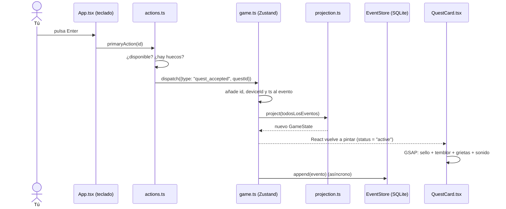

# Cómo funciona Quests por dentro

Esta guía explica **cómo se construyó la app y qué ocurre por detrás** cuando la usas. Está pensada para leerla con el código abierto al lado: cada sección indica los archivos implicados.

Para la visión de arquitectura (diagramas de clases, stack, riesgos y hoja de ruta) consulta el informe técnico. Aquí vamos al detalle de mecanismos.

---

## Índice

1. [La idea en un minuto: qué pasa al pulsar Enter](#1-la-idea-en-un-minuto-qué-pasa-al-pulsar-enter)
2. [Cómo se construyó, paso a paso](#2-cómo-se-construyó-paso-a-paso)
3. [Tauri por dentro: dos procesos y un puente](#3-tauri-por-dentro-dos-procesos-y-un-puente)
4. [Event sourcing: guardar hechos, no estado](#4-event-sourcing-guardar-hechos-no-estado)
5. [Niveles, rangos y huecos](#5-niveles-rangos-y-huecos)
6. [Almacenamiento: SQLite y su sustituto en el navegador](#6-almacenamiento-sqlite-y-su-sustituto-en-el-navegador)
7. [El estado global con Zustand](#7-el-estado-global-con-zustand)
8. [La interfaz: tablón, selección y teclado](#8-la-interfaz-tablón-selección-y-teclado)
9. [Las animaciones por dentro](#9-las-animaciones-por-dentro)
10. [El sonido: sintetizado, sin archivos](#10-el-sonido-sintetizado-sin-archivos)
11. [Estilos, fuentes y el problema de los 26 MB](#11-estilos-fuentes-y-el-problema-de-los-26-mb)
12. [Idiomas: español y japonés](#12-idiomas-español-y-japonés)
13. [Cómo se verificó y los fallos que aparecieron](#13-cómo-se-verificó-y-los-fallos-que-aparecieron)
14. [Recetas para ampliar la app](#14-recetas-para-ampliar-la-app)
15. [Comandos útiles](#15-comandos-útiles)
16. [Glosario](#16-glosario)

---

## 1. La idea en un minuto: qué pasa al pulsar Enter

Toda la app sigue un único ciclo. Por ejemplo, al aceptar una quest:



La regla de oro: **nadie modifica el estado directamente**. Solo se emiten eventos, y el estado se *calcula* a partir de ellos. Las animaciones *observan* los cambios de estado; nunca los provocan.

---

## 2. Cómo se construyó, paso a paso

Este fue el orden de trabajo, y el motivo de cada paso:

1. **Analizar el vídeo de referencia.** Con `ffmpeg` se extrajeron fotogramas en una cuadrícula para estudiar el diseño: fondo oscuro, acentos dorados, un color por categoría, el sello «受注中» con destello y las grietas sobre las tarjetas aceptadas.
2. **Crear el proyecto.** `pnpm create tauri-app` con la plantilla `react-ts`. Se quitó el plugin `opener` que no se usaba y se añadió `tauri-plugin-sql` con SQLite.
3. **Dominio primero** (`src/domain/`): tipos, eventos, proyección y niveles, sin ninguna interfaz. Es la parte que más importa que sea correcta.
4. **Almacenamiento** (`src/storage/`): una interfaz `EventStore` y dos implementaciones.
5. **Store y acciones** (`src/store/`): conectan el dominio con React.
6. **Interfaz** (`src/components/`): primero estructura y estilos, después las animaciones.
7. **Verificación**: primero en el navegador integrado (más rápido de inspeccionar) y luego en la app nativa con SQLite. Aparecieron varios fallos, que se explican en la [sección 13](#13-cómo-se-verificó-y-los-fallos-que-aparecieron).

El backend de Rust se compiló en segundo plano mientras se escribía el frontend, porque la primera compilación tarda.

---

## 3. Tauri por dentro: dos procesos y un puente

**Archivos:** `src-tauri/src/lib.rs`, `src-tauri/tauri.conf.json`, `src-tauri/capabilities/default.json`

Una app Tauri son **dos programas que se hablan**:

| Proceso | Qué es | Qué hace en Quests |
|---|---|---|
| **Núcleo nativo (Rust)** | Un ejecutable compilado | Abre la ventana, carga los plugins y accede a disco y sistema |
| **WebView** | El motor web del sistema operativo: WKWebView en macOS, WebView2 en Windows | Ejecuta React, las animaciones y toda la lógica de la app |

A diferencia de Electron, Tauri **no empaqueta un navegador**: usa el que ya trae el sistema. Por eso la app ocupa megas en lugar de cientos de megas. La contrapartida es que en Mac y en Windows el motor web es distinto, y hay que probar en los dos.

### El puente (IPC)

Cuando el código JavaScript hace esto:

```ts
const db = await Database.load("sqlite:quests.db");
await db.execute("INSERT OR IGNORE INTO events ...", [id, ...]);
```

…no está tocando SQLite directamente. `@tauri-apps/plugin-sql` serializa la llamada y la envía por IPC al proceso Rust. Allí, `tauri-plugin-sql` (que usa la librería `sqlx`) ejecuta la consulta y devuelve el resultado.

El lado Rust de Quests es mínimo; solo registra el plugin:

```rust
tauri::Builder::default()
    .plugin(tauri_plugin_sql::Builder::default().build())
    .run(tauri::generate_context!())
```

### Permisos (capabilities)

Tauri 2 deniega todo por defecto. El WebView solo puede llamar a lo que se declara en `capabilities/default.json`:

```json
"permissions": ["core:default", "sql:default", "sql:allow-execute"]
```

`sql:default` permite abrir la base de datos y hacer `SELECT`; `sql:allow-execute` permite escribir. Si mañana la app cargara contenido malicioso, no podría, por ejemplo, leer archivos arbitrarios del disco.

### Dónde vive la base de datos

Tauri resuelve `sqlite:quests.db` dentro de la carpeta de datos de la app, que depende del `identifier` (`com.quests.app`):

- macOS: `~/Library/Application Support/com.quests.app/quests.db`
- Windows: `%APPDATA%\com.quests.app\quests.db`

### Desarrollo frente a producción

- `pnpm tauri dev` arranca Vite en `localhost:1420` y abre la ventana nativa apuntando a él, con recarga en caliente.
- `pnpm tauri build` compila el frontend a `dist/`, lo incrusta en el ejecutable y genera el instalador.

---

## 4. Event sourcing: guardar hechos, no estado

**Archivos:** `src/domain/events.ts`, `src/domain/projection.ts`

### La idea

Una app tradicional guardaría «nivel = 4, XP = 1150, quest X = completada». Quests guarda en cambio **lo que pasó**:

```
1. quest_created    «Recado del Mercado»
2. quest_accepted   «Recado del Mercado»
3. progress_added   Fruta +1
4. progress_added   Fruta +1
   …
9. quest_completed  «Recado del Mercado», recompensa {xp: 150, gold: 80}
```

El estado actual se obtiene **reproduciendo** esa lista desde el principio. Es como un libro de contabilidad: el saldo no se apunta, se calcula sumando los movimientos.

### Por qué así

- **Sincronizar es trivial.** Si el portátil y el sobremesa trabajan sin conexión, basta con *unir* sus listas de eventos y reproducirlas. No hay «quién tiene la versión buena».
- **Historial gratis.** Se puede saber qué hiciste cada día, sacar estadísticas o deshacer.
- **El dominio es una función pura**, lo que lo hace fácil de testear: misma lista de eventos, mismo resultado, siempre.

### Anatomía de un evento

```ts
type GameEvent = EventMeta & EventBody;

interface EventMeta {
  id: string;       // UUID único: permite deduplicar al fusionar
  deviceId: string; // qué equipo lo generó
  ts: number;       // cuándo (milisegundos)
}

type EventBody =
  | { type: "quest_created"; quest: QuestDef }
  | { type: "quest_accepted"; questId: string }
  | { type: "progress_added"; questId: string; conditionId: string; amount: number }
  | { type: "quest_completed"; questId: string; reward: RewardDef }
  | ... // quest_deleted, quest_abandoned
```

TypeScript trata `EventBody` como una *unión discriminada*: dentro de un `switch (e.type)`, sabe qué campos tiene cada caso.

### La proyección, línea a línea

`project(events)` recorre los eventos en orden y va construyendo el estado:

```ts
for (const e of events) {
  const q = "questId" in e ? quests.get(e.questId) : undefined;
  switch (e.type) {
    case "quest_accepted":
      if (q && (q.status === "available" || (q.status === "cooldown" && e.ts >= q.availableAt))) {
        q.status = "active";
        q.progress = {};
      }
      break;
    case "quest_completed":
      if (q?.status === "active") {
        xp += e.reward.xp;
        ...
      }
      break;
  }
}
```

Fíjate en las **guardas** (`if q?.status === "active"`). Hacen que los eventos «imposibles» se ignoren en lugar de romper nada. Por ejemplo: si dos equipos completan la misma quest sin conexión, al fusionar habrá dos `quest_completed`. El primero la pasa a `done` y el segundo ya no la encuentra activa, así que **la XP no se duplica**.

### Tres decisiones finas

1. **El progreso es un delta (`amount: +1`), no un valor (`value: 3`).** Si dos equipos suman +1 cada uno, el total es +2. Con valores absolutos, uno pisaría al otro.
2. **La recompensa se copia dentro de `quest_completed`.** Si en el futuro editas la quest para dar más XP, lo que ya ganaste no cambia.
3. **La espera de las repetibles no genera eventos.** La proyección guarda `availableAt` y la función `effectiveStatus(q, now)` decide en el momento de pintar:

   ```ts
   if (q.status === "cooldown" && now >= q.availableAt) return "available";
   ```

   Así, una repetible «vuelve» sola aunque la app esté cerrada, sin que nadie emita nada. Desde las quests complejas, **cualquier** quest con `cooldownMinutes` vuelve igual: la proyección pregunta `recurs(q)` en lugar de mirar la categoría ([src/features/complex/README.md](../src/features/complex/README.md)).

### Guardas que miran otras entidades

Algunas guardas no dependen solo de la entidad del evento, sino del estado de otras **en ese punto de la reproducción**:

| Evento | Se ignora si… | Función |
|---|---|---|
| `quest_accepted` | La quest pide requisitos que aún no se han completado | `prerequisitesMet(q, quests)` (`features/complex/model.ts`) |
| `temporal_completed` | Alguna quest enlazada al encargo no está terminada | `linkDone(questId, since)`, que `project()` pasa a `applyTemporalEvent` (`features/temporal/model.ts`) |

`applyTemporalEvent` no conoce las quests: `project()` le pasa una función que las consulta. Así el modelo de los encargos sigue siendo puro y la regla vive en un solo sitio. Como las guardas se evalúan en el orden de los eventos, el resultado es el mismo en todos los dispositivos.

Al terminar el recorrido, `project()` calcula además **a qué encargo pendiente pertenece cada quest** (`QuestState.temporalId`, con `questOwners`). No se guarda en ningún evento: sale de los enlaces de los encargos.

### Lo que depende de la hora, en la interfaz

El **plazo** de una quest o un encargo (1 día, 7 días, 2 semanas, 1 mes, +1 mes) también se calcula al pintar: `horizonOf({ dueAt, allDay }, now)` en `features/horizon/model.ts`. La fecha de una quest es la suya (`QuestDef.dueAt`) o la de su encargo (`questDue`). Nada de esto genera eventos.

### El azar también se guarda

Los drops de objetos son aleatorios, pero la proyección no puede tirar dados: dos dispositivos reproducirían botines distintos. Por eso el azar se resuelve **en la acción** (`reportQuest` llama a `rollDrops(…, Math.random)`) y el resultado viaja **dentro** de `quest_completed.drops`. La proyección solo lo lee, y así el inventario y el pity son idénticos en todos los equipos. Al ir dentro de `quest_completed`, los drops heredan su guarda: si la quest se completa dos veces sin conexión, el botín tampoco se duplica. Detalles en [src/features/items/README.md](../src/features/items/README.md).

### El orden

Los eventos se ordenan por `ts` y, en caso de empate, por `id` (`compareEvents`). Así el orden es **determinista**: todos los dispositivos reproducen exactamente la misma secuencia. Su punto débil es que `ts` viene del reloj de cada equipo; el informe técnico propone sustituirlo por un reloj lógico híbrido.

---

## 5. Niveles, rangos y huecos

**Archivo:** `src/domain/leveling.ts`

La XP necesaria para pasar de un nivel al siguiente crece algo más rápido que lineal:

```ts
xpToNext(level) = Math.round(100 * level ** 1.4)
```

Los rangos van por umbrales de nivel (F, E, D, C, B, A, S) y los huecos de quest activa crecen cada 3 niveles: `min(10, 4 + floor(level / 3))`.

| Nivel | XP para subir | XP total al llegar | Rango | Huecos |
|---:|---:|---:|:---:|---:|
| 1 | 100 | 0 | F | 4 |
| 2 | 264 | 100 | F | 4 |
| 3 | 466 | 364 | E | 5 |
| 4 | 696 | 830 | E | 5 |
| 5 | 952 | 1.526 | D | 5 |
| 6 | 1.229 | 2.478 | D | 6 |
| 8 | 1.838 | 5.232 | C | 6 |
| 10 | 2.512 | 9.237 | C | 7 |
| 12 | 3.242 | 14.619 | B | 8 |

`levelFromXp(total)` va restando `xpToNext` nivel a nivel hasta que no llega, y devuelve el nivel, la XP dentro del nivel y la que falta. Con las quests de ejemplo, completar el «Dragón del Papeleo» (400 XP) te lleva directamente a nivel 3.

Para cambiar el ritmo del juego basta con tocar el exponente `1.4` o la base `100`. Como la XP se recalcula desde los eventos, **el cambio se aplica también a todo lo ya jugado**.

---

## 6. Almacenamiento: SQLite y su sustituto en el navegador

**Archivo:** `src/storage/eventStore.ts`

### La interfaz

```ts
interface EventStore {
  deviceId: string;
  all(): Promise<GameEvent[]>;          // todos, ordenados
  append(event): Promise<void>;          // uno nuevo, local
  merge(events): Promise<number>;        // remotos (fase 2): inserta solo los nuevos
  unsynced(): Promise<GameEvent[]>;      // los que faltan por subir (fase 2)
  markSynced(ids): Promise<void>;        // marcarlos como subidos (fase 2)
}
```

El resto de la app solo conoce esta interfaz. Por eso cambiar de SQLite a otra cosa, o añadir la sincronización, no obliga a tocar la UI.

### ¿Tauri o navegador?

```ts
const isTauri = () => "__TAURI_INTERNALS__" in window;
export async function openEventStore() {
  return isTauri() ? openSqliteStore() : openLocalStore();
}
```

Tauri inyecta `__TAURI_INTERNALS__` en su WebView. Si no existe, la app está en un navegador normal (`pnpm dev`) y se usa `localStorage`. Esto permitió desarrollar y probar la interfaz sin abrir la app nativa.

### SQLite

Al arrancar se crean las tablas si no existen:

```sql
CREATE TABLE IF NOT EXISTS events (
  id TEXT PRIMARY KEY, device_id TEXT NOT NULL, ts INTEGER NOT NULL,
  body TEXT NOT NULL, synced INTEGER NOT NULL DEFAULT 0);
CREATE TABLE IF NOT EXISTS meta (key TEXT PRIMARY KEY, value TEXT NOT NULL);
```

- `body` guarda el JSON con el `type` y sus datos. Los metadatos (`id`, `device_id`, `ts`) van en columnas propias para poder indexar y ordenar.
- `meta` guarda el `device_id`, generado la primera vez que se abre la app en ese equipo.
- Se inserta con **`INSERT OR IGNORE`**: si llega un evento cuyo `id` ya existe, no pasa nada. Fusionar dos veces lo mismo es inofensivo (*idempotente*).
- `synced` distingue los eventos ya subidos a Drive (fase 2).

### Archivos adjuntos: el almacén de binarios

**Archivo:** `src/storage/blobStore.ts`

Los PDF e imágenes que se adjuntan a los encargos temporales **no van en los eventos**: un archivo de varios MB se leería en cada arranque y no cabría en el `localStorage` del navegador. El evento lleva una referencia (`AttachmentRef`: nombre, tipo, tamaño, una miniatura de 320 px y el `blobId`), y el contenido va a un almacén aparte:

```ts
interface BlobStore {
  put(data: Blob): Promise<string>;      // guarda y devuelve su SHA-256
  get(id): Promise<Blob | undefined>;    // undefined si este equipo no lo tiene
  remove(id): Promise<void>;
}
```

- **Direccionado por contenido**: la clave es el SHA-256 del archivo. El mismo archivo tiene el mismo id en todos los dispositivos, y guardarlo dos veces no ocupa el doble.
- **Tauri**: tabla `blobs` en el mismo `quests.db` (`id`, `mime`, `size`, `data` en base64, `created`, `synced`). Usa la misma conexión que los eventos (`sqliteDb()` en `eventStore.ts`), así que no hacen falta plugins ni permisos nuevos. El puente JS↔Rust viaja en JSON, por eso el binario va en base64.
- **Navegador**: IndexedDB (`quests.blobs`), que admite archivos grandes.
- **Limpieza**: al quitar un adjunto o retirar un encargo, las acciones borran los binarios que ya no usa nadie.

Detalles y límites en el [README de los encargos temporales](../src/features/temporal/README.md).

### Datos de ejemplo

Si la base está vacía al arrancar, `seedEvents()` (`src/domain/seed.ts`) crea cinco quests de ejemplo. Son eventos `quest_created` normales, así que el usuario puede retirarlas como cualquier otra.

---

## 7. El estado global con Zustand

**Archivos:** `src/store/game.ts`, `src/store/actions.ts`

### Qué guarda el store

```ts
{
  events: GameEvent[];  // la fuente de verdad en memoria
  state: GameState;     // project(events): quests + jugador
  store?: EventStore;   // el almacén abierto
  // estado de UI:
  tab, selectedId, creating, clear, toast
}
```

### `dispatch`: el único punto de escritura

```ts
async dispatch(body) {
  const e = { ...body, id: uid(), deviceId: store.deviceId, ts: Date.now() };
  const next = [...events, e].sort(compareEvents);
  set({ events: next, state: project(next) });  // 1. la UI se actualiza ya
  await store.append(e);                          // 2. se guarda después
}
```

Primero se actualiza la memoria y **después** se escribe en disco (actualización *optimista*): la animación arranca sin esperar a SQLite.

### Acciones fuera de React

`actions.ts` contiene los casos de uso (`acceptQuest`, `addProgress`, `reportQuest`, `abandonQuest`). Leen el store con `useGame.getState()` en lugar de un hook, así que se pueden llamar desde cualquier sitio: un botón, un atajo de teclado o, en el futuro, un test.

`reportQuest` es el más interesante: guarda el jugador **antes**, emite el evento, lee el jugador **después** y pasa ambos a la pantalla «Quest Clear». Con eso sabe desde dónde y hasta dónde animar la barra de XP, y si hay subida de nivel.

### Inicialización una sola vez

En desarrollo, React (modo estricto) ejecuta los efectos **dos veces** a propósito. Si `init()` se llamaba dos veces a la vez, las dos veían la base vacía y metían las quests de ejemplo por duplicado. La solución es guardar la promesa:

```ts
let initOnce: Promise<void> | undefined;
init() { initOnce ??= load(); return initOnce; }
```

La segunda llamada recibe la misma promesa que la primera.

---

## 8. La interfaz: tablón, selección y teclado

**Archivos:** `src/App.tsx`, `src/components/*`

- **Filtrado y orden.** `App` toma las quests de la proyección, oculta las `done`, filtra por pestaña y ordena por categoría (élite, repetible, encargo) y fecha de creación. El orden no cambia al aceptar una quest, para que la tarjeta no salte de sitio a mitad de la animación. Después filtra por **plazo** (`features/horizon`): los contadores del filtro cuentan las quests de la pestaña, y el plazo elegido vive en el store de la funcionalidad (`useHorizonUi`), uno por tablón.
- **Selección.** Si la quest seleccionada desaparece (completada o retirada), se selecciona automáticamente la primera visible.
- **Teclado.** Un único `keydown` en `window` traduce teclas a acciones. Se ignora mientras escribes en un campo o hay un modal o el overlay abierto (estos tienen sus propios atajos). Las flechas mueven ±1 en horizontal y ±2 en vertical, porque la cuadrícula tiene 2 columnas.
- **Reloj.** `useNow()` actualiza `now` cada 20 segundos para que «Vuelve en 3 h» avance y las repetibles reaparezcan sin recargar.
- **Avisos.** `say(texto)` muestra el mensaje dorado junto a los botones y lo borra a los 4,5 s, salvo que haya llegado otro aviso entretanto. Se ve también con el tablón vacío y, en el tablón de encargos, abajo, sobre la madera.
- **Dos tablones.** `section` (en el store) elige entre el Quest Board y los encargos temporales. Se cambia con el selector de la cabecera o la tecla `T`. `App` maneja las teclas comunes (`T`, `H`, `I`, `L`, `M`) y, en el tablón de encargos, deja el resto a `TemporalBoard`, que mueve la selección por la posición de los carteles en pantalla (su rejilla es irregular).
- **Saltar de un tablón a otro.** Desde el cartel abierto se va a una de sus quests (`goToQuest`) y desde el detalle de una quest, a su encargo (`goToTemporal`). Los dos ponen el plazo del tablón de destino en «Todo»: si no, lo elegido podría quedar oculto por el filtro y `App` seleccionaría otra cosa.
- **Borrado en dos pasos.** «Retirar del tablón» pide un segundo clic («¿Seguro? Retirar») durante 3 s. No se usa `window.confirm` porque no está garantizado que funcione en el WebView de Tauri en todas las plataformas.

---

## 9. Las animaciones por dentro

Se usan dos librerías, cada una para lo que mejor hace:

| Librería | Para qué | Ejemplos |
|---|---|---|
| **Motion** (`motion/react`) | Animaciones declarativas ligadas a React: aparecer, desaparecer, cambiar de posición | Entrada de tarjetas, resaltado de pestaña que se desliza (`layoutId`), panel de detalle con escalonado, barras de progreso con muelle |
| **GSAP** | Secuencias largas y encadenadas con tiempos precisos | Sello «EN CURSO», pantalla «Quest Clear», «Level Up!» |

Regla práctica: si es «este elemento aparece o se mueve», Motion; si es «primero pasa esto, luego aquello, y a la vez lo otro», GSAP.

### 9.1 El sello al aceptar

**Archivo:** `src/components/QuestCard.tsx`

La tarjeta guarda el estado anterior en una referencia y, cuando detecta el paso a `active`, lanza una **línea de tiempo** de GSAP:

```ts
const tl = gsap.timeline();
tl.set(cracks, { opacity: 1 })
  .fromTo(stamp, { scale: 2.8, opacity: 0, rotate: -30 },
                 { scale: 1, opacity: 1, rotate: -9, duration: 0.2, ease: "power4.in" })
  .add(() => sfx.stamp())                       // sonido en el impacto
  .to(card, { keyframes: [{x:-5,y:3}, {x:4,y:-2}, {x:-2,y:1}, {x:0,y:0}] })  // temblor
  .fromTo(burst, { scale: 0.5, opacity: 1 }, { scale: 1.6, opacity: 0 }, "<")
  .fromTo(flash, { opacity: 0.55 }, { opacity: 0 }, "<")
  .fromTo(crackPaths, { strokeDashoffset: 1 }, { strokeDashoffset: 0, stagger: 0.05 }, "<");
```

Claves para leerla:

- Cada paso empieza **cuando acaba el anterior**, salvo que lleve `"<"`, que significa «a la vez que el anterior».
- `ease: "power4.in"` hace que el sello **acelere** al caer, como un golpe real. Al impactar suena el «clac», tiembla la tarjeta y estallan las líneas.
- `fromTo` define el estado inicial y el final, así la animación es igual aunque se repita.

### 9.2 Las grietas: aleatorias pero siempre iguales

Las líneas tipo mapa se generan con un **generador pseudoaleatorio con semilla** (`seededRandom`, algoritmo mulberry32 en `src/lib/id.ts`). La semilla es el `id` de la quest. Resultado: cada quest tiene su propio dibujo de grietas, pero **el mismo cada vez** que se pinta.

Para que «se dibujen», se usa un truco clásico de SVG:

```tsx
<path d={...} pathLength={1} strokeDasharray="1 2" />
```

- `pathLength={1}` hace que el navegador trate la línea como si midiera 1, mida lo que mida.
- `strokeDasharray="1 2"`: un trazo de longitud 1 seguido de un hueco de longitud 2.
- Con `strokeDashoffset` en 1 se ve el hueco (línea invisible); al animarlo hasta 0, el trazo «avanza» y la línea se dibuja.

### 9.3 La tarjeta que se rompe

**Archivo:** `src/components/ClearOverlay.tsx`

1. **Trocear.** `makeShards()` crea una rejilla de 4×3 puntos. Desplaza aleatoriamente los interiores (los bordes se quedan en su sitio) y divide cada celda en 2 triángulos: 24 pedazos.
2. **Recortar.** Cada pedazo es una **copia completa de la tarjeta** recortada con `clip-path: polygon(...)` a su triángulo. Juntos parecen una sola tarjeta.
3. **Estallar.** GSAP mueve cada pedazo alejándolo del centro (según dónde está su centroide), le añade gravedad (`+120` en y), lo gira y lo desvanece.

### 9.4 La secuencia «Quest Clear»

Es una sola línea de tiempo de GSAP (acelerada un 25 % con `timeScale(1.25)`):

1. Fundido del fondo y aparición de la tarjeta con rebote (`back.out`).
2. Temblor, brillo y sonido de cristal.
3. Estallido de los 24 pedazos, un anillo y chispas.
4. Aparición del título: el espaciado entre letras pasa de `0.9em` a `0.22em` mientras las líneas doradas crecen desde el centro.
5. Filas de recompensa con escalonado y **contadores**: GSAP anima un objeto normal `{xp: 0, gold: 0}` y en cada fotograma `onUpdate` escribe el número redondeado en el DOM.
6. **Barra de nivel**: si subes de nivel, se llena hasta el 100 %, suena el arpegio, se reinicia a 0, aparece «Level Up!» y se llena hasta la posición nueva.
7. Aparece «Pulsa Enter para continuar».

Al pulsar Enter durante la animación, `tl.progress(1)` **salta al final**; un segundo Enter cierra. Todo vive dentro de `gsap.context(..., el)`, que permite deshacer limpiamente todas las animaciones al cerrar (`ctx.revert()`).

### 9.5 Estado inicial sin animación

Si abres la app con quests ya aceptadas, el sello debe aparecer **ya puesto**, sin animarse. Por eso el efecto distingue dos casos:

```ts
if (!active || was === "active") {
  gsap.set(stamp, { opacity: active ? 1 : 0 });  // estado final, sin animación
  return;
}
// …solo si pasa de no-activa a activa: línea de tiempo completa
```

### 9.6 El cofre del botín

Al final de «Quest Clear», si hay objetos, cae un cofre (`src/features/items/components/LootChest.tsx`). El overlay lo controla con dos métodos: `appear()` al terminar su línea de tiempo y `advance()` con cada clic o `Enter` (abrir, saltar al final). La apertura es una línea de tiempo larga con cinco fases: carga, compresión, estallido, objetos y final. El diseño completo está en el [README de los objetos](../src/features/items/README.md).

Tres detalles técnicos:

- **Partículas fuera de React.** `src/lib/fx.ts` crea `<span>` sueltos, los anima con el plugin `Physics2D` de GSAP (velocidad, ángulo y gravedad) y los borra al acabar. Así React no tiene que reconciliar cientos de nodos.
- **Sacudidas en el contenido y destellos fuera.** La vibración mueve `.cl-stage`. El destello a pantalla completa y la lluvia de monedas van en un portal en `<body>`, para no moverse con ella (un `transform` en un antecesor rompería el `position: fixed`).
- **`immediateRender: false` en las líneas de tiempo largas.** Un `fromTo()` pinta su estado inicial nada más crearse, aunque empiece a los 2 s. Sin esa opción, el destello y las ondas se verían encendidos desde el primer clic.

---

### 9.7 Los encargos temporales

**Archivos:** `src/features/temporal/components/PostedOverlay.tsx` y `ClearedOverlay.tsx`

Dos líneas de tiempo largas que imitan los vídeos de referencia: el texto que irrumpe gigante con una **estela de zoom** (tres copias del texto, más grandes y transparentes, que se cierran sobre él mientras el original pierde el desenfoque), el golpe con sacudida, un **destello que recorre las letras** (un degradado recortado al texto con `background-clip: text` cuyo `background-position` anima GSAP) y, al final, la «cámara» que se lanza contra el pergamino y se funde en blanco. Al cumplir, los dígitos giran como una tragaperras: un tween vacío de 1,19 s escribe dígitos al azar en su `onUpdate` y cada dígito se detiene en su momento.

Tres detalles técnicos:

- **El cartel no está en el tablón hasta que llega.** Mientras dura «cartel clavado» se pinta oculto (`visibility: hidden`); el fogonazo blanco llama a `land(id)` y el cartel cae con su chincheta mientras la luz se aclara.
- **El salto al final no dispara lo pendiente.** `tl.seek("finale", true)` y `tl.progress(1, true)` suprimen los callbacks (sonidos y partículas); el estado final que ponían esos callbacks (dígitos, calaveras de oro) lo fija `settle()`.
- **Bordes rasgados estables.** `look.ts` genera con el PRNG con semilla (el id del encargo) el `clip-path` del papel, la inclinación y dónde caen las calaveras: el mismo cartel se ve igual siempre.

El diseño completo, fase a fase y comparado con los vídeos, está en el [README de los encargos temporales](../src/features/temporal/README.md).

---

## 10. El sonido: sintetizado, sin archivos

**Archivo:** `src/lib/sfx.ts`

No hay archivos de audio: cada sonido se fabrica con la **Web Audio API** a partir de dos piezas:

- **`tone(frecuencia, inicio, duración, onda, volumen)`**: un oscilador con una envolvente de volumen. Sube en 10 ms y cae de forma exponencial, lo que suena a «golpe» y no a pitido.
- **`noise(duración, volumen, corte)`**: ruido blanco que se apaga solo, pasado por un filtro paso bajo. Es la base de los impactos y del cristal.

| Efecto | Receta |
|---|---|
| Sello | Ruido grave (corte 1.800 Hz) + seno a 85 Hz (el «bombo») + triángulo a 170 Hz |
| Progreso | Dos notas agudas cortas (880 y 1.320 Hz) |
| Cristal roto | Ruido brillante (6.000 Hz) + cuatro tintineos agudos escalonados |
| Quest Clear | Arpegio de do mayor (do, mi, sol, do) |
| Level Up | Arpegio más largo de 6 notas |
| Encargo clavado | Silbido que sube (ruido filtrado en barrido), golpe grave con palmada de papel y acorde de orquesta en do mayor, destello agudo y una calavera que «sella» por cada una |
| Encargo cumplido | Estallido brillante con crepitar, tic-tic de tragaperras, campanilla en do7 y la melodía re-fa-mi-fa-sol-mi-fa |

Para los encargos temporales se añadieron cuatro piezas más: `hiss` (ruido con filtro que barre y envolvente propia), `stab` (acorde de sierras con un filtro que se cierra, el «golpe de orquesta»), `celesta` y `chime` (campana con parciales inarmónicos). Las recetas se sacaron midiendo el audio de los vídeos de referencia con un espectrograma; el detalle está en el README de la funcionalidad.

El silencio se guarda en `localStorage` (`quests.muted`).

---

## 11. Estilos, fuentes y el problema de los 26 MB

**Archivos:** `src/styles/theme.css`, `src/styles/app.css`, `src/main.tsx`

- **Tokens.** Todos los colores son variables CSS (`--gold`, `--elite`, `--repeat`…). Cada tarjeta recibe `--cat` con el color de su categoría, y los estilos lo usan sin saber cuál es.
- **Grano del fondo.** Es un SVG con el filtro `feTurbulence` incrustado como `data:` URI, al 7 % de opacidad. No hay ninguna imagen que cargar.
- **Botones inclinados.** El corte en diagonal de los botones es un `clip-path: polygon(...)`, no una imagen.
- **Fuentes locales** con Fontsource: Cormorant Garamond (título), Cinzel (etiquetas en versalitas) y Shippori Mincho (texto, con aire de JRPG).

**El problema.** Shippori Mincho es una fuente japonesa. Al importar `@fontsource/shippori-mincho/500.css` se incluían cientos de ficheros con los subconjuntos japoneses: **26 MB** de un build de 27 MB. Se cambió a importar solo el subconjunto latino:

```ts
import "@fontsource/shippori-mincho/latin-500.css";
```

El build bajó a **852 KB**. Los pocos caracteres que no están en el subconjunto latino (`「」`, `−`) los dibuja una fuente del sistema.

---

## 12. Idiomas: español y japonés

**Archivos:** `src/i18n/index.ts`, `src/i18n/locales/es.ts`, `src/i18n/locales/ja.ts`, `src/i18n/i18next.d.ts`

La interfaz usa **i18next** con **react-i18next**. Se cambia con el selector `ES | 日本語` de la cabecera o con la tecla `L`.

### Qué se traduce y qué no

| Se traduce | No se traduce |
|---|---|
| Todos los textos de la interfaz, avisos, tiempos («3 h 20 min» / 「3時間20分」) y números (1.150 / 1,150) | Lo que escribe el usuario: títulos, descripciones y objetivos de sus quests |
| Las quests de ejemplo, que se crean en el idioma activo **la primera vez** que se abre la app | Las etiquetas decorativas en inglés (ELITE, REQUEST, QUEST CLEAR), como en el vídeo de referencia |

### Diccionarios con tipos

`es.ts` es el diccionario de referencia y `ja.ts` se declara con su tipo:

```ts
export const ja: Translation = { ... };   // Translation = typeof es
```

Si falta una clave en japonés, o sobra alguna, **TypeScript da error al compilar**. Además, `i18next.d.ts` registra las claves en i18next, de modo que `t("detail.reward")` tiene autocompletado y `t("detail.rewrad")` no compila.

### Cómo se usa en el código

- **En componentes**: `const { t } = useTranslation();` y luego `t("actions.accept")`. El hook hace que el componente se vuelva a pintar al cambiar de idioma.
- **Fuera de React** (acciones, `formatRemaining`): `i18n.t("toast.accepted", { title })`.
- **Frases con etiquetas dentro** (como `<kbd>N</kbd>`): `<Trans i18nKey="detail.emptyHint" components={{ kbd: <kbd /> }} />`.
- **Plurales**: las claves `hours_one` / `hours_other` se eligen solas según `count` («1 hora», «4 horas»). En japonés no hay plural: las dos formas son iguales.
- **Números**: `num(n)` formatea con el separador del idioma activo.

### Avisos que siguen al idioma

Un aviso no se guarda como texto, sino como una **función** que lo traduce al pintarse:

```ts
say(() => i18n.t("toast.accepted", { title: q.title }));
```

Así, si cambias de idioma con un aviso en pantalla, el aviso cambia también.

### Idioma inicial y preferencia

1. Si hay una preferencia guardada en `localStorage` (`quests.lang`), se usa.
2. Si no, se mira el idioma del sistema (`navigator.language`): japonés si empieza por `ja`, español en cualquier otro caso.

El idioma es una **preferencia de cada equipo**, no un evento: no se sincroniza entre dispositivos.

### Fuentes japonesas

Shippori Mincho solo se incluye con el subconjunto latino (ver la sección 11). Los caracteres japoneses caen en el mincho del sistema, que está en la lista `--f-body`: Hiragino Mincho en macOS y Yu Mincho o MS PMincho en Windows. Coste en tamaño: cero. En japonés se ajusta el espaciado entre letras con selectores `:lang(ja)`, porque `<html lang>` se actualiza al cambiar de idioma.

### Añadir un texto nuevo

1. Añade la clave en `es.ts`.
2. TypeScript marcará `ja.ts` en rojo hasta que añadas la traducción.
3. Úsala con `t("seccion.clave")`.

### Añadir un idioma (por ejemplo, inglés)

1. Crea `src/i18n/locales/en.ts` con `export const en: Translation = { ... }`.
2. Regístralo en `LANGS`, `locales` y `resources` en `src/i18n/index.ts`.
3. El selector de la cabecera lo mostrará solo, porque recorre `LANGS`.

---

## 13. Cómo se verificó y los fallos que aparecieron

### Método

- **Navegador integrado** con `pnpm dev`: capturas durante las animaciones, inspección del DOM y llamadas directas a las acciones importando los módulos desde Vite (`await import('/src/store/actions.ts')`).
- **App nativa** con `pnpm tauri dev`: lectura de los logs y comprobación de la base real con `sqlite3`.

### Fallos encontrados y corregidos

| Síntoma | Causa | Solución |
|---|---|---|
| Quests de ejemplo duplicadas | El modo estricto de React llamaba a `init()` dos veces a la vez | Memorizar la promesa (`initOnce`) |
| Trocitos de grieta visibles en tarjetas no aceptadas | El truco del `dasharray` deja asomar puntos con algunos renderizados | Ocultar el SVG entero (`opacity: 0`) hasta aceptar |
| Repetible en espera con el sello «EN CURSO» | Al limpiar el efecto, `tl.progress(1)` volvía a dejar el sello visible justo después de que React lo ocultara | Que GSAP controle siempre la visibilidad; la limpieza solo hace `tl.kill()` |
| Ventana en negro tras «Quest Clear» en la app nativa | Al cerrar, GSAP revertía el contador y su `onUpdate` usaba una referencia de React que ya era `null` | Capturar el elemento en una constante (`const el = root.current`) |
| El aviso «aceptada» se quedaba para siempre | No había caducidad | Borrado automático a los 4,5 s |
| Build de 27 MB | Subconjuntos japoneses de la fuente | Solo subconjunto latino |
| El color del cofre no subía de rareza | `gsap.set(el, { "--rc": "var(--r-epic)" })` no aplica un valor `var(...)` a una variable CSS | `el.style.setProperty("--rc", …)` |
| Imágenes del almanaque en negro | El estilo de «no conseguido» era una silueta (`brightness(0)`) | Color apagado (`saturate` + `opacity`) |
| Con el selector de tablón, toda la ventana se ensanchaba y se cortaba por la derecha | La cabecera no cabía y la columna implícita de la rejilla de `.app` crecía hasta su contenido | `grid-template-columns: minmax(0, 1fr)` y una cabecera más compacta por debajo de 1.180 px (ya se desbordaba a 1.024 px antes) |
| Los recordatorios no se veían con el tablón de quests vacío | El aviso (`Toast`) solo se pintaba con una quest seleccionada | Pintarlo también en el estado vacío |
| La campana del recordatorio al abrir la app daba avisos de autoplay | El WebView bloquea el audio antes de la primera interacción | Sin interacción previa (`navigator.userActivation`), solo el aviso |

### Trampas del entorno de pruebas (no son fallos de la app)

- **Dos copias del mismo módulo.** Tras una recarga en caliente, Vite sirve el módulo editado como `game.ts?t=123…`. Importar `/src/store/game.ts` a mano daba **otra instancia** del store, con otros datos. Solución: recargar la página o importar la URL con `?t=`.
- **Oír sin altavoces.** Para revisar los sonidos de una animación, una prueba sustituye `window.AudioContext` por un `OfflineAudioContext` cuyo `currentTime` es el reloj de GSAP (pausado y avanzado a mano). Al final, `startRendering()` da el audio exacto de la animación, que se guarda como WAV, se mide con un espectrograma y se une a los fotogramas con `ffmpeg`. El reproductor de música debe estar desactivado (`quests.music`), porque `OfflineAudioContext` no tiene `createMediaElementSource`.
- **Software sin GPU.** En Chromium sin interfaz, los textos gigantes con filtros tardan tanto en pintarse que GSAP frena su reloj (*lag smoothing*) y las capturas por tiempo real salen desfasadas. Con el reloj avanzado a mano no pasa.
- **Animaciones que no avanzan.** Si la pestaña está oculta (`document.hidden`), el navegador frena `requestAnimationFrame`, que es el reloj de GSAP. En la ventana real de la app esto no ocurre. Para revisar una animación fotograma a fotograma, se importa la misma instancia de GSAP que usa la app (la URL `/node_modules/.vite/deps/gsap.js?v=…` aparece en el código que sirve Vite, por ejemplo en `fetch('/src/lib/fx.ts')`). Después se pausa `gsap.globalTimeline` y se avanza con `.time(t + 1/60)` en bucle: los callbacks se disparan en orden. La captura de pantalla puede repetir un fotograma viejo hasta que algo fuerza el repintado, como cambiar el tamaño del viewport.

---

## 14. Recetas para ampliar la app

### Añadir un tipo de evento (ejemplo: editar una quest)

1. **`src/domain/events.ts`**: añade el caso a la unión:
   ```ts
   | { type: "quest_updated"; questId: string; changes: Partial<QuestDef> }
   ```
2. **`src/domain/projection.ts`**: añade el `case` con su guarda:
   ```ts
   case "quest_updated":
     if (q) Object.assign(q, e.changes);
     break;
   ```
3. **`src/store/actions.ts`**: crea `updateQuest(id, changes)`, que valida y llama a `dispatch`.
4. **UI**: llama a la acción desde un formulario.

No hay que tocar el almacenamiento: guarda cualquier evento sin saber qué es. TypeScript avisará si te dejas algún `switch` sin cubrir.

### Añadir una funcionalidad completa

Cada funcionalidad nueva va en su propia carpeta, `src/features/<nombre>/`. El pomodoro es la plantilla de referencia: [src/features/pomodoro/README.md](../src/features/pomodoro/README.md).

1. `model.ts`: tipos y funciones puras (sin React ni store).
2. `events.ts`: sus eventos, que se suman a `EventBody`.
3. `actions.ts`: casos de uso que validan y llaman a `dispatch`.
4. `components/`, `i18n.ts`, estilos y un `README.md` con el diseño.
5. Integración mínima fuera de la carpeta: tipos, proyección y el componente que la aloja.

El dominio importa solo `model.ts` y `events.ts` de la funcionalidad, nunca su `index.ts`, para no crear ciclos con el store.

No todas necesitan eventos: `complex` (repetición y requisitos) y `horizon` (plazos) solo añaden campos opcionales a `QuestDef` y funciones puras. Si una funcionalidad necesita la proyección para su lógica de interfaz (`effectiveStatus`), esa parte va fuera de `model.ts` (por ejemplo, `features/temporal/links.ts`), porque el dominio importa `model.ts` y se crearía un ciclo.

### Añadir una animación a un cambio de estado

Sigue el patrón de `QuestCard`: guarda el valor anterior en un `useRef`, compara en `useLayoutEffect`, lanza la línea de tiempo solo en la transición que te interesa y, en cualquier otro caso, coloca el estado final con `gsap.set`. Limpia con `tl.kill()`.

### Cambiar el equilibrio del juego

- Curva de XP, rangos y huecos: `src/domain/leveling.ts`.
- Probabilidades de drop, tiradas por quest y pity: `DROP_TABLES` y `PITY_RULES` en `src/features/items/model.ts`.
- Recompensas sugeridas por categoría: `DEFAULT_REWARD` en `src/components/CreateQuestModal.tsx`.
- Tiempos de reaparición disponibles: `COOLDOWNS` en el mismo archivo.

---

## 15. Comandos útiles

```bash
pnpm tauri dev          # app nativa con recarga en caliente
pnpm dev                # solo la UI en el navegador (datos en localStorage)
pnpm build              # comprobar tipos y compilar el frontend a dist/
npx tsc --noEmit        # solo comprobar tipos
pnpm tauri build        # instalador para el sistema actual
```

Inspeccionar la base de datos de la app nativa en macOS:

```bash
sqlite3 ~/Library/Application\ Support/com.quests.app/quests.db \
  "SELECT json_extract(body, '$.type') AS tipo, count(*) FROM events GROUP BY tipo;"
```

Ver los archivos adjuntos guardados (encargos temporales):

```bash
sqlite3 ~/Library/Application\ Support/com.quests.app/quests.db \
  "SELECT substr(id, 1, 12), mime, size FROM blobs;"
```

Empezar de cero (borra todo tu progreso):

```bash
rm ~/Library/Application\ Support/com.quests.app/quests.db*
```

---

## 16. Glosario

| Término | Significado |
|---|---|
| **Evento** | Hecho inmutable que ya ocurrió («se aceptó la quest X»). Nunca se modifica ni se borra. |
| **Proyección** | Estado calculado reproduciendo los eventos (`project()`). |
| **Event sourcing** | Guardar eventos en lugar de estado. |
| **Local-first** | Los datos viven en tu equipo; la nube solo sincroniza. La app funciona sin conexión. |
| **Idempotente** | Hacerlo dos veces da el mismo resultado que una (`INSERT OR IGNORE`). |
| **IPC** | Comunicación entre procesos: cómo el WebView pide cosas al núcleo Rust. |
| **Capability** | Permiso explícito de Tauri para que el WebView use una función nativa. |
| **WebView** | Motor web del sistema operativo que pinta la interfaz. |
| **Línea de tiempo (timeline)** | Secuencia de animaciones de GSAP con tiempos relativos entre sí. |
| **Easing** | Curva de aceleración de una animación (`power4.in`, `back.out`…). |
| **PRNG con semilla** | Generador de números «aleatorios» que da siempre la misma serie para la misma semilla. |
| **Drop / botín** | Objeto aleatorio que se recibe al completar una quest. |
| **Pity** | Contador de tiradas que garantiza una rareza alta tras muchas sin ella (legendario a las 90, épico cada 10), como en Genshin. |
| **Upcasting** | Convertir datos antiguos al formato actual al leerlos, sin reescribir los eventos (`legacy.ts`). |
| **Optimista** | Actualizar la interfaz antes de confirmar la escritura en disco. |
| **i18n** | Internacionalización: preparar la app para varios idiomas (18 letras entre la «i» y la «n»). |
| **HLC** | Reloj lógico híbrido: ordena eventos entre dispositivos aunque sus relojes no coincidan (pendiente). |
| **Blob / binario** | El contenido de un archivo (PDF, imagen). Los adjuntos viven en el almacén de binarios, no en los eventos. |
| **Direccionado por contenido** | La clave de un dato es la huella de su contenido (SHA-256): el mismo archivo tiene la misma clave en todas partes. |
| **Encargo temporal** | Algo con fecha (una cita, una entrega) clavado en su propio tablón, con calaveras según su dificultad. |
