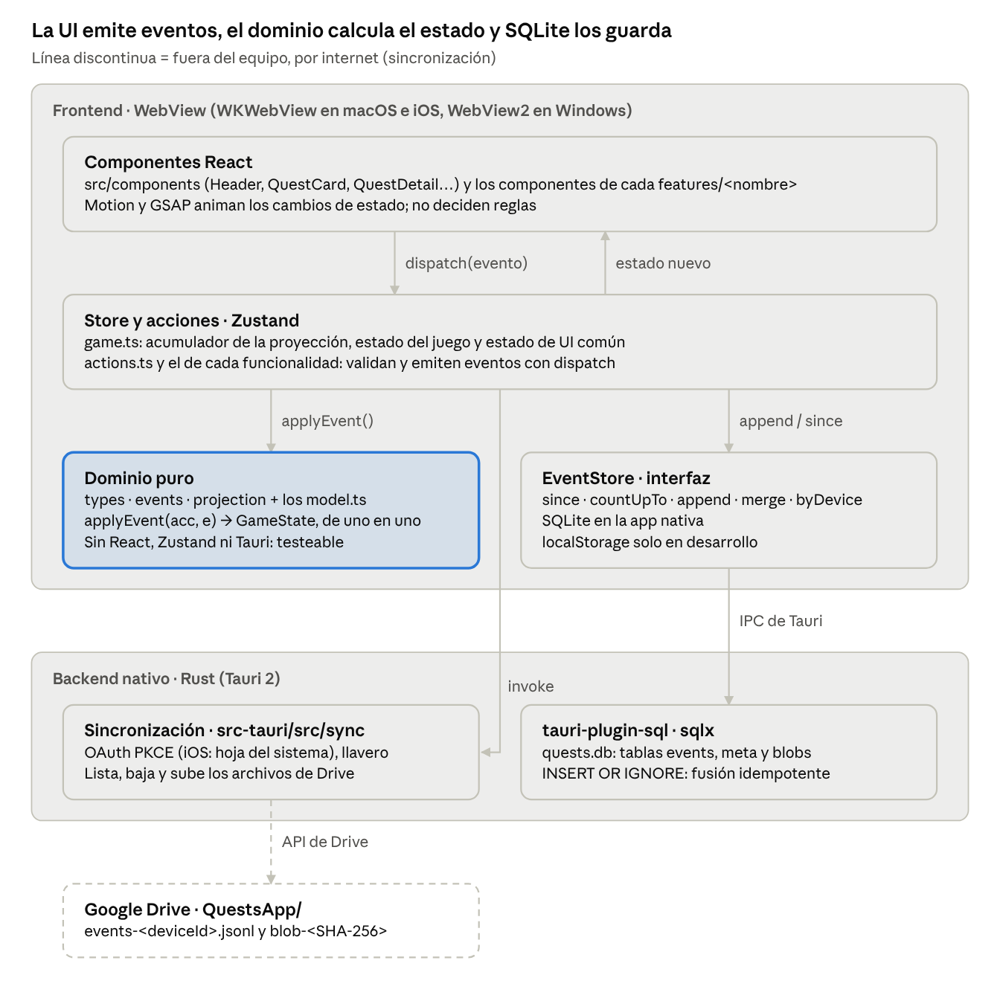
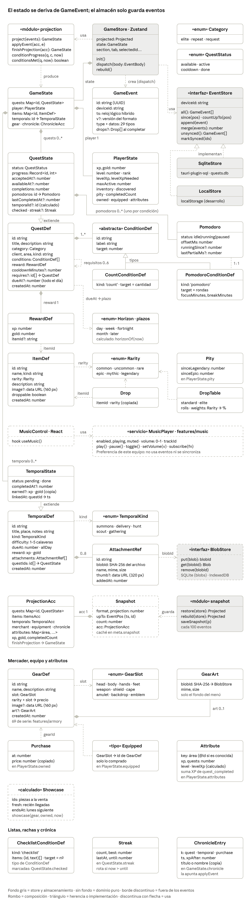
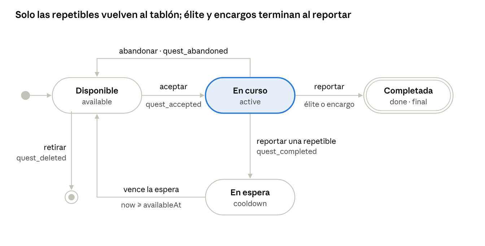
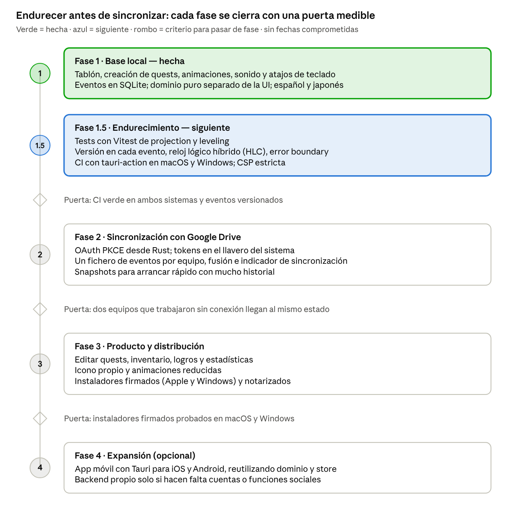

# Quests — Informe técnico de arquitectura

> **Copia del informe técnico a fecha de 2026-10-02** (actualizada con el mercader, el personaje, los atributos, el equipo de serie, las rachas, las listas, la crónica y la fase 1.5: eventos versionados, reloj lógico híbrido, error boundary, CSP y CI). El original vive como documento colaborativo en Claude: [Quests — Informe técnico de arquitectura](https://claude.ai/code/artifact/1cb3618f-d1e6-483e-a198-a1998279827b). Los diagramas de esta copia son capturas de ese documento (`docs/img/`).
>
> Las cifras de líneas de código y la tabla «Estructura del código» describen la **fase 1**. Después se añadieron idiomas (`src/i18n/`), el pomodoro como tipo de condición (`src/features/pomodoro/`), la música (`src/features/music/`), los objetos con rareza y drops (`src/features/items/`), los encargos temporales con archivos adjuntos y quests enlazadas (`src/features/temporal/`), las quests complejas con repetición y requisitos (`src/features/complex/`), los plazos (`src/features/horizon/`) el snapshot de la proyección con los primeros tests de Vitest (`src/features/snapshot/`), el mercader (`src/features/merchant/`), el personaje con su equipo (`src/features/equipment/`), los atributos (`src/features/attributes/`), el equipo de serie (`src/features/armory/`), las rachas (`src/features/streaks/`), el objetivo de tipo lista (`src/features/checklist/`), la crónica del aventurero (`src/features/chronicle/`) y la pantalla de recuperación (`src/features/recovery/`). El diagrama de clases (imagen, redibujado el 2026-10-02) ya incluye el pomodoro, la música, los objetos (`ItemDef`, `Rarity`, `Drop`, `Pity`, `DropTable`), los encargos temporales (`TemporalDef`, `TemporalState`, `TemporalKind`, `AttachmentRef`, `BlobStore`), sus quests enlazadas (`questIds`, `linkedAt`, `QuestState.temporalId`), los requisitos y la fecha límite de las quests (`requires`, `dueAt`, `lastCompletedAt`), los plazos (`Horizon`) y el snapshot de la proyección (`ProjectionAcc`, `Snapshot`, el módulo `snapshot`, `GameStore.projected` y `EventStore.since` / `countUpTo`) y el mercader, el equipo y los atributos (`GearDef`, `GearSlot`, `GearArt`, `Purchase`, `Equipped`, `Attribute`, `Showcase`, `GameState.gear` y `PlayerState.owned` / `equipped` / `attributes`), y las listas, las rachas y la crónica (`ChecklistConditionDef`, `QuestState.checked` / `streak`, `Streak`, `ChronicleEntry`, `GameState.chronicle`). La estructura vigente y las normas de trabajo están en [AGENTES.md](AGENTES.md).

---

## Resumen

La fase 1 está terminada: Quests ya funciona como app de escritorio en macOS (Tauri 2 + React 19 + TypeScript), con datos persistentes en SQLite y todas las animaciones del tablón. Son unas 1.930 líneas de TypeScript y 1.160 de CSS. La fase 1.5 (endurecimiento) también está hecha: hay 314 tests automáticos del dominio y el store, y una CI que los pasa y compila la app en macOS y Windows. Windows no se ha probado a mano todavía.

Tres decisiones sostienen la escalabilidad del proyecto:

1. **Event sourcing.** No se guarda el estado («XP = 1150»), sino los hechos que lo producen. Así la sincronización entre dispositivos consiste en unir listas de eventos, sin conflictos de escritura.
2. **Dominio puro y separado de la UI.** Las reglas del juego (niveles, recompensas, estados) viven en `src/domain/` sin depender de React ni de Tauri. Se pueden testear y reutilizar en móvil o en un servidor.
3. **Almacenamiento detrás de una interfaz.** `EventStore` aísla SQLite. La fase 2 (Google Drive) y un posible backend futuro se enchufan ahí sin tocar la UI.

Las deudas que había que cerrar antes de sincronizar ya están resueltas: los eventos llevan versión (ADR-24), se ordenan con un reloj lógico híbrido en lugar del reloj de cada dispositivo (ADR-25), la interfaz tiene un error boundary (ADR-27), la CSP es estricta (ADR-26) y la CI pasa en los dos sistemas. Los snapshots (ADR-16) y los tests del dominio y el store ya estaban hechos. Lo siguiente es la fase 2: la sincronización con Google Drive.

## Estado del proyecto

Todas las funciones de la fase 1 están hechas; la verificación ha sido manual (navegador integrado y app nativa en macOS).

| Funcionalidad | Estado | Cómo se verificó |
| --- | --- | --- |
| Tablón con pestañas por categoría (Élite, Repetible, Encargo) | Hecho | Prueba manual en navegador |
| Crear quest con objetivos, recompensa y tiempo de reaparición | Hecho | Prueba manual: formulario completo publicado |
| Aceptar: sello «EN CURSO», destello, temblor y grietas | Hecho | Capturas durante la animación |
| Progreso por objetivo con botones +/− | Hecho | Prueba manual |
| Reportar: tarjeta rota, «Quest Clear», contadores, «Level Up!» | Hecho | Capturas de la secuencia completa |
| Repetibles con espera («Vuelve en 20 h») | Hecho | Prueba manual tras corregir un fallo del sello |
| Abandonar y retirar quests | Hecho | Prueba manual |
| Niveles, rangos F–S, oro, huecos de quest activa | Hecho | Comprobado: 400 XP → nivel 3, 1.150 XP → nivel 4 |
| Persistencia SQLite en la app nativa | Hecho | Base `quests.db` inspeccionada con `sqlite3` |
| Atajos de teclado | Hecho | Flechas, Enter y X probados; la tecla `+` no se pudo probar |
| Sonidos sintetizados con botón de silencio | Hecho | Sin verificación auditiva |
| Quests complejas: repetición en cualquier categoría (también «cada 3 días») y requisitos con candado | Hecho | Comprobaciones del dominio con marcas de tiempo fijas en tres zonas horarias y prueba en navegador (Playwright) |
| Plazos: filtro de 1 día, 7 días, 2 semanas, 1 mes y más de un mes en los dos tablones; fecha límite de las quests | Hecho | Bordes de cada plazo, cambio de hora y prueba en navegador, también en japonés y a 1.024 px |
| Encargos con quests enlazadas: se crean en el Quest Board y hay que terminarlas para cumplir el encargo | Hecho | Guardas de la proyección, datos antiguos proyectados idénticos y flujo completo en navegador |
| Snapshot de la proyección: cada acción aplica solo su evento y el arranque parte del último snapshot | Hecho | Tests con 25 historiales aleatorios cortados en 10 puntos y prueba en navegador (snapshot falseado, evento antiguo, reloj atrasado); app nativa: arranque, cola, evento antiguo y snapshot falseado sobre la base real |
| Mercader (Hu Tao) con escaparate semanal, personaje con su equipo y decoración del menú, y atributos por área con radar | Hecho | Tests del dominio y del store (compras, doble gasto entre dispositivos, escaparate con cambios de hora, equipo, atributos) y prueba en navegador con Playwright: crear piezas, comprar, equiparlas, fondo y emblema, japonés y de 1.024 a 1.440 px. Sin probar en la app nativa |
| 69 piezas de serie del mercader (Mushoku Tensei, Re:Zero, Konosuba, JRPG) con precio por ranura, rachas de las repetibles, objetivo de tipo lista, crónica del aventurero y áreas traducidas | Hecho | 302 tests en 21 archivos; prueba en navegador con un historial de 14 días, en español y japonés, de 1.024 a 1.300 px; un snapshot de la versión 2 se descarta y se recalcula. Sin probar en la app nativa (tampoco el arreglo del vídeo de Hu Tao) |
| Eventos versionados (`v`, `EVENT_VERSION`, `upcastEvent`) | Hecho | Tests: sin `v`, actual y futura dan el estado esperado; los de una versión futura se ignoran (prueba de mutación: quitar la guarda la detectan 2 tests) |
| Reloj lógico híbrido (`nextTs` con deriva máxima de 1 minuto) | Hecho | Tests con dos equipos desfasados y con el store (fusionar eventos de un equipo adelantado 30 s); con la regla anterior de 1 s fallan 2 tests |
| Error boundary con pantalla de recuperación | Hecho | Fallo forzado en el navegador: sale la pantalla y «Volver a intentarlo» devuelve el tablón |
| CSP estricta | Hecho | La misma política como cabecera en Chromium (build de producción): sin bloqueos en el tablón, el mercader con su vídeo, el personaje, la música y un PDF en `blob:`. App nativa de macOS: arranca y abre la base de datos con la CSP; sin revisar la ventana a simple vista |
| CI en macOS y Windows | Hecho | `.github/workflows/ci.yml`: tipos, tests y build con `tauri-action` en los dos sistemas |
| Prueba a mano en Windows | Pendiente | La CI deja el instalador como artefacto |
| Tests automáticos | Hecho | 314 tests en 23 archivos (dominio y store); prueba de mutación: detectan 19 de 20 errores introducidos, y 11 de 11 en el mercader, el equipo y los atributos. Sin tests del almacén de binarios ni de la interfaz |
| Sincronización con Google Drive (fase 2) | Pendiente | Interfaz preparada en `EventStore` |

La base de datos de la app nativa está en `~/Library/Application Support/com.quests.app/quests.db` (macOS) y en `%APPDATA%\com.quests.app\` (Windows).

## Stack tecnológico

Tauri se eligió frente a Electron por tamaño (unos 10 MB frente a ~150 MB) y por tener un backend nativo en Rust donde irán OAuth y la sincronización. El resto es el ecosistema web estándar, el más rico para animaciones de interfaz.

| Capa | Tecnología | Versión | Papel | Por qué |
| --- | --- | --- | --- | --- |
| Contenedor de escritorio | Tauri | 2.12.1 | Ventana nativa, empaquetado, puente JS↔Rust | Binario pequeño, macOS + Windows (y móvil en el futuro) |
| Backend nativo | Rust (edición 2021) | 1.94.1 | Plugins, y en fase 2 OAuth y sync | Seguro, rápido, acceso al sistema y al llavero |
| Base de datos | SQLite vía tauri-plugin-sql (sqlx) | 2.5.0 / 0.8.6 | Almacén local de eventos | Embebida, sin servidor, transaccional |
| UI | React | 19.3.0 | Componentes de interfaz | Ecosistema y librerías de animación |
| Lenguaje | TypeScript | 6.0.3 | Tipado de dominio, eventos y UI | Errores en compilación, refactors seguros |
| Bundler | Vite | 8.3.1 | Servidor de desarrollo y build | Recarga en caliente, integrado con Tauri |
| Estado | Zustand | 5.0.15 | Store global (eventos, proyección, UI) | Mínimo, sin boilerplate, accesible fuera de React |
| Animación declarativa | Motion (Framer Motion) | 13.4.6 | Transiciones, layout, pestañas, paneles | Springs y animaciones de layout |
| Animación por línea de tiempo | GSAP | 3.15.0 | Sello, tarjeta rota, Quest Clear, Level Up | Secuencias precisas y encadenadas |
| Sonido | Web Audio API | nativo | Efectos sintetizados | Sin archivos de audio que empaquetar |
| Tipografía | Fontsource (Cormorant Garamond, Cinzel, Shippori Mincho) | 5.3.0 | Fuentes locales | Funciona sin conexión |
| Gestor de paquetes | pnpm | 11.8.0 | Dependencias JS | Rápido y determinista |

Para los idiomas se añadieron después i18next 26.4.2 y react-i18next 17.0.15 (español y japonés, unos 64 KB en el build). Todas las versiones son las instaladas en el repositorio a fecha de este informe.

## Arquitectura por capas

La app tiene dos procesos: el frontend en un WebView y un backend nativo en Rust. Toda la lógica de negocio vive en el dominio puro, en el centro.



Las flechas bajan como comandos (`dispatch`) y suben como estado nuevo; ningún componente lee ni escribe SQLite directamente.

## Diagrama de clases

El modelo separa la definición inmutable de una quest (`QuestDef`) de su estado de juego (`QuestState`). Todo lo que hay en `GameState` se calcula; lo único que se guarda es `GameEvent`.



Son tipos de TypeScript, no clases con métodos: la lógica vive en funciones puras (`project`, `effectiveStatus`, `conditionsMet`), lo que facilita testearla. `quest_created` transporta un `QuestDef` completo y `quest_completed` una copia de `RewardDef`.

Una condición es de dos tipos: **contador** (`target` = cantidad, avanza con +1) o **pomodoro** (`target` = rondas, avanza con el tiempo). Cada ronda de pomodoro es concentración más descanso, salvo la última, que no tiene descanso porque la tarea ya ha terminado. Cada condición de pomodoro tiene su `Pomodoro` en `QuestState.pomodoros` (1 : 1); su estado guarda solo el avance en una línea de tiempo, así que sobrevive a cerrar la app. Los datos de la versión anterior, cuando el pomodoro era un objeto único de la quest, se convierten al leerlos (`legacy.ts`): es el primer caso real de versionado de eventos. La música (`MusicPlayer`) es la excepción deliberada: una preferencia de cada equipo, sin eventos ni sincronización, y por eso sí es una clase.

**Objetos.** `ItemDef` vive en el almanaque (`GameState.items`) y tiene nombre, rareza, tipo, descripción, imagen reducida y si sale en drops. `PlayerState` suma `inventory`, `discovered` y `pity`, todo calculado a partir de los eventos. `RewardDef.itemId` sustituye al antiguo texto `item`, que se convierte al leerlo (`features/items/legacy.ts`). Cada `Drop` de `quest_completed` copia su rareza, y `DropTable` define las probabilidades por rareza y las tiradas.

**Encargos temporales.** `TemporalDef` es algo con fecha (una cita, una entrega) que vive en su propio tablón, fuera de las quests: tipo de cartel (`TemporalKind`), dificultad de 1 a 5 calaveras, fecha (`dueAt`, o todo el día), lugar, notas, recompensa y adjuntos. `TemporalState` añade si está pendiente o cumplido, cuándo y lo ganado; están en `GameState.temporals`. Cumplir uno suma su XP y su oro al jugador. La urgencia (hoy, pronto, vencido) se calcula con la hora actual, sin eventos. Cada `AttachmentRef` lleva solo los metadatos y una miniatura: el archivo está en el almacén de binarios (`BlobStore`), con su SHA-256 como clave.

**Quests complejas, plazos y encargos con quests.** `QuestDef` gana dos campos opcionales: `requires` (quests que hay que completar antes de poder aceptarla) y `dueAt` (fecha límite de todo el día); `cooldownMinutes` ya vale para cualquier categoría, no solo para las repetibles. `QuestState` añade `lastCompletedAt` y `temporalId`, el encargo pendiente al que pertenece, calculado a partir de los enlaces. `TemporalDef.questIds` enlaza las quests que hay que terminar antes de cumplir el encargo, y `TemporalState.linkedAt` guarda cuándo se enlazó cada una. El plazo (`Horizon`: 1 día, 7 días, 2 semanas, 1 mes o más) se calcula con la hora actual, sin eventos. El detalle está en [src/features/complex/README.md](../src/features/complex/README.md) y [src/features/horizon/README.md](../src/features/horizon/README.md).

**Snapshot de la proyección.** `project()` se parte en `applyEvent(acc, e)`, que aplica un evento sobre el acumulador `ProjectionAcc`, y `finishProjection(acc)`, que calcula nivel, rango, huecos y `temporalId`. El store ya no guarda la lista de eventos: `GameStore.projected` lleva el acumulador y el último evento aplicado, y `dispatch` aplica solo el evento nuevo sobre una copia. Cada 100 eventos se guarda un `Snapshot` en la tabla `meta`. Al arrancar se usa si es de la misma `PROJECTION_VERSION` y `EventStore.countUpTo(upTo)` coincide con su `count`; entonces solo se aplican los eventos de `EventStore.since(upTo)`. Si no, se reproduce todo. Detalle en [src/features/snapshot/README.md](../src/features/snapshot/README.md).

**Mercader, equipo y atributos.** `GearDef` es el catálogo del mercader (`GameState.gear`): armadura para las ocho ranuras del muñeco (`GearSlot`) y decoración del menú (fondo y emblema), con rareza, icono y, solo el fondo, la imagen grande en el `BlobStore` (`GearArt`). `PlayerState` suma `owned` (cada `Purchase` con su precio copiado), `equipped` (ranura → pieza) y `attributes` (un `Attribute` por área de las quests, calculado a partir de `quest_completed`). El escaparate de la semana (`Showcase`) se calcula con la hora, sin eventos. Detalle en [src/features/merchant/README.md](../src/features/merchant/README.md), [src/features/equipment/README.md](../src/features/equipment/README.md) y [src/features/attributes/README.md](../src/features/attributes/README.md).

**Piezas de serie, listas, rachas y crónica.** El catálogo trae 69 piezas de serie (`features/armory`) que no son eventos: `GameState.gear` junta las del jugador y las de serie, y el precio sale de la rareza y la ranura. `ConditionDef` suma `ChecklistConditionDef` (casillas; las marcadas en `QuestState.checked`). `QuestState.streak` (`Streak`) cuenta las veces seguidas a tiempo de una quest que se repite. `GameState.chronicle` lleva las entradas de la crónica (`ChronicleEntry`: quest, encargo o compra), que apunta `applyEvent` cuando un evento cuenta. Las áreas conocidas tienen clave `@id` y se traducen.

**Versión y orden de los eventos.** `EventMeta` suma `v`, la versión del formato (`EVENT_VERSION`, ahora 1; los eventos anteriores no la llevan y cuentan como 0). `applyEvent` pasa cada evento por `upcastEvent`, que lo sube paso a paso con `UPCASTERS`, e ignora los de una versión más nueva que la app (`isFromFuture`). `EventMeta.ts` es ahora un reloj lógico híbrido (`nextTs`): sigue al último evento aplicado, propio o fusionado, con una deriva máxima de 1 minuto (`MAX_DRIFT_MS`).

## Modelo de eventos y persistencia

Cada acción del usuario se registra como un evento inmutable. El estado se obtiene reproduciendo los eventos en orden (`ts`, luego `id`) con la función pura `project()`. Hay seis tipos de evento de quest, que son estos. El pomodoro añade otros cinco (`pomodoro_started`, `_paused`, `_resumed`, `_stopped` y `_break_skipped`), documentados en [src/features/pomodoro/README.md](../src/features/pomodoro/README.md). Los objetos añaden tres (`item_created`, `item_updated` e `item_deleted`), documentados en [src/features/items/README.md](../src/features/items/README.md). Los encargos temporales añaden ocho (`temporal_created`, `_updated`, `_attached`, `_detached`, `_linked`, `_unlinked`, `_completed` y `_deleted`), documentados en [src/features/temporal/README.md](../src/features/temporal/README.md); `temporal_completed` se ignora mientras quede alguna quest enlazada sin terminar. Las quests complejas y los plazos no añaden eventos: solo campos opcionales de `QuestDef`. El mercader añade cuatro (`gear_created`, `gear_updated`, `gear_deleted` y `gear_purchased`, que copia el precio y solo cuenta si el oro llega en ese punto del historial) y el equipo, dos (`gear_equipped` y `gear_unequipped`); los atributos no añaden ninguno. Por ellos, `PROJECTION_VERSION` pasa a 2. La lista añade un evento más, `checklist_checked` (marca o desmarca una casilla con la quest en curso), 29 tipos en total. Las rachas y la crónica no añaden ninguno. Por ellas, `PROJECTION_VERSION` pasa a 3.

| Evento | Datos | Efecto en la proyección | Regla de conflicto |
| --- | --- | --- | --- |
| `quest_created` | `quest: QuestDef` completa | Añade la quest como `available` | Se ignora si el id ya existe |
| `quest_deleted` | `questId` | Elimina la quest | Los eventos posteriores sobre ella se ignoran |
| `quest_accepted` | `questId` | `available` o espera vencida → `active`; reinicia el progreso | Solo aplica desde un estado válido y con sus requisitos completados |
| `quest_abandoned` | `questId` | `active` → `available` (o `cooldown` si aún no venció) | Solo aplica si está activa |
| `progress_added` | `questId`, `conditionId`, `amount` (±1) | Suma al contador, limitado a [0, objetivo] | Delta, no valor absoluto: dos dispositivos suman en vez de pisarse |
| `quest_completed` | `questId`, `reward` (copia, con `itemId` garantizado), `drops` (botín ya tirado) | Suma XP, oro, objeto garantizado y drops; avanza el pity; si se repite (repetible o con repetición) → `cooldown`, resto → `done` | Si dos dispositivos la completan sin conexión, solo cuenta la primera, botín incluido |

El `ts` de cada evento nuevo lo pone `dispatch` con `nextTs`, un reloj lógico híbrido: max(reloj, último aplicado + 1 ms), donde el último aplicado puede ser de otro equipo, salvo que vaya más de 1 minuto por delante del reloj (ADR-17 y ADR-25). Así, los eventos que una acción emite en el mismo milisegundo no se reordenan por su `id` aleatorio, y lo que un equipo hace después de ver un evento remoto va detrás de él aunque su reloj vaya atrasado.

Cada evento nuevo lleva también `v`, la versión de su formato (ADR-24). Para cambiar la forma de un evento se sube `EVENT_VERSION`, se añade un paso en `UPCASTERS` (`src/domain/upcast.ts`) y se sube `PROJECTION_VERSION`. Los eventos de una versión más nueva que la app se guardan, pero la proyección los ignora hasta actualizarla.

La recompensa se copia dentro de `quest_completed`. Así, editar una quest en el futuro no cambia la XP ya ganada. Lo mismo con el botín: se tira al reportar y el resultado se guarda en el evento, así que la proyección no depende del azar.

**Esquema SQLite** (creado al arrancar por `openSqliteStore()`):

```sql
CREATE TABLE events (
  id        TEXT PRIMARY KEY,      -- UUID v4 del evento
  device_id TEXT NOT NULL,         -- dispositivo que lo generó
  ts        INTEGER NOT NULL,      -- milisegundos desde epoch (reloj local)
  body      TEXT NOT NULL,         -- JSON con type + datos
  synced    INTEGER NOT NULL DEFAULT 0  -- 1 = ya subido a Drive
);
CREATE INDEX events_ts ON events (ts, id);
CREATE TABLE meta (key TEXT PRIMARY KEY, value TEXT NOT NULL);  -- device_id, y en fase 2 cursores de sync
```

La inserción usa `INSERT OR IGNORE`, de modo que fusionar eventos remotos repetidos es seguro (idempotente). En el navegador, el mismo contrato se cumple sobre `localStorage`, solo para desarrollo.

Los archivos adjuntos de los encargos temporales no van en `events`, sino en una tabla aparte del mismo `quests.db` (ADR-11). En el navegador, en IndexedDB:

```sql
CREATE TABLE blobs (
  id      TEXT PRIMARY KEY,         -- SHA-256 del contenido
  mime    TEXT NOT NULL,
  size    INTEGER NOT NULL,
  data    TEXT NOT NULL,            -- base64 (el puente JS↔Rust viaja en JSON)
  created INTEGER NOT NULL,
  synced  INTEGER NOT NULL DEFAULT 0
);
```

## Ciclo de vida de una quest

Una quest tiene cuatro estados y cada transición corresponde a un evento. Para reportar, todos los objetivos tienen que estar cumplidos.



La espera no genera ningún evento: `effectiveStatus()` compara la hora actual con `availableAt`, así que una quest que se repite vuelve sola al tablón aunque la app esté cerrada.

Una quest con requisitos sigue en `available`, pero no se puede aceptar hasta completarlos: el bloqueo se calcula con `prerequisitesMet()`, no es un estado nuevo.

## Flujos principales

Todos los flujos siguen el mismo patrón: una acción valida, emite un evento, el store recalcula el estado y la UI reacciona animando el cambio.

**Aceptar una quest** (`Enter` o botón «Aceptar»):

1. `acceptQuest(id)` comprueba que la quest esté disponible y que queden huecos (`activas < player.maxActive`).
2. `dispatch({type: "quest_accepted"})` crea el evento con `id`, `deviceId` y `ts`.
3. El store recalcula `project(eventos)` y React vuelve a pintar.
4. `QuestCard` detecta el cambio a `active` y lanza la línea de tiempo GSAP: sello, sonido, temblor, destello y grietas.
5. El evento se escribe en SQLite de forma asíncrona.

**Reportar una quest** (`Enter` con todos los objetivos cumplidos):

1. `reportQuest(id)` guarda el `PlayerState` de antes.
2. Emite `quest_completed` con una copia de la recompensa.
3. Lee el `PlayerState` de después y abre `ClearOverlay` con ambos.
4. El overlay anima: tarjeta rota en 24 pedazos, «Quest Clear», contadores de XP y oro, barra de nivel y, si sube de nivel, «Level Up!».

**Sincronizar con Google Drive** (fase 2, propuesto):

1. Al abrir la app, cada 5 minutos y al cerrar: `store.unsynced()` devuelve los eventos locales no subidos.
2. Se añaden a `events-<deviceId>.jsonl` en la carpeta de la app en Drive; luego `markSynced(ids)`.
3. Se descargan los ficheros de los otros dispositivos a partir del último cursor guardado en `meta`.
4. `store.merge(remotos)` inserta solo los nuevos y se recalcula la proyección.
5. Cada dispositivo escribe solo en su propio fichero, así que nunca hay dos escritores sobre el mismo archivo.

## Estructura del código

Las dependencias van en un solo sentido: `components` → `store` → `domain` ← `storage`. El dominio no importa nada de React, Zustand ni Tauri; es la regla que hay que proteger al crecer.

| Módulo | Archivos | Líneas | Responsabilidad |
| --- | --- | --- | --- |
| `src/domain/` | types, events, projection, leveling, seed | 332 | Reglas del juego puras: tipos, eventos, proyección, curva de XP, rangos, datos de ejemplo |
| `src/storage/` | eventStore | 127 | Interfaz `EventStore` y sus dos implementaciones (SQLite y localStorage) |
| `src/store/` | game, actions | 158 | Store Zustand (eventos + estado + UI) y casos de uso (aceptar, progresar, reportar, abandonar) |
| `src/components/` | Header, Tabs, QuestCard, QuestDetail, CreateQuestModal, ClearOverlay, Footer | 1.041 | Interfaz y animaciones |
| `src/lib/` | sfx, id, time | 124 | Utilidades: sonido, UUID, PRNG con semilla, formato de tiempo |
| `src/App.tsx`, `main.tsx` | — | 152 | Composición, filtrado del tablón y navegación por teclado |
| `src/styles/` | theme, app | 1.164 | Tokens de color y tipografía; estilos de componentes |
| `src-tauri/` | lib.rs, tauri.conf.json, capabilities | ~40 | Ventana, plugin SQL y permisos mínimos (`sql:default`, `sql:allow-execute`) |

Convenciones a mantener:

- Toda escritura pasa por `dispatch(evento)`; ningún componente modifica el estado directamente.
- La lógica que decide (¿se puede aceptar?, ¿está completa?) vive en `domain/` o `store/actions.ts`, nunca en un componente.
- Las animaciones leen el cambio de estado; no lo provocan.

**Una carpeta por funcionalidad.** Cada funcionalidad nueva vive en `src/features/<nombre>/` con su modelo, eventos, acciones, componentes, textos y un `README.md` de diseño. Ya existen `pomodoro` (dominio, con eventos), `music` (servicio local, sin eventos), `items` (entidades propias, azar e imágenes), `temporal` (sección propia, estado de UI propio, archivos adjuntos y quests enlazadas), `complex` (repetición y requisitos, sin eventos propios) y `horizon` (plazos calculados, sin eventos); después, `snapshot` (infraestructura), `merchant` (el mercader: catálogo, precios, escaparate semanal y compras), `equipment` (el muñeco, el armario y la decoración del menú) y `attributes` (un nivel por área de las quests, sin eventos). El dominio importa solo el `model.ts` de cada funcionalidad, nunca su `index.ts`, para no crear ciclos con el store.

## Escalabilidad

La arquitectura escala bien en dispositivos y plataformas; el primer límite real era el volumen de eventos, y ya se resuelve con snapshots sin cambiar el modelo (ADR-16). Las cifras de capacidad son estimaciones, no mediciones.

| Dimensión | Situación actual | Cuándo se nota | Medida propuesta |
| --- | --- | --- | --- |
| Volumen de eventos | Cada acción aplica solo su evento; el arranque carga el último snapshot (cada 100 eventos) y lee solo los posteriores | Resuelto (ADR-16). Queda: cada acción copia el estado entero, y un evento antiguo fusionado obliga a reproducirlo todo | Hecho en src/features/snapshot. Pendiente: medirlo en la app nativa con un historial grande, porque el ahorro real está en no leer todo SQLite por el puente de Tauri; cambios en `dispatch` |
| Evolución del esquema | Cada evento lleva `v`; `upcastEvent` convierte los antiguos al leerlos | Resuelto (ADR-24) | Un paso en `UPCASTERS` por cada cambio de formato |
| Varios dispositivos | Reloj lógico híbrido con deriva máxima de 1 minuto | Resuelto (ADR-25). Queda: un equipo con más de 1 minuto de retraso respecto a lo ya aplicado recalcula todo en cada acción | Si se nota, recalcular desde el snapshot anterior en lugar de desde cero |
| Sincronización | Interfaz lista (`unsynced`, `merge`, `markSynced`), sin implementación | Fase 2 | Un fichero JSONL por dispositivo en Drive; compactar a snapshot cuando superen ~1 MB |
| Escrituras en lote | `markSynced` y `merge` hacen una sentencia por evento | Al fusionar miles de eventos | Una transacción por lote |
| Plataformas | macOS probado; Windows compilado y con tests en la CI, sin probar a mano | Ahora | Abrir el instalador de la CI en un Windows real |
| Móvil | No soportado | Si se decide sacar app móvil | Tauri 2 compila a iOS y Android; el dominio y el store se reutilizan tal cual |
| Backend propio | No hay | Si se quieren cuentas, social o web | Sustituir el sync de Drive por un servidor detrás de la misma interfaz `EventStore` |
| Equipo | Una persona; tests con Vitest y CI en macOS y Windows | Al entrar un segundo desarrollador | Lint y CI obligatoria antes de fusionar (protección de la rama `main` en GitHub) |
| Funcionalidad | Store único mezcla dominio y UI | Al pasar de ~10 pantallas | Separar `uiStore` del `gameStore`; un módulo por feature (quests, inventario, estadísticas). Los encargos temporales ya tienen su propio store de UI (`features/temporal/ui.ts`) |
| Archivos adjuntos | Tabla `blobs` en SQLite, por SHA-256; se borran los que nadie usa; sin sincronizar | Al sincronizar (fase 2) o con muchos PDF grandes | Subir cada archivo una sola vez por su hash (`unsynced` / `markSynced` en `BlobStore`); avisar del espacio ocupado |

## Deuda técnica y riesgos

La fase 1.5 cerró los puntos de prioridad alta que había que resolver antes de la sincronización. Solo queda uno, el destino de los tokens OAuth, que se resuelve dentro de la propia fase 2.

| Prioridad | Problema | Riesgo | Solución |
| --- | --- | --- | --- |
| Media | Faltan tests del almacén de binarios, de los adjuntos y de la interfaz (dominio y store: 314 tests, en la CI) | Romper los adjuntos o la interfaz sin enterarse | Tests de `blobStore` (IndexedDB y SQLite) y de los componentes |
| Baja | Resuelto: los eventos no tenían versión | Ninguno ya | Hecho: campo `v`, `EVENT_VERSION` y `UPCASTERS` (ADR-24) |
| Baja | Resuelto: orden por reloj local | Ninguno ya; con más de 1 minuto de deriva se recalcula todo | Hecho: reloj lógico híbrido (ADR-25) |
| Baja | Resuelto: sin error boundary en React | Ninguno ya | Hecho: `features/recovery` (ADR-27) |
| Alta | Tokens OAuth de la fase 2 sin destino seguro definido | Credenciales de Google expuestas en disco | Guardarlos en el llavero del sistema (crate `keyring`) |
| Baja | Resuelto: CSP desactivada | Ninguno ya; falta verla a simple vista en la app nativa | Hecho: CSP estricta en `tauri.conf.json` (ADR-26) |
| Media | Windows sin probar a mano (la CI compila y pasa los tests) | Diferencias de WebView2 frente a WKWebView en fuentes, animaciones y el visor de PDF | Instalar el artefacto de la CI en un Windows real |
| Media | App sin firma ni notarización, icono por defecto | Avisos de Gatekeeper y SmartScreen al instalar | Certificados de Apple y Windows; icono propio |
| Media | No respeta `prefers-reduced-motion` (parcial: las partículas y sacudidas de `src/lib/fx.ts`, que usa el cofre del botín, sí lo respetan) | Accesibilidad: animaciones intensas sin opción de reducirlas | Versión reducida de cada animación; extender `calm()` al resto |
| Baja | El límite [0, objetivo] del progreso depende del orden | Resultados distintos en casos raros de fusión | Aceptable; documentado |
| Baja | Resuelto: los textos estaban fijos en español | Ninguno ya | Hecho: i18next con español y japonés en `src/i18n/`, diccionarios tipados |
| Baja | No se pueden editar quests, solo crear y retirar | Fricción de uso | Evento `quest_updated` |

## Decisiones de arquitectura

Cada decisión queda registrada con la alternativa que se descartó, para no reabrirlas sin un motivo nuevo.

| # | Decisión | Alternativas descartadas | Motivo | Consecuencia |
| --- | --- | --- | --- | --- |
| ADR-01 | Tauri 2 como contenedor | Electron, Flutter, Godot/Unity, nativo por plataforma | Binario ~10 MB, Rust para sync/OAuth, ecosistema web para animaciones | Probar en dos motores web (WebKit en macOS, Chromium en Windows) |
| ADR-02 | Event sourcing en lugar de guardar estado | Tablas con estado actual + última escritura gana | Fusión sin conflictos entre dispositivos e historial completo | Hace falta versionado de eventos y snapshots al crecer |
| ADR-03 | SQLite local como fuente de verdad (local-first) | Base de datos remota, Supabase | Funciona sin conexión, sin coste ni servidor | La sincronización es responsabilidad de la app |
| ADR-04 | Google Drive como canal de sync, un fichero por dispositivo | Replicación MySQL, SQLite dentro de una carpeta de Drive | MySQL exige servidores siempre conectados; un SQLite compartido se corrompe con dos escritores | OAuth propio y app de Google Cloud en modo producción |
| ADR-05 | Zustand para el estado | Redux Toolkit, Context de React | Mínimo y accesible desde fuera de componentes (atajos, acciones) | Separar store de UI cuando crezca |
| ADR-06 | Motion + GSAP | Solo CSS, solo Motion, PixiJS | Motion para layout y transiciones; GSAP para secuencias largas encadenadas | Dos librerías que conocer; regla: GSAP solo en secuencias |
| ADR-07 | Sonido sintetizado con Web Audio | Archivos de audio | Cero recursos que empaquetar | Sonidos sencillos; se pueden sustituir por samples más adelante |
| ADR-08 | Fuentes locales con Fontsource | Google Fonts por red | La app funciona sin conexión | Solo el subconjunto latino: 372 KB de fuentes y 852 KB de frontend total (con los subconjuntos japoneses eran 26 MB) |
| ADR-09 | Drops aleatorios resueltos en la acción y guardados dentro de `quest_completed` | Tirar en la proyección con semilla; evento `item_dropped` aparte | La proyección sigue siendo determinista y el botín hereda la guarda contra completados duplicados | El pity se recalcula reproduciendo los drops; cambiar las tablas no altera lo ya ganado |
| ADR-10 | Imagen de los objetos reducida a 160 px y guardada como data URL en el evento | Ficheros en la carpeta de la app (plugin `fs`); imagen original | Se sincroniza con los demás eventos, sin plugin ni permisos nuevos | 3–30 KB por imagen dentro de SQLite; si se cambia mucho, valorar snapshots |
| ADR-11 | Adjuntos (PDF e imágenes de hasta 20 MB) en un almacén de binarios aparte, por su SHA-256: tabla `blobs` en SQLite e IndexedDB en el navegador; en el evento, solo la referencia y una miniatura de 320 px | El archivo dentro del evento como ADR-10; plugin `fs`; IndexedDB también en la app nativa | Un PDF de varios MB se leería en cada arranque y no cabe en `localStorage`; la misma conexión SQLite evita plugins y permisos nuevos; el hash evita duplicados entre dispositivos | La fase 2 tendrá que sincronizar binarios además de eventos; un dispositivo puede ver la referencia antes que el archivo («no está en este equipo») |
| ADR-12 | Encargos temporales como entidad y tablón propios (`TemporalDef`, sección aparte) | Una cuarta categoría de quest | Tienen fecha y se cumplen una vez: no se aceptan, no ocupan huecos ni tienen objetivos ni esperas | Comparten con las quests la recompensa (XP y oro suman al jugador), no `completedCount` ni los drops |
| ADR-13 | Repetición (en cualquier categoría) y requisitos como campos opcionales de `QuestDef`, con una guarda en la proyección: `quest_accepted` se ignora si faltan requisitos | Eventos nuevos para los requisitos; una categoría «cadena»; comprobarlo solo en la acción | La definición ya viaja entera en `quest_created` y los datos antiguos se leen igual; con la guarda, todos los dispositivos llegan al mismo estado | Repetición y requisitos no se editan hasta que exista `quest_updated`; un requisito retirado deja de bloquear |
| ADR-14 | Quests enlazadas a un encargo con `TemporalDef.questIds` y los eventos `temporal_linked` / `temporal_unlinked`; `temporal_completed` se ignora mientras quede alguna sin terminar | `QuestDef.temporalId` fijado al crear la quest; borrar las quests al retirar el encargo | Se pueden enlazar y desenlazar después, como deltas que se suman entre dispositivos; `linkedAt` hace que una repetible cuente solo si se completa tras enlazarla | Con el reloj de cada equipo, un encargo cumplido justo tras la última quest podría volver a pendiente al fusionar (lo resuelve el reloj híbrido); retirar un encargo deja sus quests en el tablón |
| ADR-15 | Plazos calculados con la hora actual (`horizonOf`), excluyentes y con «1 mes» (de 15 a 30 días) para no dejar huecos; fecha límite opcional en `QuestDef` | Guardar el plazo en un evento; plazos acumulativos; solo los cuatro plazos pedidos | Cambia solo con el paso del tiempo, sin eventos; cada fecha cae en un plazo y los contadores suman el total | Una quest sin fecha propia ni encargo sale en «sin fecha»; las que se repiten no tienen fecha límite |
| ADR-16 | Snapshot del acumulador de la proyección en la tabla meta cada 100 eventos, válido si coinciden PROJECTION_VERSION y el número de eventos hasta upTo; dispatch aplica solo el evento nuevo sobre una copia (structuredClone) | Guardar GameState; validar con un hash de todos los eventos; actualizaciones inmutables a mano en cada case; guardar en cada evento | Arrancar sin leer todo el historial; el recuento detecta cualquier evento que entre en medio, porque nunca se borran; la copia no obliga a tocar el switch ni los modelos | Hay que subir PROJECTION_VERSION al cambiar project() (en desarrollo se avisa si se olvida); el snapshot es una caché local que no se sincroniza |
| ADR-17 | El ts de un evento nuevo es como mínimo el del último aplicado + 1 ms si el reloj no ha avanzado o va por detrás menos de 1 s (nextTs) | Ids ordenables en el tiempo (UUID v7, ULID); un contador por equipo; esperar al reloj híbrido | Las acciones que emiten varios eventos lo hacen en el mismo milisegundo y el desempate por id aleatorio los reordenaba (un quest_completed antes de su quest_accepted). Es el arreglo más pequeño y no cambia el formato de los eventos | El ts puede adelantarse unos milisegundos al reloj; un retraso de más de 1 s sigue recalculándolo todo. El reloj híbrido sigue pendiente para varios dispositivos |
| ADR-18 | Mercader con catálogo propio (GearDef); el precio y el rango salen de la rareza, gear_purchased copia el precio y la proyección solo vigila el oro | Vender objetos del almanaque; precio elegido por el usuario; comprobar el escaparate y el rango en la proyección | El propietario quiere que comprar cueste y añadir mercancía sin poner precio; un mismo oro gastado en dos dispositivos sin conexión solo vale una vez | Cambiar los precios no altera lo pagado; el escaparate y el rango se comprueban en la acción, como los huecos al aceptar |
| ADR-19 | Escaparate semanal calculado con la semana como semilla: 5 piezas más las añadidas en los últimos 7 días, sin eventos | Un evento de reposición cada lunes; todo el catálogo siempre a la venta | Hace que comprar sea más difícil y todos los equipos ven el mismo escaparate sin sincronizar nada | Una pieza puede tardar semanas en volver (nextShowing dice cuándo); con 5 piezas o menos, todo está a la venta |
| ADR-20 | Atributos calculados en la proyección a partir de quest_completed y el área de la quest; muñeco dibujado en SVG, una forma por ranura con el color de la rareza | Eventos propios de atributos; pegar la imagen de cada pieza sobre el muñeco | Sin datos nuevos y retroactivo para lo ya completado; las imágenes del usuario no encajan en un cuerpo | Las áreas se normalizan (mayúsculas y espacios); la imagen de cada pieza se ve en su ranura, no sobre el cuerpo |
| ADR-21 | Piezas de serie del mercader en el código (`BUILTIN_GEAR`), sumadas al catálogo del jugador con `gearOf` / `fullCatalog`, fuera del acumulador; arte en SVG generado | Crearlas con eventos en el primer arranque; un JSON en `public/`; imágenes de las series | Las tiene todo el que instala la app, también quien ya tenía datos; sin peso en los eventos ni en el snapshot; sin derechos de imagen | No se editan ni se retiran; nunca se borra ni se renombra una clave (las compras la nombran) |
| ADR-22 | Rachas y crónica calculadas en la proyección (`QuestState.streak`, `ProjectionAcc.chronicle`), apuntadas solo cuando un evento pasa sus guardas | Eventos propios; leer el historial de SQLite al abrir la crónica | Retroactivas, sin duplicados entre dispositivos y sin repetir las guardas fuera del dominio | La crónica crece con el snapshot (unos 270 KB al año); `PROJECTION_VERSION` pasa a 3 |
| ADR-23 | Objetivo de tipo lista con `checklist_checked` (valor por casilla) y áreas conocidas con clave `@id` para traducir los atributos | Reusar `progress_added` (+1); traducir las áreas solo al pintarlas | Marcar dos veces en dos dispositivos cuenta una; «Salud» y «健康» suben el mismo atributo | Cambiar los sinónimos une atributos: hay que subir `PROJECTION_VERSION` |
| ADR-24 | Versión en cada evento (`v`, `EVENT_VERSION`) con conversión paso a paso al aplicarlo (`UPCASTERS`); los eventos de una versión futura se ignoran | Solo upcasters por forma, como `legacy.ts`; reescribir los eventos al migrar; rechazar los de una versión futura | Con la sincronización, cada cambio de formato llegará a equipos con versiones distintas; la versión explícita dice qué conversión toca sin adivinar por la forma | Cambiar un formato obliga a subir `EVENT_VERSION` y `PROJECTION_VERSION`; un equipo sin actualizar no ve lo que hacen los actualizados hasta actualizarse |
| ADR-25 | Reloj lógico híbrido dentro de `ts`: max(reloj, último aplicado + 1 ms), también si el último es de otro equipo, con una deriva máxima de 1 minuto | HLC clásico con contador y hora física en campos aparte; relojes vectoriales; ids ordenables en el tiempo | Mantiene la causalidad entre equipos sin cambiar el formato de los eventos, las consultas de SQLite ni el snapshot; el orden total (ts, id) sigue siendo el mismo en todos los equipos | El `ts` puede adelantarse hasta 1 minuto al reloj; un equipo con más deriva recalcula todo hasta que su reloj lo alcanza |
| ADR-26 | CSP estricta: solo `'self'`, `data:` y `blob:` donde hace falta e IPC; sin *nonces* de Tauri en `style-src` | `csp: null`; *nonces* también en los estilos | Cierra la carga de scripts y recursos de fuera; Motion, GSAP y React necesitan estilos en línea, que el *nonce* anularía | Cada origen nuevo (Google, en la fase 2) hay que añadirlo a mano; `'unsafe-inline'` en los estilos |
| ADR-27 | Un error boundary en la raíz con pantalla de recuperación (`features/recovery`) que vuelve a montar la app sin recargar | Uno por sección; recargar sin más | Un fallo a medias deja estados raros; volver a montar conserva el store y descarta el estado local roto | Un fallo en un rincón tapa toda la ventana hasta reintentar |

## Hoja de ruta

Recomiendo una fase corta de endurecimiento antes de la sincronización. Lo que se cambie en el formato de los eventos después de sincronizar obliga a migrar datos ya repartidos entre dispositivos.



No hay fechas comprometidas: cada fase termina cuando se cumple su puerta, no en un plazo.

**Siguientes pasos concretos:**

- [x] Añadir Vitest y tests de `project()` y `levelFromXp()`
- [x] Añadir el campo `v` a `EventMeta` y un upcaster vacío
- [x] Sustituir `ts` por un reloj lógico híbrido
- [x] Añadir un error boundary con pantalla de recuperación
- [x] Configurar GitHub Actions con `tauri-action` para macOS y Windows
- [x] CSP estricta en `tauri.conf.json`
- [ ] CI en verde en macOS y Windows (puerta de la fase 1.5) y probar a mano el instalador de Windows
- [ ] Crear el proyecto en Google Cloud con un OAuth Client ID de tipo «Desktop app» (lo hace el propietario de la cuenta)
