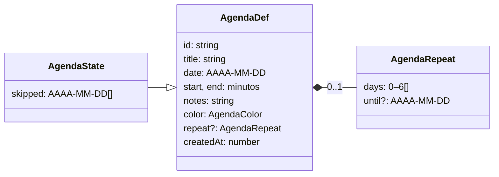

# Agenda

Bloques con hora de inicio y de fin («Gimnasio, 19:00–20:30»), de un solo día o que **se repiten** ciertos días de la semana (o todos), con un último día opcional. Se ven en el [calendario](../calendar/README.md): en la semana, como bloques de color; en el día, en una rejilla por horas donde se pulsa para añadir. No da XP ni oro y no se marca como hecho: es para organizarse. Se sincroniza como todo lo demás.

## Qué hace

| # | Requisito del propietario | Cómo se cumple |
|---|---|---|
| R1 | Un calendario por horas para uso personal | `AgendaDef` (título, día, inicio, fin, notas, color); la vista «Día» del calendario es una rejilla por horas |
| R2 | Bloques que se repiten | `AgendaRepeat`: días de la semana (los 7 = «Cada día») y un último día opcional; quitar un solo día con `agenda_skipped` |
| R3 | Que se vea también en el iPhone | Eventos como el resto; formulario y rejilla con su diseño de teléfono |

Fuera, porque no se pidió: marcar bloques como hechos, dar XP u oro y avisos propios (los avisos del sistema sí avisan 5 minutos antes: [notifications](../notifications/README.md)).

## Reglas y decisiones

- **Días como texto, horas como minutos.** El día va como `AAAA-MM-DD` en la hora local y las horas como minutos desde medianoche (`start`, `end`). Un bloque de las 9:00 sigue a las 9:00 aunque cambie la hora, y se compara sin zonas horarias (`"2026-10-05" < "2026-10-12"`). `atMinute(día, minutos)` lo pasa a milisegundos con `new Date(año, mes, día, 0, minutos)`, que respeta el cambio de hora.
- **Semanas de lunes a domingo** (`weekStart`); los días de la semana van como en `getDay()` (0 = domingo) y la interfaz los ordena de lunes a domingo.
- **Repetición** (`occursOn`): un bloque suelto sale solo su día; uno que se repite, desde `date` hasta `until` (incluido), los días elegidos, salvo los `skipped`. Sin `repeat`, no se repite.
- **Quitar «solo este día» o «todos».** Desde un día concreto de un bloque que se repite: **Quitar solo el 8 oct** (`agenda_skipped`, un delta) o **Quitar todos** (`agenda_deleted`). Las dos piden un segundo clic.
- **Deltas.** `agenda_updated` lleva solo lo que cambia. Quitar la repetición va como `repeat: { days: [] }`: un campo `undefined` desaparecería del JSON.
- **Datos tolerantes** (`normalizeAgenda`): sin título o con un día imposible (`2026-02-31`) no hay bloque; las horas se ajustan al día y a 5 minutos de duración como mínimo; un color desconocido pasa a oro; los días de la semana, sin repetir y en orden.
- **Cinco colores** con los tokens del tema: `gold`, `elite`, `request`, `repeat` y `stamp`. En el evento va el nombre, no el color.

Por qué eventos propios y no quests repetibles, y por qué días en texto: [ADR-40](../../../docs/decisions/ADR-40-agenda.md).

## Modelo

`AgendaState` vive en `ProjectionAcc.agenda` y sale en `GameState.agenda`. No toca al jugador ni a la crónica.

## Eventos

| Evento | Datos | Efecto en la proyección | Guarda |
|---|---|---|---|
| `agenda_created` | `entry: AgendaDef` | Lo añade (normalizado) con `skipped: []` | Se ignora si el id existe o se retiró, o si no tiene título o día válido |
| `agenda_updated` | `entryId`, `patch` | Mezcla los campos y vuelve a normalizar | Si existe; si el resultado no vale, se queda como estaba. Nunca toca el id, la fecha de creación ni los días quitados |
| `agenda_skipped` | `entryId`, `date` | Añade el día a `skipped` | Solo si se repite, ese día tiene bloque y no llega al límite (500) |
| `agenda_deleted` | `entryId` | Lo quita; el id queda retirado | Si existe |

Crear, editar, quitar un día y retirar se pueden deshacer unos minutos ([undo](../undo/README.md)).

## Interfaz

`AgendaForm`: título, día, inicio y fin, días de la semana (al cambiar el día, el marcado sigue al nuevo salvo que se eligieran otros a mano), «hasta el día…», color y notas. En el teléfono, a pantalla completa con campos de 16 px.

## Archivos

| Archivo | Contenido |
|---|---|
| `model.ts` | Tipos, días (`dateKey`, `addDays`, `weekStart`, `weekDays`, `atMinute`, `parseClock`), repetición (`occursOn`, `agendaOn`) y la proyección (`normalizeAgenda`, `applyAgendaEvent`). Puro |
| `events.ts` | `AgendaEventBody` |
| `actions.ts` | Formulario (`emptyAgendaDraft`, `agendaDraftOf`, `agendaDraftError`), `saveAgenda` (crear o un parche mínimo), `deleteAgenda`, `skipAgendaDay` |
| `ui.ts` | Qué bloque se crea o se edita (Zustand); `agendaBusy` |
| `components/AgendaForm.tsx` | La ventana de añadir o editar; `AGENDA_COLOR_VAR` |
| `agenda.css`, `i18n.ts` | Estilos (con su bloque de teléfono) y textos es + ja |
| `model.test.ts` | Días, cambio de hora, repetición y guardas |

## Integración

| Fuera de la carpeta | Cambio |
|---|---|
| `src/domain/events.ts` | `AgendaEventBody` en la unión |
| `src/domain/types.ts` | `GameState.agenda` |
| `src/domain/projection.ts` | `ProjectionAcc.agenda` y los cuatro `case` |
| `src/features/snapshot/model.ts` | `decodeSnapshot` exige `acc.agenda.entries` |
| `src/App.tsx` | `<AgendaFormModal />` |
| `src/i18n/locales/{es,ja}.ts` | Montan `agenda` |
| `src/test/streams.ts` | `agendaDef` y los cuatro eventos en `randomStream` (con días imposibles, horas fuera del día y días repetidos) |

## Dependencias

- **features/undo** (`actions.ts` → `offerUndo`): el aviso con «Deshacer» al guardar o quitar. No hace falta leer su README.
- **La usan:** `calendar` (la enseña y abre el formulario), `today` (agenda de hoy), `failure`, `notifications` y `search` (leen `model.ts`).

## Estado actual

- **Última verificación:** 2026-10-03, tests y navegador a 1024 × 768 y 402 × 874, en español y japonés.
- **Tests:** `model.test.ts` y, con el store, `src/store/game.test.ts`.
- **Sin verificar:** la app nativa y el iPhone de verdad; dos equipos editando el mismo bloque a la vez (lo cubren las guardas y los tests de la proyección, no una prueba real).
- **Historial:** [docs/history/verificacion/agenda.md](../../../docs/history/verificacion/agenda.md).

## Pendiente

- Repetición mensual.
