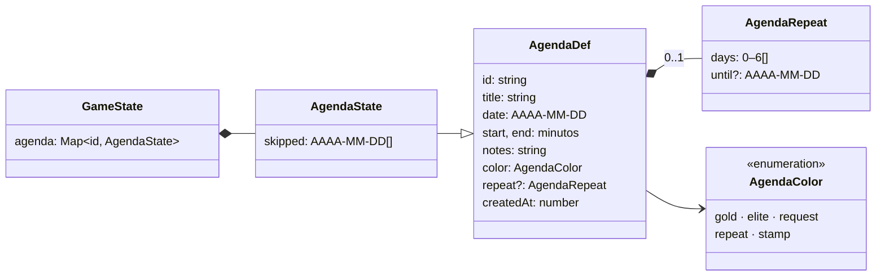

# Agenda

El **calendario por horas para uso personal**: bloques con hora de inicio y de fin («Gimnasio, 19:00–20:30», «Comida con Ana, 14:00–15:30»), de un solo día o que **se repiten** ciertos días de la semana (o todos), con una fecha final opcional. Se ven en el calendario ([../calendar/README.md](../calendar/README.md)): en la semana, como bloques de color; en el día, en una rejilla por horas.

No da XP ni oro y no se marca como hecho: es para organizarse. Se sincroniza entre equipos como todo lo demás.

Sigue la convención del proyecto: **una carpeta por implementación** (`src/features/<nombre>/`).

---

## Requisitos

| # | Requisito | Cómo se cumple |
|---|---|---|
| R1 | Otro calendario para añadir cosas por horas del día, de uso personal | `AgendaDef` (título, día, inicio, fin, notas, color); la vista «Día» del calendario es una rejilla por horas donde se pulsa para añadir |
| R2 | Bloques que se repiten (elegido por el propietario) | `AgendaRepeat`: días de la semana (los 7 = «Cada día») y un último día opcional; quitar un solo día con `agenda_skipped` |
| R3 | Que se vea también en el iPhone | Eventos como el resto (se sincroniza); formulario y rejilla con su diseño de teléfono |

Lo que el propietario **no** pidió (y se dejó fuera): marcar los bloques como hechos, dar XP u oro, y avisos antes de cada bloque.

---

## Decisiones de diseño

### Días como texto, horas como minutos

El día va como `AAAA-MM-DD` en la hora local y las horas como minutos desde medianoche (`start`, `end`). Así un bloque de las 9:00 sigue a las 9:00 aunque cambie la hora (verano / invierno) y se compara sin zonas horarias: `"2026-10-05" < "2026-10-12"`. `atMinute(día, minutos)` lo pasa a milisegundos con `new Date(año, mes, día, 0, minutos)`, que respeta el cambio de hora.

El dominio no llama a `Date.now()` (norma 5.2): las funciones reciben el día. Las semanas empiezan en lunes (`weekStart`); los días de la semana van como en `getDay()` (0 = domingo), y la interfaz los ordena de lunes a domingo.

### Repetición

| Elección | Se guarda |
|---|---|
| No se repite | `repeat` falta: solo su `date` |
| Cada día | `repeat.days` = los 7 |
| Días de la semana | `repeat.days` = los elegidos (al cambiar el día, el marcado sigue al nuevo salvo que se eligieran otros a mano) |
| Hasta el día… | `repeat.until` (incluido); vacío, sin fin |

`occursOn(bloque, día)`: un suelto, solo su día; uno que se repite, desde `date` hasta `until`, los días de la semana elegidos, salvo los `skipped`.

### Quitar «solo este día» o «todos»

Al abrir un bloque que se repite desde un día concreto, el formulario ofrece **Quitar solo el 8 oct** (`agenda_skipped`: un delta que se suma entre equipos) o **Quitar todos** (`agenda_deleted`). En un bloque suelto solo hay **Quitar**. Las dos piden confirmación (segundo clic).

### Eventos como deltas

- `agenda_updated` lleva solo los campos que cambian. Quitar la repetición va como `repeat: { days: [] }`, porque un campo `undefined` desaparece del JSON y el cambio se perdería. El parche nunca toca el id, la fecha de creación ni los días quitados.
- `agenda_skipped` se ignora si el bloque no se repite o ese día no tiene bloque, así que un día solo se quita una vez.
- **Datos tolerantes** (`normalizeAgenda`): sin título o con un día imposible (`2026-02-31`) no hay bloque; las horas se ajustan al día y a 5 minutos de duración como mínimo; el color desconocido pasa a oro; los días de la semana, sin repetir y en orden. Una edición mal formada deja el bloque como estaba.

### Colores

Cinco, con los tokens del tema: oro (`--gold`), rojo (`--elite`), verde (`--request`), violeta (`--repeat`) y cian (`--stamp`). En el evento va el nombre (`gold`…), no el color.

---

## Eventos

| Evento | Datos | Efecto en la proyección | Guarda |
|---|---|---|---|
| `agenda_created` | `entry: AgendaDef` | Lo añade (normalizado) con `skipped: []` | Se ignora si el id existe o se retiró, o si no tiene título o día válido |
| `agenda_updated` | `entryId`, `patch` | Mezcla los campos y vuelve a normalizar | Si existe; si el resultado no vale, se queda como estaba |
| `agenda_skipped` | `entryId`, `date` | Añade el día a `skipped` | Solo si se repite, ese día tiene bloque y no llega al límite (500) |
| `agenda_deleted` | `entryId` | Lo quita; el id queda retirado | Si existe |

La agenda no toca al jugador (ni XP ni oro) ni a la crónica. Vive en `ProjectionAcc.agenda` y sale en `GameState.agenda`. Es nueva, así que los datos anteriores simplemente no tienen bloques. `PROJECTION_VERSION` pasa a 9 porque el acumulador gana un campo: un snapshot anterior no lo tiene (y `decodeSnapshot` ya lo exige).

---

## Diagrama de clases

---

## Archivos

| Archivo | Contenido |
|---|---|
| `model.ts` | Tipos, días (`dateKey`, `addDays`, `weekStart`, `weekDays`, `atMinute`, `parseClock`), repetición (`occursOn`, `agendaOn`) y la proyección (`normalizeAgenda`, `applyAgendaEvent`). Puro |
| `events.ts` | `AgendaEventBody` |
| `actions.ts` | Formulario (`emptyAgendaDraft`, `agendaDraftOf`, `agendaDraftError`), `saveAgenda` (crear o un parche mínimo), `deleteAgenda` y `skipAgendaDay` |
| `ui.ts` | Qué bloque se crea o se edita (Zustand); `agendaBusy` |
| `i18n.ts` | Textos es + ja |
| `agenda.css` | Formulario (días de la semana, colores) y su diseño de teléfono |
| `components/AgendaForm.tsx` | La ventana de añadir o editar un bloque; `AGENDA_COLOR_VAR` |
| `model.test.ts` | Días, cambio de hora, repetición y guardas |

## Puntos de integración

| Fuera de la carpeta | Cambio |
|---|---|
| `domain/events.ts` | `AgendaEventBody` en la unión |
| `domain/types.ts` | `GameState.agenda` |
| `domain/projection.ts` | `ProjectionAcc.agenda`, los cuatro `case` y `PROJECTION_VERSION` 9 |
| `features/snapshot/model.ts` | `decodeSnapshot` exige `acc.agenda.entries` |
| `App.tsx` | `<AgendaFormModal />` |
| `features/calendar` | Lo enseña (semana y día) y abre el formulario |
| `i18n/locales/{es,ja}.ts` | Montan `agenda` |
| `test/streams.ts` | `agendaDef` y los cuatro eventos en `randomStream` (con días imposibles, horas fuera del día y días de la semana repetidos) |

---

## Verificación

Hecho el 2026-10-03.

- **Tests:** días y cambio de hora (el 25 de octubre), semanas de lunes a domingo, horas del formulario, repetición (días elegidos, `until`, días quitados), guardas (id repetido o retirado, parche que no toca la identidad, día sin bloque, bloque suelto, edición mal formada) y, con el store, crear, editar (parche mínimo), quitar la repetición (`repeat: { days: [] }`), saltar un día y retirar sin tocar al jugador. Los historiales aleatorios incluyen los cuatro eventos.
- **Navegador** (`pnpm dev`, 1024 × 768 y 402 × 874): «Gimnasio» los lunes y jueves de 19:00 a 20:30 (se repite la semana siguiente), «Desayuno con Ana» pulsando en la rejilla del día (se reparte en columnas con un encargo a la misma hora), quitar solo el jueves 1, el formulario en el teléfono y en japonés.

**No verificado:** la app nativa y el iPhone de verdad; dos equipos editando el mismo bloque a la vez (lo cubren las guardas y los tests de la proyección, no una prueba real).
