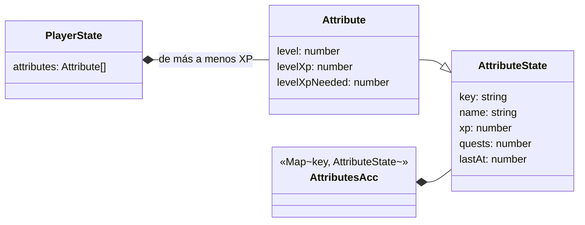

# Atributos: una por cada área de tus quests

Cada **área** de las quests («Salud», «Estudio», «Hogar»…) es un **atributo** del personaje con su propio nivel. Sube con la XP de las quests completadas en esa área, así que el radar dice en qué partes de tu vida estás avanzando y cuáles tienes abandonadas. Se ven en la ventana del personaje, junto al muñeco ([src/features/equipment/README.md](../equipment/README.md)).

Sigue la convención del proyecto: **una carpeta por implementación** (`src/features/<nombre>/`).

---

## Requisitos

| # | Requisito | Cómo se cumple |
|---|---|---|
| R1 | Cada área es un atributo con su propio nivel | `AttributeState` por área (normalizada) y `attributeLevel(xp)` |
| R2 | Verlos en un gráfico de radar | `AttributesPanel`: radar de las 6 áreas con más XP y la lista completa con barras |
| R3 | Junto al muñeco del personaje | Panel derecho de la ventana `CharacterModal` (tecla `P`) |

---

## Decisiones de diseño

### Sin eventos: se calcula a partir de `quest_completed`

No hay eventos nuevos. La proyección suma la XP de cada `quest_completed` válido al área de su quest (`gainAttribute`). Consecuencias:

- **Retroactivo**: al actualizar la app, las quests que ya completaste suben sus atributos desde el primer arranque.
- Un `quest_completed` duplicado (dos dispositivos) no cuenta dos veces: hereda la guarda de siempre.
- Se usa la XP **copiada en el evento**, no la de la quest.

Va en el acumulador de la proyección (y no se calcula en `finishProjection` a partir de las quests) porque una quest retirada deja de estar en `quests`, y su XP tiene que seguir contando, igual que la XP del jugador.

### Las áreas las escribe el usuario

- **Normalización** (`areaKey`): sin espacios de más y en minúsculas. «Salud», « salud » y «SALUD» son el mismo atributo, que se muestra como se escribió **la última vez**.
- **Un `Map`, no un objeto**: un área llamada «__proto__» rompería un objeto plano.
- **Sin área, sin atributo**: esas quests dan XP al jugador, pero no suben nada. Los encargos temporales tampoco (no tienen área).
- Los nombres no se traducen (son texto del usuario).

### La curva

`attributeXpToNext(n) = 60 · n^1,3`, más suave que la del jugador (`100 · n^1,4`), porque cada área recibe solo una parte de la XP: el nivel 5 de un área cuesta 822 XP (unas 6–8 quests normales). No tiene tope.

### El radar

- Ejes: las **6 áreas con más XP** (`RADAR_AXES`). Con menos de 3 no hay polígono y queda la lista.
- Borde: el múltiplo de 5 por encima del nivel más alto (5 como mínimo, `radarScale`). Así la forma enseña el **equilibrio** y crece por saltos que se notan.
- El valor de cada eje incluye la fracción del nivel en curso.

---

## Diagrama de clases

## Funciones (`model.ts`, puro)

| Función | Qué hace |
|---|---|
| `cleanArea(area)` / `areaKey(area)` | El área sin espacios de más / su clave en minúsculas |
| `gainAttribute(acc, area, xp, ts)` | Suma una quest completada a su área (la proyección la llama en `quest_completed`) |
| `attributeXpToNext(n)`, `attributeLevel(xp)` | La curva y el nivel de un atributo |
| `listAttributes(acc)` | Los atributos con su nivel, de más a menos XP (estable por nombre) |
| `radarScale(attrs)`, `radarPoints(values, scale)` | Borde del radar y vértices del polígono |

## Archivos

| Archivo | Contenido |
|---|---|
| `model.ts` | Todo lo anterior. Puro |
| `i18n.ts` | Textos es + ja |
| `attributes.css` | Estilos del panel y del radar |
| `components/AttributesPanel.tsx` | Radar y lista |

## Puntos de integración

| Fuera de la carpeta | Cambio |
|---|---|
| `domain/types.ts` | `PlayerState.attributes` |
| `domain/projection.ts` | `ProjectionAcc.attributes`; `gainAttribute` en `quest_completed`; `listAttributes` en `finishProjection`. `PROJECTION_VERSION` = 2 |
| `i18n/locales/{es,ja}.ts` | Montan `attributes` |
| `features/equipment/components/CharacterModal.tsx` | Aloja `<AttributesPanel />` |
| `test/streams.ts` | Áreas escritas de varias formas en las quests de `randomStream` |

---

## Verificación

Hecho el 2026-10-02:

- **Tests**: `model.test.ts` (normalización, suma y última forma de escribirla, «__proto__», la curva con sus bordes, el orden, el radar) y en `domain/projection.test.ts`: una quest completada sube su área una sola vez, las quests sin área y los encargos no suben nada, y el invariante de que los atributos nunca suman más XP que el jugador.
- **Navegador**: seis áreas con XP distinta, el radar con su escala (10) y la lista con niveles y barras, también en japonés. Con un historial y un snapshot de la versión anterior, las quests ya completadas aparecen como atributos al arrancar.

## Posibles mejoras

- Sugerir las áreas que ya existen al escribir una quest (un `datalist` en el formulario), para no partir «Salud» en «Salud» y «Sallud».
- Juntar o renombrar áreas desde la ventana del personaje.
- Una racha por área (días seguidos con alguna quest de esa área).
