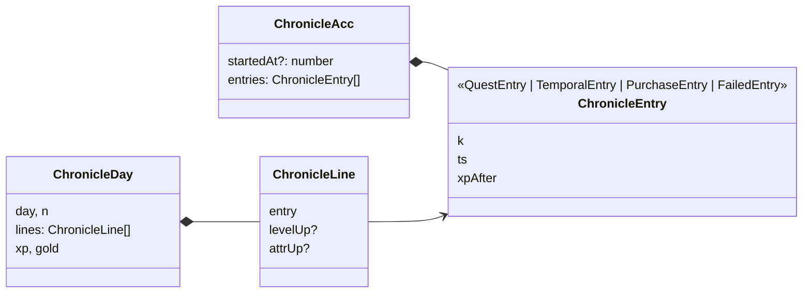

# Crónica del aventurero

Un **diario** con todo lo que has hecho, día a día: las quests completadas (con su recompensa, su racha y lo que encontraste por primera vez), los encargos cumplidos, las compras a Hu Tao, lo que falló y lo que se deduce de leerlo en orden: **subidas de nivel** y de **atributo**. Se abre con la tecla `J` o la tarjeta «Chronicle» del [menú](../menu/README.md).

Mismo marco que el almanaque (un libro abierto con lomo y páginas que se pasan), con estilo de **diario usado**: tapas de cuero rozado y cosido a mano, papel amarillento con renglones y margen rojo, manchas, cercos de taza, bordes comidos, alguna oreja doblada, una cinta de punto de lectura y letra de imprenta antigua (IM Fell English).

## Qué hace

| # | Requisito del propietario | Cómo se cumple |
|---|---|---|
| R1 | Crónica del aventurero | Ventana `ChronicleModal` con todo lo apuntado, agrupado por días |
| R2 | Estilo parecido al almanaque | El mismo libro abierto (lomo, páginas, flechas, `←`/`→`) |
| R3 | Pero de diario usado y algo desgastado | Cuero rozado y cosido, papel viejo con renglones, manchas y cercos, borde comido, oreja doblada, cinta deshilachada y tinta a mano |

## Reglas y decisiones

### Se apunta en la proyección, cuando el evento cuenta

La proyección añade una entrada (`record`) **solo cuando un evento pasa sus guardas**: un `quest_completed` válido, un `temporal_completed` que da su recompensa, un `gear_purchased` o `collectible_purchased` con oro suficiente, o un fallo (`quest_failed`, `temporal_failed`: entrada `failed`, en tinta roja y sin XP ni oro). Lo deshecho nunca se apunta, porque la proyección lo salta. Así la crónica no dice nada que no pasara, aunque lleguen eventos repetidos de otro equipo ([ADR-22](../../../docs/decisions/ADR-22-rachas-y-cronica-calculadas.md)).

Leer los eventos de SQLite al abrirla obligaría a repetir las guardas (y con el snapshot el store ya no tiene la lista). Guardar el nivel y los atributos en cada entrada tampoco hace falta: se deducen leyendo en orden (`chronicleDays`); cada entrada guarda solo `xpAfter`.

Cada entrada **copia** lo que puede cambiar después: el título de la quest, su área, el nombre del objeto encontrado, el de la pieza comprada. Retirar una quest no borra su recuerdo. Es **retroactiva**: lo ya hecho aparece al actualizar. Ocupa unos 150 bytes por entrada (un año con cinco quests diarias, unos 270 KB en el snapshot).

### Las páginas

- La página 0 es la **portadilla**: título, rango y nivel, la fecha de comienzo y el resumen (días de aventura y con algo apuntado, quests, encargos, compras, mejor racha).
- Las demás se llenan con `paginate(days, lines, weigh)`: el encabezado de cada día, sus entradas y el total del día. Un día que no cabe sigue en la página siguiente («(sigue)») y el total nunca queda solo.
- Cuántos renglones caben se **mide** (`ResizeObserver` sobre el libro: alto ÷ 26 px) y cada entrada pesa los renglones de su **texto ya escrito** en el idioma de la interfaz (`textUnits`: un kana o un ideograma cuentan doble).
- Se abre por **la última página escrita**.
- El desgaste de cada página sale de una semilla con su número: siempre igual.

### Las frases

Cada tipo de entrada tiene varias frases («Completé…», «Hoy cayó…», «Por fin…»; las élite, «Vencí a…») y se elige una con el `ts` de la entrada: siempre la misma. Las piezas de serie y las áreas conocidas se nombran en el idioma de la interfaz.

## Modelo

`QuestEntry` lleva `questId`, `title`, `category`, `area?`, `xp`, `gold`, `drops`, `found?` (objetos nuevos) y `streak?`. `PurchaseEntry.collectible` marca las compras de coleccionables.

## Eventos

No tiene eventos propios: apunta entradas al aplicar los de otras funcionalidades (ver arriba).

## Interfaz

| Tecla (ventana abierta) | Acción |
|---|---|
| `J` / `Esc` | Cerrar |
| `←` / `→` | Pasar página |
| `Home` / `End` | Portadilla / última página |

- **El papel viejo es solo CSS**: degradado radial más oscuro hacia los bordes, renglones (`repeating-linear-gradient`) con margen rojo, fibras y grano (dos `feTurbulence` en SVG) y una mancha con su posición en variables CSS. El borde exterior de la página derecha está «comido» con un `clip-path` de 21 puntos.
- **El desgaste** (manchas, cerco de taza, oreja doblada con `::after` e inclinación de medio grado) sale de `seededRandom` con el número de página.
- **Pasar página**: transición de Motion por pliego (`AnimatePresence` con `mode="popLayout"`).
- **Teléfono**: una página cada vez (`per`), con las flechas dentro del libro y deslizar el dedo para pasar página.

## Archivos

| Archivo | Contenido |
|---|---|
| `model.ts` | Entradas, `ChronicleAcc`, `noteStart`, `record`, `chronicleDays`, `chronicleTotals`, `paginate`, `blockWeight`, `textUnits`. Puro |
| `ui.ts` | Si la ventana está abierta (`openChronicle`, `chronicleBusy`) |
| `components/ChronicleModal.tsx` | El diario: portadilla, páginas, desgaste, frases y teclado |
| `components/DiaryIcon.tsx` | Icono del diario (el botón está en el menú) |
| `chronicle.css`, `i18n.ts` | Estilos y textos es + ja |
| `model.test.ts` | Una entrada por hecho que cuenta, días locales, subidas, XP que cuadra con la del jugador, páginas que no se pasan de renglones |

### Dónde está cada cosa

| Concepto | Símbolo |
|---|---|
| Apuntar una entrada cuando un evento cuenta | [`record`](model.ts) y [`noteStart`](model.ts) |
| Días, subidas de nivel y de atributo | [`chronicleDays`](model.ts) |
| Resumen de la portadilla | [`chronicleTotals`](model.ts) |
| Repartir el diario en páginas | [`paginate`](model.ts), [`blockWeight`](model.ts) y [`textUnits`](model.ts) |
| Medir cuántos renglones caben | [`useDiaryLines`](components/ChronicleModal.tsx) |
| Desgaste estable de cada página | [`wearOf`](components/ChronicleModal.tsx) |
| Frases de cada entrada | [`phrase`](components/ChronicleModal.tsx) y [`entryTexts`](components/ChronicleModal.tsx) |
| Ventana y portadilla | [`ChronicleModal`](components/ChronicleModal.tsx) y [`Cover`](components/ChronicleModal.tsx) |

## Integración

| Fuera de la carpeta | Cambio |
|---|---|
| `src/domain/types.ts` | `GameState.chronicle` |
| `src/domain/projection.ts` | `ProjectionAcc.chronicle`; `noteStart` en cada evento; `record` cuando un evento cuenta |
| `src/features/snapshot/model.ts` | Un snapshot sin `chronicle` se descarta |
| `src/App.tsx` | Tecla `J`, `<ChronicleModal />` y el teclado del tablón espera mientras está abierta |
| `src/styles/theme.css` | Tokens `--diary-*` |
| `package.json` | `@fontsource/im-fell-english` (solo el subconjunto latino; en japonés, el mincho del sistema) |
| `src/i18n/locales/{es,ja}.ts` | Montan `chronicle` |

## Dependencias

- **features/items** (`model.ts`): los objetos encontrados en cada entrada y su rareza.
- **features/attributes** (`model.ts`, `labels.ts`): las subidas de atributo y el nombre traducido de las áreas.
- **features/armory** (`labels.ts`): el nombre traducido de las piezas de serie compradas.
- **features/streaks** (`Flame`): la llama de las entradas con racha.
- **features/mobile** (`index`): una página cada vez y deslizar en el teléfono.
- Ninguno de esos README hace falta para tocar el diario.
- **La usan:** `menu` (tarjeta y teclado), `today` («Hecho hoy»), `calendar` y `temporal` (su teclado espera con el diario abierto).

## Estado actual

- **Última verificación:** 2026-10-02, tests y navegador con un historial de 14 días, en japonés a 1.024 × 680; un snapshot antiguo se descarta y la crónica sale entera.
- **Tests:** `model.test.ts`.
- **Sin verificar:** la app nativa y Windows; el sonido de pasar página.
- **Historial:** [docs/history/verificacion/chronicle.md](../../../docs/history/verificacion/chronicle.md).

## Pendiente

- Escribir notas propias en el diario (un evento `chronicle_noted`).
- Buscar por quest o por fecha; un índice por meses.
