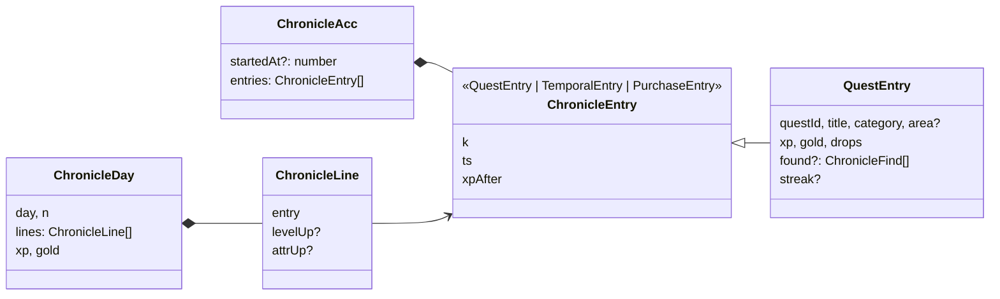

# Crónica del aventurero

Un **diario** con todo lo que has hecho, día a día: las quests completadas (con su recompensa, su racha y lo que encontraste por primera vez), los encargos cumplidos, las compras a Hu Tao, y lo que se deduce de leerlo en orden: **subidas de nivel** y de **atributo**. Se abre con la tecla `J` o la tarjeta «Chronicle» del menú de opciones ([../menu/README.md](../menu/README.md)).

Mismo marco que el almanaque (un libro abierto con lomo y páginas que se pasan), pero con estilo de **diario usado**: tapas de cuero rozado y cosido a mano, papel amarillento con renglones y margen rojo, manchas, cercos de taza, bordes comidos, alguna oreja doblada, una cinta de punto de lectura y letra de imprenta antigua (IM Fell English).

Sigue la convención del proyecto: **una carpeta por implementación** (`src/features/<nombre>/`).

---

## Requisitos

| # | Requisito (del propietario) | Cómo se cumple |
|---|---|---|
| R1 | Crónica del aventurero | Ventana `ChronicleModal` con todo lo apuntado, agrupado por días |
| R2 | Estilo parecido al almanaque | El mismo libro abierto (lomo, páginas, flechas, ←/→), con la misma estructura de ventana |
| R3 | Pero más de diario usado y un poco desgastado | Cuero rozado y cosido, papel viejo con renglones, manchas y cercos, borde comido, oreja doblada, cinta deshilachada y tinta a mano |

---

## Decisiones de diseño

### Se apunta en la proyección, cuando el evento cuenta

No hay eventos propios. La proyección añade una entrada (`record`) **solo cuando un evento pasa sus guardas**: un `quest_completed` válido, un `temporal_completed` que da su recompensa, un `gear_purchased` con oro suficiente o un fallo (`quest_failed`, `temporal_failed`: entrada `failed`, en tinta roja y sin XP ni oro, features/failure). Lo deshecho (features/undo) nunca se apunta: la proyección lo salta. Así la crónica no dice nada que no pasó, aunque lleguen eventos repetidos de otro dispositivo.

| Alternativa | Por qué no |
|---|---|
| Leer todos los eventos de SQLite al abrir la crónica | Habría que repetir las guardas de la proyección; con el snapshot, el store ya no tiene la lista de eventos |
| Guardar el nivel y los atributos en cada entrada | Se deducen leyendo en orden (`chronicleDays`): cada entrada guarda solo `xpAfter` |

Cada entrada **copia** lo que puede cambiar después: el título de la quest, su área, el nombre del objeto encontrado, el de la pieza comprada. Retirar una quest no borra su recuerdo. Es **retroactiva**: al actualizar la app, lo ya hecho aparece en la crónica.

Ocupa poco (unos 150 bytes por entrada; un año con cinco quests diarias son unos 270 KB en el snapshot).

### Las páginas

- La página 0 es la **portadilla**: título, rango y nivel, la fecha de comienzo y el resumen (días de aventura y con algo apuntado, quests, encargos, compras, mejor racha).
- Las demás se llenan con `paginate(days, lines, weigh)`: el encabezado de cada día, sus entradas y el total del día. Un día que no cabe sigue en la página siguiente («(sigue)») y el total nunca queda solo.
- Cuántos renglones caben se **mide** (`ResizeObserver` sobre el libro) y cada entrada pesa los renglones de su **texto ya escrito**, en el idioma de la interfaz (`textUnits`: un kana o un ideograma cuentan doble).
- Un diario se abre por **la última página escrita**.
- El desgaste de cada página sale de una semilla con su número: siempre igual para la misma página.

### Las frases

Cada tipo de entrada tiene varias frases («Completé…», «Hoy cayó…», «Por fin…»; las élite, «Vencí a…»), y se elige una con el `ts` de la entrada: siempre la misma. Las piezas de serie y las áreas conocidas se nombran en el idioma de la interfaz.

---

## Diagrama de clases

## Archivos

| Archivo | Contenido |
|---|---|
| `model.ts` | Entradas, `ChronicleAcc`, `noteStart`, `record`, `chronicleDays`, `chronicleTotals`, `paginate`, `blockWeight`, `textUnits`. Puro |
| `ui.ts` | Si la ventana está abierta (`openChronicle`, `chronicleBusy`) |
| `components/ChronicleModal.tsx` | El diario: portadilla, páginas, desgaste, frases y teclado |
| `components/DiaryIcon.tsx` | Icono del diario (el botón está en el menú, features/menu) |
| `chronicle.css`, `i18n.ts` | Estilos y textos es + ja |

## Puntos de integración

| Fuera de la carpeta | Cambio |
|---|---|
| `domain/types.ts` | `GameState.chronicle` |
| `domain/projection.ts` | `ProjectionAcc.chronicle`; `noteStart` en cada evento; `record` en `quest_completed`, `temporal_completed` y `gear_purchased` cuando cuentan |
| `features/snapshot/model.ts` | Un snapshot sin `chronicle` se descarta |
| `App.tsx` | Tecla `J`, `<ChronicleModal />` y el teclado del tablón espera mientras está abierta |
| `features/temporal/components/TemporalBoard.tsx` | Su teclado también espera con el mercader, el personaje o la crónica abiertos |
| `components/Header.tsx`, `components/Footer.tsx` | Botón del libro y tecla `J` |
| `styles/theme.css` | Tokens `--diary-*` |
| `package.json` | `@fontsource/im-fell-english` (solo el subconjunto latino; en japonés, el mincho del sistema) |
| `i18n/locales/{es,ja}.ts` | Montan `chronicle` |

## Teclado (ventana abierta)

| Tecla | Acción |
|---|---|
| `J` / `Esc` | Cerrar |
| `←` / `→` | Pasar página |
| `Home` / `End` | Portadilla / última página |

## Verificación

Hecho el 2026-10-02:

- **Tests** (`model.test.ts`): una entrada por quest completada (un duplicado no), encargo y compra con oro (sin oro no); objetos solo la primera vez; días locales numerados, subidas de nivel y de atributo; en historiales aleatorios, la XP de la crónica cuadra con la del jugador; ninguna página se pasa de renglones, no se pierde ninguna entrada y cada página empieza por un día.
- **Navegador**: con un historial de 14 días, la portadilla, las páginas por días, «(sigue)», el desgaste y la cinta; en japonés a 1.024 × 680 (ahí se vio que el japonés ocupa más y se pasó a medir el texto ya escrito). Un snapshot de la versión anterior se descarta y la crónica sale entera.

**No verificado:** la app nativa y Windows; el sonido de pasar página.

## Posibles mejoras

- Escribir notas propias en el diario (un evento `chronicle_noted`).
- Buscar por quest o por fecha; un índice por meses.
