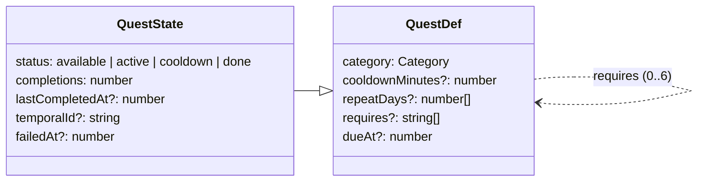

# Quests complejas

Una quest «compleja» tiene **reglas** además de objetivos:

- **Repetición:** tras completarla vuelve al tablón pasado un tiempo («cada 3 días») o **ciertos días de la semana** («lunes, miércoles y viernes»). Antes solo las de la categoría Repetible volvían; ahora **cualquier** quest puede hacerlo.
- **Requisitos:** otras quests que hay que completar antes de poder aceptarla («Hacer simulacros» pide «Repasar los temas»). Hasta entonces sale **con candado**.

Las dos reglas se combinan con los encargos temporales: un encargo puede crear sus quests **en cadena** (cada una requiere la anterior), ver [../temporal/README.md](../temporal/README.md).

Sigue la convención del proyecto: **una carpeta por implementación** (`src/features/<nombre>/`).

---

## Requisitos

| # | Requisito | Cómo se cumple |
|---|---|---|
| R1 | Una tarea que, al terminarla, se repita en 3 días | Repetición en cualquier categoría: `QuestDef.cooldownMinutes` + `recurs(q)`. En el formulario, opciones de siempre (1 h … 1 semana) o personalizada («cada N horas, días o semanas») |
| R2 | Una tarea que dependa de otra tarea creada | `QuestDef.requires` (ids). La quest no se puede aceptar hasta completar sus requisitos; la proyección lo garantiza |
| R3 | Que se vea qué falta | Candado en la tarjeta («Requiere «X»»), sección «Requisitos» en el detalle con ✓ / 🔒, y el botón «Bloqueada» |
| R4 | Que se note al cumplir el requisito | Aviso ««X» completada · desbloquea «Y»» al reportar |

---

## Decisiones de diseño

### Campos opcionales en `QuestDef`, sin eventos nuevos

Repetición y requisitos son **parte de la definición** de la quest, que es inmutable y viaja entera en `quest_created`. No hacen falta eventos nuevos: basta con dos campos opcionales.

| Campo | Tipo | Falta en los datos antiguos | Significado |
|---|---|---|---|
| `cooldownMinutes` | `number?` | En las de élite y encargo (no se repetían) | Minutos hasta que vuelve tras completarla |
| `requires` | `string[]?` | Siempre | Ids de las quests que hay que completar antes |

Como los datos antiguos no tienen `requires` y solo las repetibles tenían `cooldownMinutes`, **se proyectan exactamente igual**: no hace falta *upcaster* (comprobado, ver «Verificación»).

### Repetición: `recurs(q)`

```ts
recurs(q) = q.category === "repeat" || (q.cooldownMinutes ?? 0) > 0 || !!q.repeatDays?.length
```

`project()` usaba `q.category === "repeat"` para decidir si una quest completada pasa a `cooldown` o a `done`; ahora usa `recurs(q)`. Una repetible sin `cooldownMinutes` (datos raros) sigue volviendo al instante, como antes.

- La categoría sigue siendo una etiqueta (color, tabla de botín): una quest de élite que se repite cada semana es un «jefe semanal».
- En el formulario, la repetición sigue a la categoría hasta que se toca: Repetible propone 20 h; Élite y Encargo, «No se repite». Una repetible no tiene la opción «No se repite».
- Límites de la personalizada: de 1 hora a 1 año (`recurrenceMinutes`).
- **Una quest que se repite no tiene fecha límite** (tras la primera vuelta quedaría vencida para siempre): el formulario oculta ese campo. Ver [../horizon/README.md](../horizon/README.md).

### Repetición por días de la semana (`repeatDays`, 2026-10-06)

Para unir la planificación en el calendario, las quests se repiten también como los bloques de la agenda: «Gimnasio lunes, miércoles y viernes».

| Campo | Tipo | Significado |
|---|---|---|
| `repeatDays` | `number[]?` (0 = domingo … 6 = sábado) | Días en que vuelve. Si está, **manda sobre** `cooldownMinutes` |

- **Cuándo vuelve** (`returnsAt`): a medianoche del siguiente día de la lista, contando desde mañana (`nextRepeatDay`). Completada el lunes con «lunes y jueves», vuelve el jueves a las 0:00; completada el jueves, el lunes siguiente.
- **Racha** (features/streaks): dura hasta que acaba el siguiente día que toca (`streakUntil`). Si se salta un día que tocaba, se rompe.
- **En el calendario** sale cada día que toca, de hoy en adelante (el pasado no se sabe), tachada el día que se completó. En «Mi día», en «Toca hoy» (features/today).
- **Se crea disponible**, aunque hoy no toque: se puede hacer ya y vuelve el siguiente día de la lista.
- Al leer, `cleanRepeatDays` deja los días de 0 a 6, sin repetir y en orden; sin ninguno, el campo no está.
- En el formulario, «Ciertos días de la semana…» en el desplegable de repetición, con una chapa por día (de lunes a domingo). Con la quest en curso no se cambia (features/editing).

La proyección pasa `q.availableAt = returnsAt(q, e.ts)` y `nextStreak(…, streakUntil(q, e.ts))`; `PROJECTION_VERSION` pasa a 10.

### Requisitos: completada al menos una vez

```ts
requirementMet(id) = !quests.get(id) || quests.get(id).completions > 0 || quests.get(id).failedAt !== undefined
```

- Un requisito se cumple al **completar esa quest una vez**. Si es de las que vuelven, no hace falta que esté completada «ahora».
- Si el requisito **se retira del tablón** o **se fractura** (features/failure), deja de bloquear. Si no, la quest quedaría bloqueada para siempre.
- **Sin ciclos:** al crear, solo se pueden pedir quests que ya existen y aún no se han completado. Desde que se pueden **editar** (features/editing), el formulario no ofrece la propia quest ni las que ya dependen de ella (`requirementCandidates(…, forQuest)`) y la proyección quita los requisitos que cerrarían un círculo (`wouldCycle`).
- Como mucho 6 requisitos por quest (`MAX_REQUIRES`). Al leer, `cleanRequires()` quita duplicados, ids vacíos y la propia quest.

**Guarda en la proyección:** `quest_accepted` se ignora si faltan requisitos en ese momento de la reproducción (`prerequisitesMet(q, quests)`). Así, aunque otro dispositivo acepte una quest bloqueada sin conexión, el resultado al fusionar es el mismo en todos. La acción `acceptQuest` lo comprueba antes y avisa: «Bloqueada: antes completa «X»».

**Estado bloqueado, calculado:** no hay un estado `locked` guardado. Una quest está bloqueada si está `available` y le faltan requisitos (`isLocked`, `blockers`). Se recalcula con cada evento.

### Reglas que he fijado (ajustables)

- El requisito se cumple con **una** compleción, aunque sea una repetible.
- Retirar un requisito **desbloquea** las quests que lo pedían.
- Las quests que desbloquea una quest se ven en su detalle («Al completarla desbloquea …»).
- La tarjeta bloqueada se apaga y su pie dice qué falta en lugar del tipo.

---

## Diagrama de clases



`lastCompletedAt` (cuándo se completó por última vez) lo usan los encargos con quests enlazadas; `temporalId` y `dueAt`, los plazos.

---

## Funciones (`model.ts`, puro)

| Función | Qué hace |
|---|---|
| `recurs(q)` | ¿Vuelve al tablón tras completarla? |
| `recurrenceMinutes(n, unit)` / `splitMinutes(min)` | «Cada N unidades» ↔ minutos, con límites |
| `cleanRequires(def)` | Normaliza `requires` al leer |
| `requirementMet(id, quests)` / `prerequisitesMet(q, quests)` | ¿Se cumple un requisito / todos? |
| `blockers(q, quests)` | Requisitos que aún bloquean, en orden |
| `isLocked(q, quests)` | Disponible pero bloqueada |
| `dependents(id, quests)` | Quests que piden esta |
| `unlockedBetween(antes, después)` | Quests que se acaban de desbloquear (para el aviso) |
| `requirementCandidates(quests, forQuest?)` | Quests que pueden ser requisito (al editar, sin ella ni las que dependen de ella) |
| `wouldCycle(questId, requireId, quests)` | ¿Pedir ese requisito cerraría un círculo? |
| `cleanRepeatDays(days)` | Normaliza `repeatDays` al leer |
| `nextRepeatDay(ms, days)` / `returnsAt(q, ts)` | Cuándo vuelve: siguiente día de la lista o tras su espera |
| `streakUntil(q, ts)` | Fin de la racha de las que se repiten por días |
| `repeatsOnWeekday(q, wd)` | ¿Toca ese día de la semana? |

---

## Estructura de la carpeta

```
src/features/complex/
├── README.md                         este documento
├── index.ts                          API pública para la interfaz
├── model.ts                          funciones puras (lo único que importa el dominio)
├── i18n.ts                           textos es / ja
├── complex.css                       estilos (formulario, detalle y tarjeta bloqueada)
└── components/
    ├── RecurrenceField.tsx             repetición en el formulario de quest
    ├── RequiresField.tsx               requisitos en el formulario de quest
    └── QuestRequirements.tsx           requisitos y desbloqueos en el detalle; LockIcon
```

No tiene `events.ts`, `legacy.ts` ni `actions.ts`: no añade eventos ni cambia datos guardados, y la comprobación al aceptar vive en `store/actions.ts`.

### Puntos de integración

| Archivo | Cambio |
|---|---|
| `src/domain/types.ts` | `QuestDef.requires`, comentario de `cooldownMinutes`; `QuestState.lastCompletedAt` |
| `src/domain/projection.ts` | `cleanRequires` al crear; guarda de requisitos en `quest_accepted`; `recurs(q)` y `lastCompletedAt` en `quest_completed` |
| `src/store/actions.ts` | `acceptQuest` avisa si está bloqueada; `reportQuest` avisa de lo que desbloquea |
| `src/components/CreateQuestModal.tsx` | `<RecurrenceField>` (sustituye al selector de espera) y `<RequiresField>` |
| `src/components/QuestCard.tsx` | `↻` en las que se repiten sin ser repetibles; tarjeta bloqueada con candado |
| `src/components/QuestDetail.tsx` | «Reaparece tras…» con `recurs`; sección «Requisitos»; botón «Bloqueada» |
| `src/App.tsx` | Pasa `blockers(q)` a cada tarjeta |
| `src/i18n/locales/{es,ja}.ts` | Montan `complex`; se quita `modal.cooldown` (ahora `complex.recurrence.labelRepeat`) |

---

## Verificación

Hecho el 2026-10-02 con `pnpm dev` en Chromium (Playwright).

- **Tipos y build:** `npx tsc --noEmit` y `pnpm build` correctos.
- **Dominio** (importando los módulos puros con marcas de tiempo fijas, en Madrid, Tokio y Ciudad de México): `recurs` en las cuatro combinaciones; `recurrenceMinutes` y `splitMinutes` con límites; un encargo con repetición de 3 días pasa a `cooldown` con `availableAt` exacto, sigue en espera 1 ms antes y vuelve justo a los 3 días; aceptarlo antes de tiempo se ignora; sin repetición acaba en `done`; `cleanRequires`; una quest bloqueada no se acepta y sí tras completar el requisito; `blockers`, `dependents`, `unlockedBetween`; un requisito retirado deja de bloquear; un requisito repetible basta con una vez.
- **Datos antiguos:** 32 eventos generados con la versión anterior (sembrado, aceptar, progresar, reportar con botín, repetible en espera, encargos cumplido y pendiente) se proyectan **idénticos** (jugador, quests, estados, esperas, encargos).
- **Interfaz:** formulario con repetición personalizada «cada 3 días» en un encargo (se guarda `cooldownMinutes: 4320` y al completarla vuelve en 3 días); requisito elegido en el desplegable; tarjeta con candado y «Requiere «Recado del Mercado»»; `Enter` sobre ella avisa «Bloqueada: antes completa…»; al completar el requisito, aviso de desbloqueo; japonés y ventana de 1.024 px.

**No verificado:** la app nativa (`pnpm tauri dev`), Windows, y escuchar los sonidos.

**Repetición por días (2026-10-06):** tests en `model.test.ts` (limpieza, siguiente día, fin de la racha, vuelta en la proyección con racha de 2) y en `features/today/model.test.ts` (salen cada día que tocan en el calendario); en el navegador, una quest de élite editada para repetirse martes y jueves sale en «Toca hoy» y el jueves en la semana.

---

## Posibles mejoras

- ~~Editar quests~~: hecho en features/editing (`quest_updated`).
- Requisito «completada N veces» o «en curso» en lugar de «una vez».
- Ver la cadena completa como un pequeño mapa de quests.
