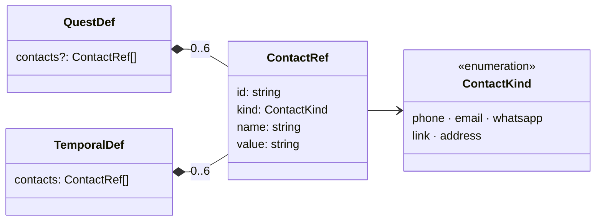

# Contactos

Una quest (o un encargo) puede llevar **a quién llamar o escribir, o dónde ir**: «Llamar al dentista» con su teléfono, «Entregar el TFG» con el correo del tutor, «Examen» con la dirección del aula. En el formulario, un **desplegable** elige qué se añade (teléfono, correo, WhatsApp, enlace o dirección); en el detalle, cada contacto lleva un botón para **llamar, escribir, abrir o ver cómo llegar**, y otro para copiarlo.

Sigue la convención del proyecto: **una carpeta por implementación** (`src/features/<nombre>/`).

---

## Requisitos

| # | Requisito | Cómo se cumple |
|---|---|---|
| R1 | En una quest, un desplegable para añadir un contacto, un correo, etc. | `ContactsField`: un `<select>` «+ Añadir contacto…» con los cinco tipos y una fila por contacto (a quién y el dato) |
| R2 | Poder agendar una llamada a alguien | La quest (con su fecha límite, `features/horizon`) lleva el teléfono; en el detalle, «Llamar» abre la app de Teléfono (o FaceTime en el Mac) |
| R3 | Que funcione igual en el Mac, Windows y el iPhone | `tauri-plugin-opener` (también en iOS) con permiso solo para `tel:`, `mailto:` y `https:` |

---

## Decisiones de diseño

### Escritos a mano

El propietario eligió escribirlos a mano (no elegirlos de la agenda del sistema). Así funciona igual en todos los equipos, no pide permisos de Contactos y no hace falta código nativo. Elegir de la agenda del iPhone (`CNContactPickerViewController`, que no pide permiso) queda como posible mejora.

### Tipos

| Tipo | Dato | Botón | Abre |
|---|---|---|---|
| `phone` | Teléfono, con o sin prefijo | Llamar | `tel:+34600123456` (solo cifras y el `+`) |
| `email` | Correo | Escribir | `mailto:` |
| `whatsapp` | Teléfono **con prefijo del país** | WhatsApp | `https://wa.me/34600123456` (sin `+` ni espacios) |
| `link` | Web, con o sin `https://` | Abrir | `https://…` (un `http://` se abre como `https://`) |
| `address` | Dirección libre | Cómo llegar | `https://maps.apple.com/?q=…`: Mapas en el Mac y el iPhone, la web de Apple Maps en Windows |

- **Validación suave:** el formulario avisa si el dato no parece lo que es («No parece un teléfono: no se podrá llamar»), pero no impide guardar: puede ser una nota. Un dato que no sirve se guarda igual y **no lleva botón**, solo el de copiar.
- **Nada de otros esquemas:** un enlace solo puede ser web (`javascript:`, `file:`… no pasan `contactValid`), y `contactHref` solo produce `tel:`, `mailto:` y `https:`, lo mismo que permite la capability. Hay un test que lo comprueba para los cinco tipos.
- **Copiar:** `navigator.clipboard` y, si el WebView no da permiso, el `execCommand("copy")` de siempre. Aviso «copiado» o «No se pudo copiar».

### Dentro de la definición, sin eventos propios

Los contactos van en `QuestDef.contacts` y `TemporalDef.contacts`: viajan en `quest_created` / `temporal_created` como el resto de la definición (norma 5.1) y se sincronizan con ella.

- **Quests:** `QuestDef` es inmutable (aún no hay `quest_updated`), así que los contactos de una quest se ponen al crearla.
- **Encargos:** se editan con el resto del encargo; `temporal_updated` lleva la lista entera en el parche cuando cambia (quitarlos todos es `contacts: []`, no un campo ausente, que el JSON perdería).
- **Al leer** (`cleanContacts`, en la proyección y en `normalize()` de los encargos): sin ids repetidos ni tipos desconocidos, sin datos vacíos, recortados (60 caracteres el nombre, 200 el dato) y como mucho 6. Una quest sin contactos no tiene el campo; un encargo tiene `[]`.
- **Datos antiguos:** no traen `contacts` y se leen como «sin contactos». No hace falta *upcaster* ni subir `PROJECTION_VERSION`: el resultado de los eventos guardados no cambia.

### Abrirlos: `tauri-plugin-opener`

El crate `open` que ya usa la sincronización no sirve en iOS (lanza el programa `uiopen`, que no existe dentro de una app). El plugin oficial `tauri-plugin-opener` abre la URL con el sistema en macOS, Windows e iOS. Se concede **solo** `opener:allow-open-url` con tres esquemas (`tel:*`, `mailto:*`, `https://*`), no `opener:default` (que además deja revelar archivos). En el navegador de desarrollo (`pnpm dev`), `https:` se abre en otra pestaña y `tel:` / `mailto:` con `location.href`. La CSP no cambia: abrir una URL va por IPC, no la carga el WebView.

---

## Diagrama de clases

---

## Archivos

| Archivo | Contenido |
|---|---|
| `model.ts` | Tipos, `contactValid`, `contactHref` y `cleanContacts`. Puro: lo importan el dominio y `features/temporal/model.ts` |
| `actions.ts` | `openContact` (plugin opener o la web) y `copyContact` |
| `i18n.ts` | Textos es + ja |
| `contacts.css` | Estilos (también sobre el pergamino de los encargos y en el teléfono) |
| `components/ContactsField.tsx` | El desplegable y las filas del formulario |
| `components/ContactList.tsx` | Los contactos con sus botones (detalle de la quest y cartel abierto) |
| `components/ContactIcon.tsx` | Icono de cada tipo |
| `model.test.ts` | Validación, enlaces, limpieza y proyección |

## Puntos de integración

| Fuera de la carpeta | Cambio |
|---|---|
| `domain/types.ts` | `QuestDef.contacts?` |
| `domain/projection.ts` | `quest_created` limpia los contactos (`cleanContacts`) |
| `features/temporal/model.ts` | `TemporalDef.contacts` y `normalize()` |
| `features/temporal/actions.ts` | `TemporalDraft.contacts`; se guardan limpios y entran en el parche al editar |
| `components/CreateQuestModal.tsx` | `<ContactsField>` tras la fecha límite |
| `components/QuestDetail.tsx` | Sección «Contact · Contactos» con `<ContactList>` |
| `components/QuestCard.tsx` | Icono del primer contacto junto al plazo |
| `features/temporal/components/TemporalForm.tsx` y `PosterView.tsx` | El campo en el formulario del encargo y la lista en el cartel abierto (`.pv-contacts`) |
| `i18n/locales/{es,ja}.ts` | Montan `contacts` |
| `src-tauri/Cargo.toml`, `src/lib.rs`, `capabilities/default.json` | `tauri-plugin-opener`, su registro y el permiso acotado |
| `package.json` | `@tauri-apps/plugin-opener` |
| `test/streams.ts` | `randomStream` crea quests con contactos (también repetidos, vacíos y de un tipo desconocido) |

---

## Verificación

Hecho el 2026-10-03.

- **Tests:** validación de los cinco tipos (también `javascript:` y `file:`), enlaces que solo son `tel:`, `mailto:` o `https:`, limpieza al leer, proyección (quest con contactos limpios, sin campo si no hay, encargo antiguo con `[]`) y, con el store, un encargo que guarda sus contactos limpios y quitarlos todos emite `contacts: []`.
- **Rust:** `cargo check` con el plugin y la capability (`tauri-build` valida el permiso al compilar).
- **Navegador** (`pnpm dev`, 800 × 600 y 402 × 874): quest «Llamar al dentista» con teléfono y correo (aviso con un correo incompleto), detalle con «Llamar» y «Escribir», icono en la tarjeta, copiar (con el portapapeles de reserva, porque el panel de pruebas no da permiso), dirección en un encargo con «Cómo llegar» sobre el pergamino, formulario y detalle en el teléfono.

**No verificado:** abrir de verdad Teléfono, Mail, WhatsApp o Mapas (en la app nativa de macOS, en Windows y en el iPhone); el portapapeles en el WKWebView; el japonés de esta pantalla (los textos están, sin revisar en pantalla).
