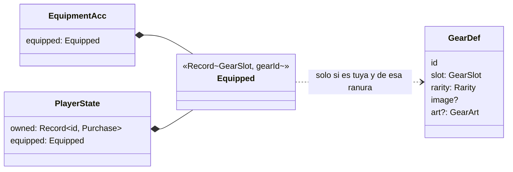

# Personaje: el muñeco, su equipo y la decoración del menú

Lo que se compra al mercader ([src/features/merchant/README.md](../merchant/README.md)) se usa aquí. La ventana **Personaje** (tecla `P`) tiene un **muñeco que te representa**, con ocho ranuras de armadura alrededor, las dos ranuras de **decoración del menú** debajo y, a la derecha, los **atributos** ([src/features/attributes/README.md](../attributes/README.md)). Al elegir una ranura, el panel de la derecha pasa a ser el **armario** de esa ranura: lo que tienes para ella, para ponértelo o quitártelo.

Sigue la convención del proyecto: **una carpeta por implementación** (`src/features/<nombre>/`).

---

## Requisitos

| # | Requisito (del propietario) | Cómo se cumple |
|---|---|---|
| R1 | Las armaduras se usan en un muñequito que te represente | `Doll`: un muñeco en SVG que se pone cada pieza en su sitio, con el color de su rareza |
| R2 | El muñeco va junto al menú de atributos | Ventana `CharacterModal`: muñeco y ranuras a la izquierda, atributos a la derecha |
| R3 | Lo que se compra puede ser decoración del menú | Ranuras de fondo y emblema; el fondo se pinta detrás de toda la app y el emblema, en el rombo de la cabecera |

---

## Decisiones de diseño

### Ponerse algo es un evento

`gear_equipped` y `gear_unequipped` se sincronizarán con los demás eventos: el muñeco y el menú se verán igual en todos los equipos. Solo se puede poner lo que es tuyo (`owned`), cada pieza va en su ranura y ponerte otra quita la anterior (no hace falta un `gear_unequipped`).

Si una pieza puesta se retira del catálogo o cambia de ranura al editarla, deja de estar puesta: `pruneEquipment` se aplica después de cada `gear_updated` y `gear_deleted`.

### Un muñeco dibujado, no las imágenes de las piezas encima

Cada ranura tiene una **forma** sobre el muñeco (yelmo, coraza con hombreras, guanteletes, botas, espada, escudo, capa y amuleto) que se pinta con el **color de su rareza** y un brillo metálico común (un degradado de luz arriba y sombra abajo). De épico para arriba lleva filo dorado; mítico y legendario brillan, y lo legendario late.

| Alternativa | Por qué no |
|---|---|
| Pegar la imagen de cada pieza sobre el cuerpo | Las imágenes las sube el usuario, de cualquier estilo, tamaño y encuadre: un PNG sin recortar taparía medio muñeco |
| Pedir imágenes con una plantilla (capas de un *paper doll*) | Añadir mercancía dejaría de ser fácil (R5 del mercader) |

La imagen de la pieza se ve en su **ranura**, junto al muñeco, y en el armario.

Al pasar el ratón por una ranura vacía, el muñeco dibuja el **contorno** de dónde iría la pieza; si está llena, la pieza brilla. Al ponértela, cae con un pequeño golpe (muelle de Motion). El muñeco respira despacio (CSS), salvo con «reducir movimiento».

### Prestigio

La cabecera de la ventana muestra el **prestigio**: la suma de estrellas de rareza de todo lo que llevas puesto (1 común … 6 legendario; como máximo 60). Se calcula, no se guarda (`prestige`).

### Decoración del menú

- **Fondo** (`Backdrop`, en lugar del `
` de `App`): la imagen grande del almacén de binarios, a pantalla completa y oscurecida para que el tablón se siga leyendo. Mientras carga, o si este equipo no tiene el archivo (en la fase 2 la referencia puede llegar antes), usa el icono difuminado.
- **Emblema** (`DecorEmblem`, en lugar de `<Emblem />` en la cabecera): la imagen recortada en rombo dentro del marco dorado, con el filo del color de su rareza.

### Estado de interfaz propio

`ui.ts` guarda si la ventana está abierta y qué ranura está elegida. No es estado de juego: no genera eventos (igual que `features/temporal/ui.ts`).

---

## Diagrama de clases

---

## Eventos

| Evento | Datos | Efecto en la proyección | Guarda |
|---|---|---|---|
| `gear_equipped` | `gearId` | La pone en su ranura (y quita la que hubiera) | Solo si la pieza existe y es tuya |
| `gear_unequipped` | `slot` | Vacía la ranura | Solo con una ranura que exista |
| `gear_updated` / `gear_deleted` (del mercader) | — | Quita lo que ya no se puede llevar (`pruneEquipment`) | — |

Son eventos nuevos, sin datos antiguos que convertir. `PROJECTION_VERSION` pasa a 2 por ellos y por los del mercader.

---

## Teclado (ventana abierta)

| Tecla | Acción |
|---|---|
| `P` | Abrir (desde los tablones) o cerrar |
| `↑` / `↓` | Ranura anterior o siguiente (izquierda, derecha y decoración) |
| `←` / `→` | Saltar a la otra columna, a la misma altura |
| `Esc` | Volver a los atributos; si no, cerrar |

---

## Archivos

| Archivo | Contenido |
|---|---|
| `model.ts` | `EquipmentAcc`, `applyEquipmentEvent`, `pruneEquipment`, `wornIn`, `prestige`. Puro |
| `events.ts` | `EquipmentEventBody` |
| `actions.ts` | `equipGear`, `unequipSlot` |
| `ui.ts` | Estado de la ventana (abierta, ranura elegida) |
| `useBlobUrl.ts` | URL de un binario del almacén (la imagen del fondo) |
| `i18n.ts` | Textos es + ja |
| `equipment.css` | Estilos propios: ventana, ranuras, muñeco, armario, fondo y emblema |
| `components/CharacterModal.tsx` | La ventana: ranuras, muñeco, decoración, armario y atributos |
| `components/Doll.tsx` | El muñeco y la forma de cada pieza |
| `components/Decor.tsx` | `Backdrop` (fondo de la app) y `DecorEmblem` (emblema de la cabecera) |
| `components/CharacterButton.tsx` | Botón del yelmo en la cabecera (y su icono, en el pie) |

## Puntos de integración

| Fuera de la carpeta | Cambio |
|---|---|
| `domain/types.ts` | `PlayerState.equipped` |
| `domain/events.ts` | `EquipmentEventBody` en la unión |
| `domain/projection.ts` | `ProjectionAcc.equipment`; `case` de sus dos eventos y `pruneEquipment` tras editar o retirar una pieza |
| `i18n/locales/{es,ja}.ts` | Montan `equipment` |
| `styles/theme.css` | Tokens del muñeco: `--doll-skin`, `--doll-skin-lo`, `--doll-cloth`, `--doll-cloth-lo` y `--doll-hair` |
| `components/Header.tsx` | `DecorEmblem` alrededor del emblema y el botón del yelmo junto al nivel |
| `components/Footer.tsx` | Tecla `P` |
| `App.tsx` | Tecla `P`, `<CharacterModal />`, `<Backdrop />` y el teclado del tablón espera mientras está abierta |
| `test/streams.ts` | Los eventos del equipo en `randomStream` |

---

## Verificación

Hecho el 2026-10-02:

- **Tests**: `model.test.ts` (solo lo tuyo y en su ranura, sustituir, quitar, la decoración igual que la armadura, retirar o cambiar de ranura quita lo puesto, prestigio) y `features/merchant/actions.test.ts` con el store de verdad (no te pones lo que no has comprado, ponérselo dos veces no emite otro evento, lo puesto sobrevive a cerrar y abrir). En `domain/projection.test.ts`, el invariante: solo llevas puesto lo que existe, es tuyo y es de esa ranura.
- **Navegador** (`pnpm dev`, 1280 × 780): las diez ranuras equipadas desde el armario, una a una; el muñeco con las ocho piezas de seis rarezas distintas; el contorno de una ranura vacía al pasar el ratón; el prestigio (39); el fondo comprado detrás del tablón y el emblema en la cabecera; el armario vacío con «Ir al mercader»; la ventana en japonés.

**No verificado:** la app nativa y Windows; el fondo leído de la tabla `blobs` de SQLite; cómo se ve el muñeco con «reducir movimiento» (está en el CSS, no se ha simulado).

## Posibles mejoras

- Que el muñeco se parezca más a ti: color de pelo y de piel, peinado.
- Variantes de forma por pieza (no solo por ranura), elegidas en el formulario.
- Más decoración del menú: marco de las tarjetas, estandarte de la cabecera.
