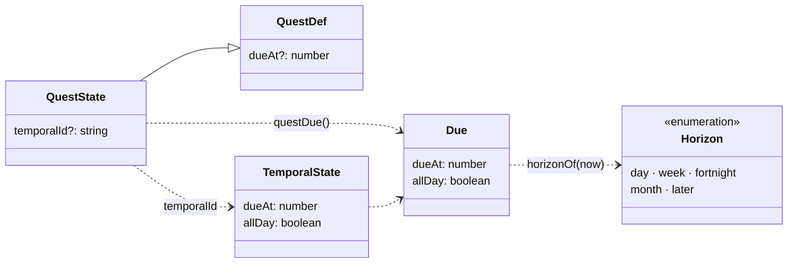

# Plazos

Clasifica las quests y los encargos temporales según **cuánto falta para su fecha**, con un filtro en cada tablón:

| Plazo | Etiqueta (es · ja) | Días naturales que faltan | Color |
|---|---|---|---|
| `day` | 1 día · 残り1日 | Hoy, mañana o **vencido** | Rojo (`--elite`) |
| `week` | 7 días · 7日以内 | De 2 a 7 | Oro (`--gold`) |
| `fortnight` | 2 semanas · 2週間 | De 8 a 14 | Verde (`--request`) |
| `month` | 1 mes · 1か月 | De 15 a 30 | Cian (`--stamp`) |
| `later` | +1 mes · 1か月以上 | Más de 30 | Violeta (`--repeat`) |
| `none` | Sin fecha · 期限なし | Sin fecha (solo quests) | Gris |

Cada opción del filtro muestra cuántos hay. La tecla `H` pasa al siguiente plazo (`Shift+H`, al anterior).

**Solo un filtro (2026-10-06).** La planificación se hace en el calendario (features/calendar y features/today: Mi día, semana y día). Los plazos se quedan como filtro de los dos tablones y como atajos de la fecha límite en el formulario; no hay más vistas por plazo.

Sigue la convención del proyecto: **una carpeta por implementación** (`src/features/<nombre>/`).

---

## Requisitos

| # | Requisito | Cómo se cumple |
|---|---|---|
| R1 | Clasificar el tablón de encargos y el de quests en «próximos 7 días», «1 día restante», «dos semanas» y «más de un mes» | `horizonOf(due, now)` y `<HorizonFilter>` en los dos tablones |
| R2 | Que las quests tengan fecha para poder clasificarlas | `QuestDef.dueAt` (fecha límite opcional, todo el día) y la fecha del encargo al que pertenezca |
| R3 | Que la clasificación cambie sola con el tiempo | Se calcula con `now`: no se guarda ni genera eventos |

---

## Decisiones de diseño

### Plazos excluyentes y sin huecos

Cada fecha cae en **un solo** plazo, así los contadores suman el total. Los cuatro plazos pedidos dejaban un hueco entre «dos semanas» y «más de un mes», así que **añadí «1 mes» (de 15 a 30 días)**. Lo vencido va en «1 día»: es lo que pide atención ya, y el cartel o la tarjeta lo marcan aparte («Vencida», «Hace 2 días»).

Se cuentan **días naturales** con `daysUntil` (de `features/temporal/model.ts`), igual que la urgencia de los encargos: «mañana a las 9:00» es 1 día aunque falten 20 horas, y el cambio de hora no descuadra la cuenta.

### El plazo se calcula, no se guarda

`horizonOf({ dueAt, allDay }, now)` es una función pura. Nada de esto genera eventos (norma 5.2): una quest con fecha dentro de 10 días está en «2 semanas» hoy y pasará sola a «7 días» dentro de 3.

### La fecha de una quest

| Origen | Cuál cuenta |
|---|---|
| Fecha límite propia (`QuestDef.dueAt`) | Medianoche local del día elegido; vence al acabar ese día |
| Encargo temporal pendiente al que pertenece (`QuestState.temporalId`) | La fecha (y hora) del encargo |
| Las dos | La que llegue antes (si caen el mismo día, la del encargo, que tiene hora) |
| Ninguna | «Sin fecha» |

`questDue(q, temporals)` lo resuelve. Una quest completada del todo (`done`) ya no tiene plazo.

- **Formulario de quest:** «Sin fecha», los atajos de los plazos (1 día, 7 días, 2 semanas, 1 mes) u «Otra fecha» con un selector de día. El atajo calcula la medianoche de dentro de N días (`deadlineIn`), respetando el cambio de hora.
- **Las que se repiten no tienen fecha límite:** tras la primera vuelta quedaría vencida para siempre, así que el campo se oculta. Si pertenecen a un encargo, toman su fecha.
- `QuestDef` es inmutable: la fecha límite no se puede cambiar después (como el resto de la quest, hasta que exista `quest_updated`). La de un encargo sí: se edita en el encargo y la quest la sigue.

### Filtro por tablón, estado de interfaz propio

El plazo elegido en cada tablón vive en `ui.ts` (`useHorizonUi`, un store de Zustand de la funcionalidad), no en `store/game.ts`. No se guarda.

- **Quest Board:** fila fina bajo las pestañas de categoría; el número va en una chapa sobre la esquina para que quepa en la columna (unos 400 px). Se combina con la categoría: los contadores cuentan las quests de la pestaña elegida.
- **Tablón de encargos:** chapas oscuras sobre la madera bajo el título; la elegida, de pergamino. Solo cuenta los pendientes; los cumplidos («Ver cumplidos») solo salen en «Todo», y al pulsar «Ver cumplidos» el filtro vuelve a «Todo».
- Al crear una quest o un encargo, o al saltar de un tablón a otro (desde el cartel o desde un requisito), el filtro vuelve a «Todo» para que lo elegido no quede oculto.

### En las tarjetas

La tarjeta de una quest con fecha lleva su plazo junto a la categoría, con el color del plazo: «Mañana», «En 12 días», «Vencida» (en rojo lleno). Si la fecha viene de un encargo, lleva una calavera delante. El detalle añade «Plazo: mar, 14 oct (En 12 días)».

---

## Diagrama de clases



---

## Funciones (`model.ts`, puro)

| Función | Qué hace |
|---|---|
| `horizonOf(due, now)` | Plazo de una fecha (`none` sin fecha) |
| `isOverdue(due, now)` | Vencida (las de todo el día, al acabar su día) |
| `matchesHorizon(filtro, due, now)` | ¿Entra en el filtro? |
| `countHorizons(lista, dueOf, now)` | Contadores del filtro |
| `questDue(q, temporals)` | Fecha de una quest: propia o de su encargo |
| `deadlineIn(días, now)` | Medianoche local de dentro de N días |
| `filtersFor(conSinFecha)` | Opciones del filtro, en orden |

`format.ts` (usa i18n) da la etiqueta corta («Mañana», «En 5 días») y la fecha («mar, 14 oct · 10:00»).

---

## Estructura de la carpeta

```
src/features/horizon/
├── README.md                    este documento
├── index.ts                     API pública para la interfaz
├── model.ts                     funciones puras
├── format.ts                    etiquetas y fechas en el idioma activo
├── ui.ts                        plazo elegido en cada tablón (Zustand) y tecla H
├── i18n.ts                      textos es / ja
├── horizon.css                  filtro, etiqueta de plazo y campo de fecha
└── components/
    ├── HorizonFilter.tsx          filtro con contadores (los dos tablones)
    ├── DueChip.tsx                plazo en la tarjeta de quest
    └── DeadlineField.tsx          fecha límite en el formulario de quest
```

Sin eventos ni `legacy.ts`: `dueAt` es un campo opcional nuevo y los datos antiguos salen «Sin fecha».

### Puntos de integración

| Archivo | Cambio |
|---|---|
| `src/domain/types.ts` | `QuestDef.dueAt`; `QuestState.temporalId` (calculado) |
| `src/domain/projection.ts` | `dueAt` tolerante al crear; `temporalId` de cada quest al final |
| `src/App.tsx` | Filtro y contadores del Quest Board; tecla `H` (común a los dos tablones) |
| `src/components/QuestCard.tsx` | `<DueChip>` en la cabecera de la tarjeta (`.card-tagline`) |
| `src/components/QuestDetail.tsx` | «Plazo: …» arriba a la derecha |
| `src/components/CreateQuestModal.tsx` | `<DeadlineField>`; el filtro vuelve a «Todo» al publicar |
| `src/components/Footer.tsx` | Tecla `H` en los dos pies |
| `src/features/temporal/components/TemporalBoard.tsx` | Filtro y contadores del tablón de encargos |
| `src/styles/app.css` | `.card-tagline`; pie más compacto por debajo de 1.180 px |
| `src/i18n/locales/{es,ja}.ts` | Montan `horizon` |

---

## Verificación

Hecho el 2026-10-02 con `pnpm dev` en Chromium (Playwright).

- **Dominio** (marcas de tiempo fijas, en Madrid, Tokio y Ciudad de México): los bordes de cada plazo (hoy ya pasado, ayer de todo el día, mañana a las 23:59, 2, 7, 8, 14, 15, 30 —cruzando el cambio de hora del 25 de octubre— y 31 días), `isOverdue`, `deadlineIn` al cruzar el cambio de hora, `questDue` (propia, del encargo, la más temprana, mismo día, encargo cumplido, quest completada), `countHorizons` y `filtersFor`.
- **Interfaz:** filtro del Quest Board con quests de todos los plazos (contadores correctos, «7 días» deja solo la de 7 días), tecla `H` en los dos tablones, filtro del tablón de encargos («1 día» deja «Dentista» y «Cumpleaños»), fecha límite «7 días» en el formulario, etiquetas «Mañana» / «En 12 días» / «Vencida» y calavera en las de un encargo, japonés y ventana mínima de 1.024 px (el filtro cabe; en el pie se oculta la pista de las flechas).

**No verificado:** la app nativa (`pnpm tauri dev`) y Windows.

---

## Posibles mejoras

- Ordenar el tablón por fecha al filtrar por plazo.
- Plazo «esta semana» / «este mes» por calendario, además de por días que faltan.
- Fecha límite que se renueve con cada vuelta en las quests que se repiten.
