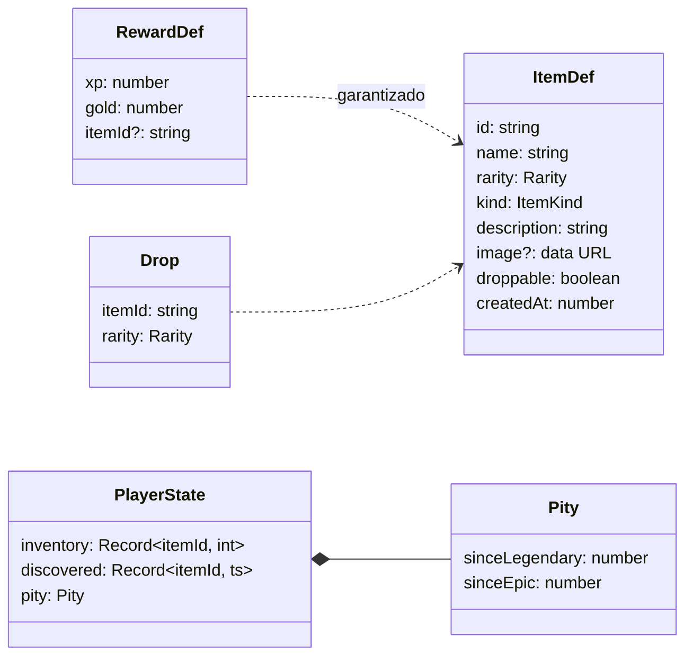

# Objetos

Los objetos son **entidades del almanaque** (`ItemDef`) con nombre, imagen, rareza, tipo y descripción, creadas desde la app. Al completar una quest, el jugador recibe su **objeto garantizado** (si tiene) y un **botín aleatorio** con probabilidades por rareza al estilo de Genshin Impact, que sale de un **cofre** con una celebración que crece con la rareza. Lo conseguido va al **inventario**; el **almanaque** es un libro de cromos con todo lo que se puede conseguir, un libro por tipo. Se abre con la tecla `I` o la tarjeta «Collection» del [menú](../menu/README.md).

## Qué hace

| # | Requisito | Cómo se cumple |
|---|---|---|
| R1 | El objeto es una entidad propia, no un texto | `ItemDef` + eventos `item_created` / `item_updated` / `item_deleted` |
| R2 | Seis rarezas: común, poco común, raro, épico, mítico y legendario | `RARITIES` (de menor a mayor) y `RARITY_META` (estrellas 1–6, color, etiqueta) |
| R3 | Colores gris, verde, azul, morado, rojo y dorado | Tokens `--r-common` … `--r-legendary` |
| R4 | El color es el fondo del objeto y el de la letra al pasar el ratón | `.iart` (degradado con `--rc`) y `.itile:hover .itile-name` |
| R5 | El jugador tiene inventario | `PlayerState.inventory` (unidades por id), calculado por la proyección |
| R6 | Almanaque para consultar los objetos, como colección de cromos | Ventana «Objetos»: pestañas Inventario, Almanaque y Probabilidades |
| R7 | Los objetos se crean desde la app | Formulario en el panel derecho del almanaque (`ItemForm`) |
| R8 | Probabilidades por rareza como en Genshin; élite mejora el botín | `DROP_TABLES` + pity (`PITY_RULES`); `dropTableFor(category)`: élite = tabla mejorada y 2 tiradas |

## Reglas y decisiones

### Probabilidades y pity

De Genshin se toman los dos extremos conocidos: **legendario 0,6 %** y **épico o superior ~9 %**.

| Rareza | Estrellas | Encargos y repetibles | Élite |
|---|---|---|---|
| Legendario | ★★★★★★ | 0,6 % | 2 % |
| Mítico | ★★★★★ | 2,4 % | 6 % |
| Épico | ★★★★ | 6 % | 12 % |
| Raro | ★★★ | 13 % | 20 % |
| Poco común | ★★ | 28 % | 30 % |
| Común | ★ | 50 % | 30 % |
| **Tiradas por quest** | | **1** | **2** |

- **Legendario:** desde la tirada 74 sin legendario, su probabilidad sube un 6 % por tirada; la 90 lo garantiza (de media, cada 62,3 tiradas con la tabla estándar).
- **Épico o superior:** garantizado cada 10 tiradas.
- El pity es **común a las dos tablas** y solo cuenta tiradas aleatorias, no los garantizados.
- **Si no hay objetos de la rareza que sale**, cae uno de la rareza inferior más cercana (o, si no hay, de la superior). Si ninguno sale en drops, no hay botín.

### El azar vive en la acción; el resultado, en el evento

`reportQuest` tira los dados y guarda el resultado en `quest_completed.drops`; la proyección solo lo lee, así que es determinista y todos los equipos calculan el mismo inventario y el mismo pity. Los drops **no son un evento aparte** para heredar la guarda de `quest_completed`: si dos equipos completan la misma quest sin conexión, la segunda se ignora con su botín. Cada drop copia su **rareza**: editar después la rareza del objeto no cambia el pity ya calculado ([ADR-09](../../../docs/decisions/ADR-09-drops-en-el-evento.md)).

### Imagen dentro del evento

La imagen se reduce en el navegador a **160 px** (`image.ts`) y se guarda como *data URL* WebP (PNG si el WebView no codifica WebP) dentro de `item_created` / `item_updated`: de 3 a 30 KB. Sin imagen se pinta un **monograma** sobre el fondo de la rareza ([ADR-10](../../../docs/decisions/ADR-10-imagen-en-el-evento.md)).

### Edición por campos y retirada

- `item_updated` lleva solo los campos que cambian (`patch`): dos equipos que editan campos distintos no se pisan.
- `item_deleted` quita el objeto del almanaque y del inventario. El id queda retirado: no lo resucita un `item_created` repetido. Las quests que lo daban como garantizado dejan de darlo.

### Coleccionables: se tienen o no se tienen

Los objetos que **salen en los cofres** (`droppable`) son **coleccionables** (`isCollectible`) ([ADR-36](../../../docs/decisions/ADR-36-coleccionables-unicos.md)):

- Solo se tiene **uno**. Un repetido (en un cofre o como garantizado) **se quema**: no suma, pero la tirada cuenta para el pity. En el cofre se ve apagado: «Repetido · se quema».
- Si un objeto pasa a salir en los cofres, sus repetidos desaparecen en ese momento.
- Los que **no** salen en cofres (solo recompensa fija) se acumulan.
- Si uno no te sale, Hu Tao vende uno cada semana: [collectibles](../collectibles/README.md).

### Tipos fijos

El tipo es uno de 8 (`ITEM_KINDS`), que se ve en la ficha: consumible, material, accesorio, reliquia, grimorio, trofeo, tesoro y otros, con su nombre traducido (`items.kinds.*`) y su icono (`KIND_GLYPH`). Los textos libres antiguos se clasifican **al leerlos** (`itemKindOf`) con palabras clave en español, japonés e inglés («Poción» → consumible, «遺物» → reliquia); lo que no encaja va a «otros».

### Un almanaque por tipo de objeto

El almanaque abarca todo lo que se puede conseguir, con un libro por tipo ([ADR-37](../../../docs/decisions/ADR-37-almanaque-por-tipo.md)), y **solo sirve para mirar**: comprar es cosa de Hu Tao (petición del propietario).

| Almanaque | Qué tiene | Conseguido si… |
|---|---|---|
| Coleccionables | Los objetos que salen en los cofres | Está en el inventario |
| Objetos de quest | Los que solo son recompensa fija (solo sale si hay alguno) | Está en el inventario |
| Armaduras | El equipo de Hu Tao para las 8 ranuras, también el de serie | Lo compraste |
| Fondos | Los fondos del menú | Lo compraste |
| Emblemas | Los emblemas de la cabecera | Lo compraste |

Cada almanaque numera sus cromos (#001…, por rareza y fecha de creación, no fija) y tiene su color de cinta. El equipo se pinta con su arte de ranura (`GearTile`) y su ficha (`GearAlmanacDetail`) dice cuándo y por cuánto lo compraste, si lo llevas puesto, o lleva a la tienda. El inventario es solo de objetos y se filtra por rareza.

### Reglas ajustables

- Los objetos de ejemplo y los creados desde la app **salen en los cofres** por defecto (casilla «Coleccionable: sale en los cofres»).
- Los convertidos desde datos antiguos **no salen en drops** (eran recompensas fijas); se cambia editándolos.
- NEW marca la primera unidad de un objeto que no estaba en el inventario antes de reportar.
- Los **no conseguidos** se ven en color apagado (saturación y opacidad bajas), sin el fondo de su rareza; al pasar el ratón, enteros.
- Probabilidades, tiradas y pity: `DROP_TABLES` y `PITY_RULES`. No se cambian sin preguntar al propietario.

## Modelo

`GameState.items` es el almanaque (`Map<id, ItemDef>`); `ItemsAcc.bought` apunta las compras de coleccionables.

## Eventos

| Evento | Datos | Efecto en la proyección | Guarda |
|---|---|---|---|
| `item_created` | `item: ItemDef` | Añade el objeto, con su tipo pasado a uno fijo | Se ignora si el id existe o fue retirado |
| `item_updated` | `itemId`, `patch` | Mezcla el parche; si pasa a coleccionable, deja una unidad | Solo si existe |
| `item_deleted` | `itemId` | Lo quita del almanaque y del inventario | Solo si existe; el id queda retirado |
| `quest_completed` (núcleo) | `reward.itemId?`, `drops?: Drop[]` | Suma el garantizado y los drops (un coleccionable que ya tienes se quema) y avanza el pity | La de siempre: solo si la quest está activa |

**Datos antiguos** (`legacy.ts`, `upcastReward`): `RewardDef.item` era un texto («Poción de Vigor»). Al leer, pasa a `reward.itemId: "legacy:Poción de Vigor"` y se registra un objeto **común**, sin imagen y fuera de los drops, con ese id (derivado del nombre, el mismo en todos los equipos). Vale para `quest_created` y para los `quest_completed` antiguos: lo ya ganado sale en el inventario.

## Interfaz

### El cofre del botín

El garantizado y los drops salen juntos de un cofre (`LootChest`), con técnicas de gacha:

| Fase | Qué pasa |
|---|---|
| Aparición | El cofre cae (rebote, polvo, la interfaz encaja el golpe) y da saltitos: «Haz clic para abrir el cofre» |
| Carga (1,15 s) | Penumbra; el cofre se hincha y tiembla, la luz se escapa por la rendija |
| Subida de color | El brillo empieza como mucho en **azul**, para no delatar nada; si hay algo mejor, sube durante la carga: morado → rojo, con campanada en cada paso. El **dorado** llega en el estallido |
| Compresión | El cofre se aplasta y todo se congela un instante (*hit-stop*) |
| Estallido | La tapa sale volando; destello a pantalla completa, ondas, rayos, haz de luz, fuente y lluvia de monedas, ascuas. La interfaz vibra y hace un «zoom» elástico |
| Objetos | Cada uno **aterriza con un golpe proporcional a su rareza**; los épicos o mejores traen fanfarria, rayos y un rótulo (`EPIC!`, `MYTHIC!`, `LEGENDARY!`). Antes de un legendario, una pausa dorada; al aterrizar, lluvia de estrellas |
| Final | El cofre se retira y los objetos quedan flotando |

| Rareza | Sacudida al estallar | Al aterrizar | Destello |
|---|---|---|---|
| Común | 6 px | — | 35 % |
| Poco común | 7 px | 2 px | 40 % |
| Raro | 9 px | 4 px | 50 % |
| Épico | 11 px | 7 px | 60 % + rótulo |
| Mítico | 14 px | 10 px | 75 % + rótulo + estrellas |
| Legendario | 18 px | 15 px | 90 % + rótulo + lluvia de estrellas |

- La carga dura lo mismo para todas las rarezas (si no, se adivinaría).
- **Un doble clic no se salta la apertura:** los clics del primer 0,9 s se ignoran. Después, un clic o `Enter` salta al final sin partículas ni sonidos acumulados; el siguiente cierra.
- Con **«reducir movimiento»**, sin sacudidas ni zoom, destellos al 40 % y partículas a un tercio (`calm()` de `src/lib/fx.ts`).
- El destello, la lluvia de monedas y el rótulo van en un portal en `<body>`, para no moverse con las sacudidas. Detalles técnicos en [COMO-FUNCIONA.md](../../../docs/COMO-FUNCIONA.md#96-el-cofre-del-botín).

### El almanaque como libro

`AlmanacBook`: tapas de cuero con el filete dorado, páginas de papel oscuro. Página izquierda, 12 cromos (4 × 3): los conseguidos «pegados» con borde, sombra e inclinación estable; los que faltan, hueco punteado del color de su rareza. Página derecha: la ficha, el formulario o, sin nada elegido, una portadilla con el progreso. Se pasa página con las flechas del pie o `←`/`→` (la hoja gira sobre el lomo, con sonido de papel); en el teléfono, deslizando el dedo.

## Archivos

| Archivo | Contenido |
|---|---|
| `model.ts` | Rarezas, `ItemDef`, tipos fijos, tablas de drop, pity, `rollDrops`, `receiveItems`, acumulador de la proyección. Puro |
| `events.ts` | `ItemEventBody` |
| `legacy.ts` | `upcastReward`: texto antiguo → objeto del almanaque |
| `almanac.ts` | Los almanaques por tipo: qué entra en cada uno, orden y progreso. Puro, solo para la interfaz (importa el modelo del mercader) |
| `actions.ts` | `createItem`, `updateItem`, `deleteItem` |
| `image.ts` | Reducción de la imagen con canvas (DOM) |
| `components/CollectionModal.tsx` | Ventana con Inventario, Almanaque y Probabilidades |
| `components/AlmanacBook.tsx` | El almanaque como libro |
| `components/ItemTile.tsx`, `ItemDetail.tsx`, `ItemForm.tsx` | Cromo, ficha y formulario de un objeto |
| `components/GearTile.tsx`, `GearAlmanacDetail.tsx` | Cromo y ficha de una pieza de equipo en el almanaque |
| `components/DropRates.tsx` | Tablas de probabilidad y pity actual |
| `components/QuestLoot.tsx` | Recompensas en el detalle de la quest, selector del garantizado y aviso del botín en el formulario |
| `components/LootChest.tsx` | El cofre y su celebración |
| `components/BagIcon.tsx` | Icono de la bolsa (el botón está en el menú) |
| `items.css`, `i18n.ts` | Estilos y textos es + ja (con los objetos de ejemplo) |
| `model.test.ts`, `legacy.test.ts`, `almanac.test.ts` | Distribución y pity con semilla, retroceso de rareza, guardas, datos antiguos, almanaques |

### Dónde está cada cosa

| Concepto | Símbolo |
|---|---|
| Tirar el botín (tablas, tiradas y pity) | [`rollDrops`](model.ts), [`DROP_TABLES`](model.ts), [`dropTableFor`](model.ts), [`PITY_RULES`](model.ts), [`advancePity`](model.ts), [`legendaryChance`](model.ts) |
| Recibir objetos (un coleccionable repetido se quema) | [`receiveItems`](model.ts) e [`isCollectible`](model.ts) |
| Guardas de los eventos de objetos | [`applyItemEvent`](model.ts) |
| Tipos fijos y textos antiguos | [`ITEM_KINDS`](model.ts) e [`itemKindOf`](model.ts) |
| Contenido del cofre (garantizado + drops) | [`chestContents`](components/LootChest.tsx) |
| Control desde «Quest Clear»: aparecer, abrir y saltar | [`ChestHandle`](components/LootChest.tsx) (`appear`, `advance`), que usa [`ClearOverlay`](../../components/ClearOverlay.tsx) |
| Subida de color sin delatar la rareza | `teaser` en [`LootChest`](components/LootChest.tsx), con los momentos de [`UP_AT`](components/LootChest.tsx) |
| Intensidad según la rareza | [`POP_SHAKE`](components/LootChest.tsx), [`LAND_SHAKE`](components/LootChest.tsx) y [`FLASH`](components/LootChest.tsx) |
| Doble clic que no se salta la apertura; salto sin partículas | [`SKIP_AFTER`](components/LootChest.tsx); `skipping` en `LootChest` |
| Almanaques por tipo | [`ALMANACS`](almanac.ts), [`almanacEntries`](almanac.ts) y [`almanacProgress`](almanac.ts) |
| Ventana y libro | [`CollectionModal`](components/CollectionModal.tsx) y [`AlmanacBook`](components/AlmanacBook.tsx) |

## Integración

| Fuera de la carpeta | Cambio |
|---|---|
| `src/domain/types.ts` | `RewardDef.itemId`; `PlayerState.inventory`, `discovered`, `pity`; `GameState.items` |
| `src/domain/events.ts` | `ItemEventBody` en la unión; `quest_completed.drops?` |
| `src/domain/projection.ts` | `upcastReward` al leer; `applyItemEvent`; `receiveItems` en `quest_completed` |
| `src/domain/seed.ts` | Almanaque inicial (10 objetos) y objeto garantizado de las quests de ejemplo |
| `src/store/game.ts` | `ClearResult.drops` y `guaranteed`; estado de UI `collection` |
| `src/store/actions.ts` | `reportQuest` tira los drops con `rollDrops` |
| `src/styles/theme.css` | Tokens `--r-*` (rarezas), `--wood*` (cofre), `--leather*` y `--paper*` (libro), `--star` |
| `src/styles/app.css` | Partículas `.fx-coin`, `.fx-spark`, `.fx-star`, `.fx-glow` y la capa `.cl-fx` |
| `src/lib/fx.ts` | Partículas con física (`burst`, `implode`, `twinkle`), sacudidas (`quake`, `tremble`) y `calm()`, de uso general |
| `src/lib/sfx.ts` | Compresor de salida y sonidos `reveal`, `coins`, `chestLand`, `chestCharge`, `chestUpgrade`, `chestOpen`, `fanfare` y `page` |
| `src/App.tsx` | Tecla `I` y `<CollectionModal />` |
| `src/components/QuestDetail.tsx` | `<QuestLoot />` en la recompensa |
| `src/components/CreateQuestModal.tsx` | Selector del objeto garantizado y aviso del botín |
| `src/components/ClearOverlay.tsx` | `<LootChest />` al final; con botín, el primer clic (o `Enter`) abre el cofre |
| `src/i18n/locales/{es,ja}.ts` | Montan `items` |

## Dependencias

- **features/merchant** (`model.ts`, `ui.ts`, `GearArt`, `SlotGlyph`): el equipo de los almanaques de armaduras, fondos y emblemas, y «Ir a la tienda». Para tocar el catálogo, lee su README.
- **features/armory** (`model.ts`, `labels.ts`): arte y nombres de las piezas de serie.
- **features/mobile** (`index`): deslizar para pasar página y «Toca el cofre…».
- **La usan:** casi todo lo que habla de rarezas o del almanaque: `armory`, `chronicle`, `collectibles`, `equipment`, `merchant`, `menu` y `search`.

## Estado actual

- **Última verificación:** 2026-10-03, la ventana de objetos en el navegador al llevar la compra de coleccionables a Hu Tao; el cofre y el libro, el 2026-10-02 (fase a fase con el reloj de GSAP parado).
- **Tests:** `model.test.ts`, `legacy.test.ts` y `almanac.test.ts`.
- **Sin verificar:** ningún sonido nuevo se ha escuchado; el giro de página en movimiento; el rendimiento de tantas partículas en el WKWebView de macOS; la app nativa con SQLite, Windows, la codificación WebP en el WKWebView y el diálogo de archivos real.
- **Historial:** [docs/history/verificacion/items.md](../../../docs/history/verificacion/items.md).
