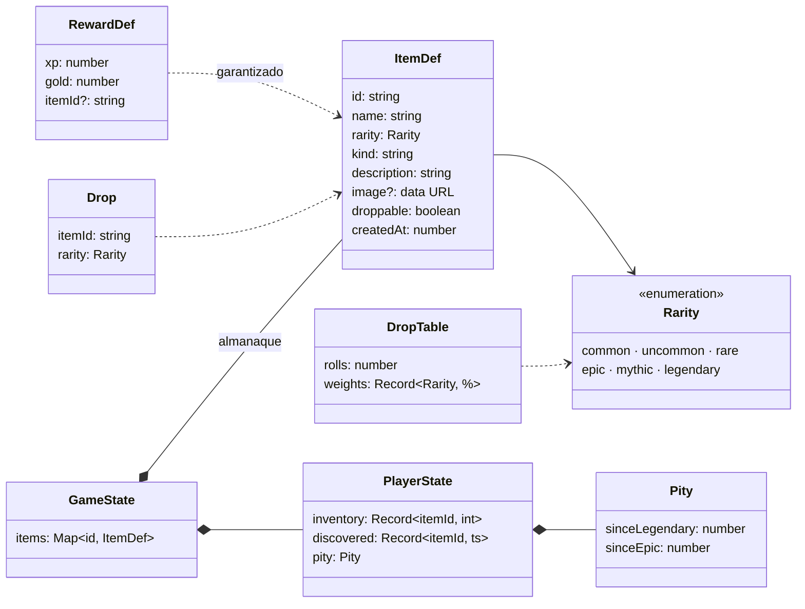

# Objetos: inventario, almanaque y drops

Los objetos dejan de ser un texto libre de la recompensa y pasan a ser **entidades del almanaque** (`ItemDef`), con nombre, imagen, rareza, tipo y descripción. Se crean desde la app. Al completar una quest, el jugador recibe el **objeto garantizado** de la quest (si tiene) y un **botín aleatorio** tirado con probabilidades por rareza al estilo de Genshin Impact. Lo conseguido va al **inventario**; el **almanaque** muestra todos los objetos como un álbum de cromos, con silueta los que faltan.

Sigue la convención del proyecto: **una carpeta por implementación** (`src/features/<nombre>/`).

---

## Requisitos

| # | Requisito | Cómo se cumple |
|---|---|---|
| R1 | El objeto es una entidad propia, no un texto | `ItemDef` + eventos `item_created` / `item_updated` / `item_deleted` |
| R2 | Seis rarezas: común, poco común, raro, épico, mítico y legendario | `RARITIES` (de menor a mayor) y `RARITY_META` (estrellas 1–6, color, etiqueta) |
| R3 | Colores gris, verde, azul, morado, rojo y dorado | Tokens `--r-common` … `--r-legendary` en `theme.css` |
| R4 | El color es el fondo del objeto y el de la tipografía al pasar el ratón | `.iart` (fondo degradado con `--rc`) y `.itile:hover .itile-name { color: var(--rc) }` |
| R5 | El jugador tiene inventario | `PlayerState.inventory` (unidades por id), calculado por la proyección |
| R6 | Almanaque para consultar los objetos, como colección de cromos | Ventana «Objetos» (tecla `I`): pestañas Inventario, Almanaque y Probabilidades |
| R7 | Los objetos se crean desde la app: nombre, imagen, calidad y opciones | Formulario en el panel derecho del almanaque (`ItemForm`) |
| R8 | Probabilidades por rareza como en Genshin | `DROP_TABLES` + pity (`PITY_RULES`) |
| R9 | Las quests de élite mejoran el drop; el resto, estándar | `dropTableFor(category)`: élite = tabla mejorada y 2 tiradas |

---

## Decisiones de diseño

### «Clase» en el diseño, tipo + funciones en el código

En el diagrama `ItemDef` es una clase. En TypeScript es una `interface` (datos planos) más funciones puras (`rollDrops`, `applyItemEvent`, `receiveItems`), igual que `QuestDef` y `Pomodoro`. La norma 5.4 de [AGENTES.md](../../../docs/AGENTES.md) lo exige: el estado tiene que poder guardarse como JSON y reconstruirse desde eventos. Una `class` con métodos no sobrevive a `JSON.parse`.

### Probabilidades

Tomo de Genshin los dos extremos que la gente conoce: **legendario 0,6 %** (el 5★) y **épico o superior ~9 %** (el 4★ es 5,1 %, pero aquí hay dos rarezas intermedias más).

| Rareza | Estrellas | Encargos y repetibles | Élite |
|---|---|---|---|
| Legendario | ★★★★★★ | 0,6 % | 2 % |
| Mítico | ★★★★★ | 2,4 % | 6 % |
| Épico | ★★★★ | 6 % | 12 % |
| Raro | ★★★ | 13 % | 20 % |
| Poco común | ★★ | 28 % | 30 % |
| Común | ★ | 50 % | 30 % |
| **Tiradas por quest** | | **1** | **2** |

**Pity**, calcado de Genshin:

- **Legendario:** desde la tirada 74 sin legendario, su probabilidad sube un 6 % por tirada; la 90 lo garantiza. Con la tabla estándar sale de media cada **62,3 tiradas** (medido con 100.000 tiradas; en Genshin, ~62,5).
- **Épico o superior:** garantizado cada 10 tiradas (el 4★ de Genshin).
- El pity es **común a las dos tablas** y solo cuenta tiradas aleatorias, no los objetos garantizados.

**Si no hay objetos de la rareza que sale**, cae uno de la rareza inferior más cercana (y, si no hay ninguna inferior, de la superior más cercana). Si ningún objeto puede salir en drops, no hay botín.

### El azar vive en la acción; el resultado, en el evento

`reportQuest` tira los dados (`Math.random`) y guarda el resultado dentro de `quest_completed.drops`. La proyección solo **lee** los drops, así que es determinista: todos los dispositivos calculan el mismo inventario y el mismo pity. `rollDrops` recibe `rnd` como parámetro y se prueba con un PRNG con semilla.

Los drops **no son un evento aparte** porque así heredan la guarda de `quest_completed`: si dos dispositivos completan la misma quest sin conexión, la segunda se ignora entera, botín incluido. Con un evento `item_dropped` independiente se duplicarían los objetos.

Cada drop copia su **rareza** (`{ itemId, rarity }`): si después se edita la rareza del objeto, el pity ya calculado no cambia.

### Imagen dentro del evento

La imagen se reduce en el navegador a **160 px** como máximo (`image.ts`, con canvas) y se guarda como *data URL* WebP (PNG si el WebView no codifica WebP) dentro de `item_created` / `item_updated`. Pesa entre 3 y 30 KB.

| Alternativa | Por qué no |
|---|---|
| Fichero en la carpeta de la app (plugin `fs` de Tauri) | Nuevo plugin y permisos, y la fase 2 tendría que sincronizar ficheros además de eventos |
| Guardar la imagen original | Una foto de móvil pesa varios MB y se cargaría en cada arranque |

Sin imagen se pinta un **monograma** (la inicial del nombre) sobre el fondo de la rareza.

### Edición por campos y retirada

- `item_updated` lleva solo los campos que cambian (`patch`). Dos dispositivos que editan campos distintos no se pisan (es la idea de los deltas de la norma 5.1).
- `item_deleted` quita el objeto del almanaque y del inventario. El id queda marcado como retirado: un `item_created` repetido o un nombre antiguo no lo resucitan. Las quests que lo daban como garantizado dejan de darlo.

### Reglas que he fijado (ajustables)

- Los objetos de ejemplo y los creados desde la app **salen en drops** por defecto (casilla «Puede salir en drops aleatorios»).
- Los objetos convertidos desde datos antiguos (ver abajo) **no salen en drops**, porque eran recompensas fijas; se puede cambiar editándolos.
- La numeración del almanaque (#001…) sigue el orden de la vista (rareza y fecha de creación), no es fija.
- NEW marca la primera unidad de un objeto que no estaba en el inventario antes de reportar.

---

## Diagrama de clases

---

## Eventos

| Evento | Datos | Efecto en la proyección | Guarda |
|---|---|---|---|
| `item_created` | `item: ItemDef` | Añade el objeto al almanaque | Se ignora si el id existe o fue retirado |
| `item_updated` | `itemId`, `patch` (campos que cambian) | Mezcla el parche | Solo si el objeto existe |
| `item_deleted` | `itemId` | Lo quita del almanaque y del inventario | Solo si existe; el id queda retirado |
| `quest_completed` (ampliado) | `reward.itemId?`, `drops?: Drop[]` | Suma el garantizado y los drops al inventario y avanza el pity | La de siempre: solo si la quest está activa |

### Compatibilidad con datos antiguos (`legacy.ts`)

Antes, `RewardDef.item` era un texto («Poción de Vigor») y el inventario contaba por nombre. Al leer (`upcastReward`):

- `reward.item: "Poción de Vigor"` → `reward.itemId: "legacy:Poción de Vigor"`.
- Se registra un objeto **común**, sin imagen y fuera de los drops, con ese id. El id se deriva del nombre, así que es el mismo en todos los dispositivos.
- Vale tanto para `quest_created` como para los `quest_completed` antiguos: lo ya ganado aparece en el inventario.

Esos objetos se pueden editar (imagen, rareza…) como cualquier otro.

---

## Archivos

| Archivo | Contenido |
|---|---|
| `model.ts` | Rarezas, `ItemDef`, tablas de drop, pity, `rollDrops`, acumulador de la proyección. Puro |
| `events.ts` | `ItemEventBody` |
| `legacy.ts` | `upcastReward`: texto antiguo → objeto del almanaque |
| `actions.ts` | `createItem`, `updateItem`, `deleteItem` (validan y llaman a `dispatch`) |
| `image.ts` | Reducción de la imagen con canvas (DOM) |
| `i18n.ts` | Textos es + ja, y los objetos de ejemplo |
| `items.css` | Estilos propios |
| `components/ItemTile.tsx` | Cromo y arte del objeto |
| `components/CollectionModal.tsx` | Ventana con inventario, almanaque, detalle y formulario |
| `components/ItemForm.tsx` | Crear y editar objetos |
| `components/DropRates.tsx` | Tablas de probabilidad y pity actual |
| `components/QuestLoot.tsx` | Recompensas en el detalle de la quest, selector del garantizado y aviso del botín en el formulario |
| `components/ClearLoot.tsx` | Objeto garantizado y botín en «Quest Clear», con su animación |
| `components/ItemsButton.tsx` | Botón de la cabecera |

## Puntos de integración

| Fuera de la carpeta | Cambio |
|---|---|
| `domain/types.ts` | `RewardDef.itemId` (sustituye a `item`); `PlayerState.inventory`, `discovered`, `pity` (sustituyen a `items`); `GameState.items` |
| `domain/events.ts` | `ItemEventBody` en la unión; `quest_completed.drops?` |
| `domain/projection.ts` | `upcastReward` al leer; `applyItemEvent`; `receiveItems` en `quest_completed` |
| `domain/seed.ts` | Almanaque inicial (10 objetos) y objeto garantizado de las quests de ejemplo |
| `store/game.ts` | `ClearResult.drops` y `guaranteed`; estado de UI `collection` |
| `store/actions.ts` | `reportQuest` tira los drops con `rollDrops` |
| `i18n/locales/{es,ja}.ts` | Montan `items`; se quitan `modal.item`, `modal.itemPh` y el `item` de las quests de ejemplo |
| `styles/theme.css` | Tokens `--r-*` |
| `lib/sfx.ts` | `sfx.reveal(tier)`: más notas cuanto mayor es la rareza |
| `App.tsx` | Tecla `I` y `<CollectionModal />` |
| `components/Header.tsx`, `Footer.tsx` | Botón de la bolsa y tecla `I` |
| `components/QuestDetail.tsx` | `<QuestLoot />` en la recompensa |
| `components/CreateQuestModal.tsx` | Selector del objeto garantizado y aviso del botín |
| `components/ClearOverlay.tsx` | `<ClearGuaranteed />`, `<ClearDrops />` y `addLootReveal` en la línea de tiempo |

---

## Verificación

Hecho el 2026-10-01 con `pnpm dev` en el navegador integrado (viewport de 1280 × 780):

- **Distribución** (200.000 tiradas con semilla, sin pity): estándar 50 / 28,1 / 13 / 6 / 2,4 / 0,58 %; élite 29,8 / 30 / 20,1 / 12 / 6 / 1,97 %.
- **Pity** (100.000 tiradas encadenadas): media de 62,3 tiradas por legendario, máximo 87; nunca más de 9 seguidas sin épico o superior. `legendaryChance`: 0,6 % hasta la 73, 6,6 % en la 74, 100 % en la 90.
- **Retroceso de rareza**, élite con 2 tiradas y catálogo sin objetos que puedan salir (sin botín).
- **Proyección** con eventos fijos: conversión de `item` antiguo, `quest_completed` duplicado ignorado (ni XP ni botín), parche por campos, re-creación ignorada y retirada sin resurrección.
- **Datos antiguos** reales del navegador de pruebas (31 eventos v1, objetos en japonés): el inventario y las recompensas se ven como objetos comunes.
- **Instalación nueva:** 10 objetos de ejemplo y quests con objeto garantizado.
- **Interfaz:** crear un objeto legendario con imagen (SVG de 512 px → WebP de 3 KB), almanaque con siluetas, inventario, filtros por rareza, color al pasar el ratón, probabilidades, «Quest Clear» con garantizado, botín y NEW, formulario de quest en japonés con el selector agrupado por rareza.

**No verificado:** el sonido de `sfx.reveal`, la app nativa con SQLite (`pnpm tauri dev`), Windows, la codificación WebP en el WKWebView de macOS (si no la soporta, cae a PNG) y la selección de imagen con el diálogo de archivos real (se probó inyectando el archivo en el `<input>`).
