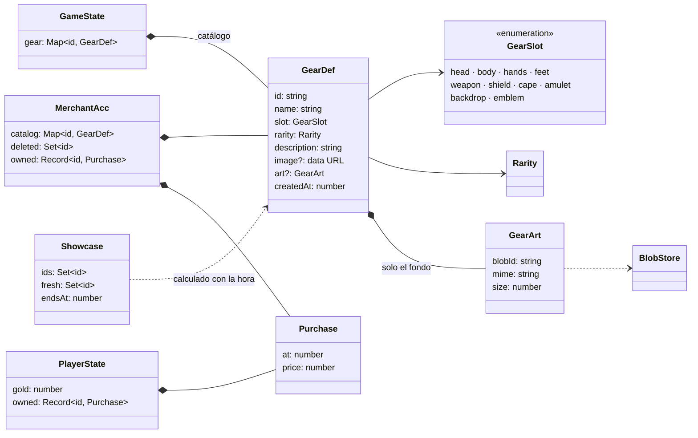

# Mercader: el escaparate de Hu Tao

El oro por fin sirve para algo. **Hu Tao**, directora de la Funeraria Wangsheng, vende **equipo para el muñeco del personaje** (cabeza, cuerpo, manos, pies, arma, escudo, capa y amuleto) y **decoración del menú** (el fondo de la app y el emblema de la cabecera). Comprar tiene que costar: los precios los pone ella según la rareza, lo bueno pide rango y cada semana solo saca unas pocas piezas a su escaparate.

Además, cada semana vende **un coleccionable del almanaque** (mítico o legendario, de los que salen en los cofres y aún no tienes), en su propia pestaña: [src/features/collectibles/README.md](../collectibles/README.md).

Las piezas se añaden a mano desde la propia tienda (nombre, tipo, rareza, imagen y descripción). El precio no se elige. Lo que se compra se lleva puesto desde la ficha del personaje: [src/features/equipment/README.md](../equipment/README.md).

Sigue la convención del proyecto: **una carpeta por implementación** (`src/features/<nombre>/`).

---

## Requisitos

| # | Requisito (del propietario) | Cómo se cumple |
|---|---|---|
| R1 | La mercader es Hu Tao, con el vídeo de su modelo moviéndose | `HuTaoStage`: el vídeo en bucle en el escaparate y su cuadro de diálogo de JRPG, con frases según lo que miras |
| R2 | Comprar tiene que ser **realmente difícil** | Precio por rareza con recargo por ranura (de 1.200 G a 160.000 G), rango mínimo por rareza y un escaparate semanal con pocas piezas |
| R3 | Lo que se vende: decoración del menú o armadura para el personaje | 8 ranuras de armadura (`ARMOR_SLOTS`) y 2 de decoración (`DECOR_SLOTS`: fondo y emblema) |
| R4 | El equipo va en un **almanaque distinto** del de objetos, que es de coleccionar | Catálogo propio (`GearDef`, `GameState.gear`) con su pestaña «Catálogo» en la tienda; el almanaque de objetos no cambia |
| R5 | Añadir las piezas a mano, con facilidad y **sin poner el precio ni nada más** | Formulario de la tienda (`GearForm`): nombre, tipo, rareza, imagen y descripción. El precio y el rango los calcula Hu Tao y el formulario solo los muestra |

---

## Decisiones de diseño

### Un catálogo propio, no el almanaque de objetos

`GearDef` es una entidad aparte de `ItemDef`, con sus eventos (`gear_*`). Los objetos son para coleccionarlos (salen en drops, se cuentan en el álbum); el equipo se **compra una vez y se lleva puesto**. Mezclarlos habría metido ranuras y precios en el álbum y drops en la tienda. Comparten solo las **rarezas** (`RARITIES` y sus colores, de `features/items/model.ts`).

### El precio y el rango los pone Hu Tao

| Rareza | Precio | Rango (nivel) | A unos 6.500 G al día |
|---|---|---|---|
| Común | 1.200 G | F (1) | menos de 1 día |
| Poco común | 3.000 G | E (3) | medio día |
| Raro | 8.000 G | D (5) | 1–2 días |
| Épico | 20.000 G | C (8) | 3 días |
| Mítico | 45.000 G | B (12) | 1 semana |
| Legendario | 100.000 G | A (17) | 2 semanas |

Calibrado con el oro de la recompensa calculada ([../rewards/README.md](../rewards/README.md)): un día bueno (4–5 h de concentración) da unos 6.500 G, y con días así el catálogo de serie entero (2.357.300 G con el recargo por ranura) se compra en un año. Al principio frena más el rango que el oro: rango A pide unos 35.000 XP (unos 3 meses a 400 XP al día). El rango es el primer nivel de cada letra (`rankFor` de `domain/leveling.ts`), así que lo legendario exige rango A además del oro.

**Recargo por ranura** (`SLOT_PRICE_FACTOR`, desde el 2026-10-02, a petición del propietario: «pricing elevado»): lo que más se ve cuesta más, y ninguna ranura baja del precio base. El resultado se redondea a precio de tienda (centenas por debajo de 10.000 G y millares por encima).

| Ranura | Recargo | Común | Rara | Legendaria |
|---|---|---|---|---|
| Manos, pies | ×1 | 1.200 G | 8.000 G | 100.000 G |
| Cabeza | ×1,1 | 1.300 G | 8.800 G | 110.000 G |
| Escudo, capa | ×1,2 | 1.400 G | 9.600 G | 120.000 G |
| Emblema | ×1,25 | 1.500 G | 10.000 G | 125.000 G |
| Amuleto | ×1,3 | 1.600 G | 10.000 G | 130.000 G |
| Cuerpo | ×1,4 | 1.700 G | 11.000 G | 140.000 G |
| Arma | ×1,5 | 1.800 G | 12.000 G | 150.000 G |
| Fondo | ×1,6 | 1.900 G | 13.000 G | 160.000 G |

Las compras ya hechas no cambian: `gear_purchased` copió su precio.

### Piezas de serie

El catálogo trae **69 piezas de serie** (`features/armory`), inspiradas en Mushoku Tensei, Re:Zero, Konosuba y los JRPG clásicos, para todo el que instala la app. No son eventos: están en el código y se suman a las del jugador (`gearOf`, `fullCatalog`). No se editan ni se retiran. Ver [src/features/armory/README.md](../armory/README.md).

### El escaparate semanal

Cada semana (de lunes a lunes, hora local) Hu Tao saca **5 piezas** al azar (`SHOWCASE_SIZE`), más las **recién llegadas**: lo añadido en los últimos 7 días está siempre a la venta (`NEW_ARRIVAL_DAYS`), para verlo nada más crearlo. Lo que ya es tuyo no se vende y su hueco lo ocupa otra pieza.

- **Se calcula, no se guarda** (`showcase(catalog, owned, now)`): cada pieza recibe una puntuación con la semana como semilla (`seededRandom("2026-10-5:<id>")`) y salen las 5 más bajas. No hay eventos y todos los equipos ven el mismo escaparate.
- La tienda dice **cuándo vuelve** una pieza guardada (`nextShowing`, mirando hasta 26 semanas hacia delante, si el catálogo no cambia).
- Con 5 piezas o menos en el catálogo, todo está siempre a la venta.

### La compra copia el precio y la proyección vigila el oro

`gear_purchased { gearId, price }` copia el precio en el evento (como la recompensa en `quest_completed`): si un día cambian los precios, lo pagado no cambia. La proyección resta `price` del oro **solo si llega**, la pieza existe y no era tuya ya (`applyMerchantEvent`).

El escaparate y el rango se comprueban en la acción (`buyBlocker`), no en la proyección: al fusionar eventos de otro dispositivo, el catálogo de esa semana podría ser distinto y una compra legítima se perdería. El oro sí se comprueba en la proyección: si dos equipos gastan el mismo oro sin conexión, **solo vale la compra que llega primero** y la otra no cobra.

### Comprar en dos pasos

El primer clic (o `Enter`) arma el botón: «¿Seguro? Pagar 8000 G», en rojo. El segundo compra. No hay devoluciones.

### Imágenes: un icono en el evento y, para el fondo, la imagen grande aparte

- **Icono** de 160 px como *data URL* dentro de `gear_created` / `gear_updated`, como los objetos (ADR-10). Sin imagen se pinta el **glifo de la ranura** (un yelmo, una espada…) sobre el color de la rareza.
- **Fondo del menú**: se ve a pantalla completa, así que además se guarda la imagen grande (hasta 1.920 px, WebP) en el **almacén de binarios** (`src/storage/blobStore.ts`, ADR-11). En el evento va solo `art: { blobId, mime, size }`.
- **Limpieza compartida**: los encargos temporales también usan ese almacén. Al quitar una imagen, tanto el mercader como los encargos solo borran el binario si no lo usa **ninguno** de los dos (`gearBlobIds` + `liveBlobIds`).

### Retirar una pieza

`gear_deleted` la quita del catálogo y, si era tuya, de lo comprado y del muñeco. El oro no se devuelve: la compra ya se hizo. El id queda retirado y no resucita. La ficha avisa al pasar el ratón por «Retirar».

### Hu Tao

- **Vídeo**: animación no oficial de la ilustración de Hu Tao, recortada a un **bucle perfecto de 32,17 s** (el fotograma 965 es idéntico al primero) y sin audio. Va en `public/merchant/` en dos formatos: `hutao.mp4` (H.264, 1280 × 720, 4,3 MB) para WebKit (macOS) y WebView2 (Windows), y `hutao.webm` (VP9, 960 × 540, 3,2 MB) para Chromium sin códecs propietarios (las pruebas automáticas). `hutao.webp` es el póster mientras carga. El propietario decidió subirlo al repositorio público.
- **Sin vídeo** (si faltan los archivos) queda un cartel con el sello de la funeraria y el diálogo sigue funcionando.
- **«Reducir movimiento»**: el vídeo se queda en el primer fotograma y el texto sale entero, sin máquina de escribir.
- **Diálogo**: cada situación tiene varias frases (bienvenida, escaparate vacío, catálogo, la pieza te llega, te falta oro, te falta rango, no está a la venta, ya es tuya, vendida) y sale una al azar. Se guarda el tipo de frase, no el texto, así que cambia de idioma con la app. El texto se escribe letra a letra y el resto de la frase ocupa ya su sitio (invisible), para que el cuadro no cambie de alto.

### Reglas que he fijado (ajustables en `model.ts`)

- `PRICES`, `SLOT_PRICE_FACTOR` y `LEVEL_REQUIRED` (las tablas de arriba), `SHOWCASE_SIZE = 5` y `NEW_ARRIVAL_DAYS = 7`.
- Con las 69 piezas de serie, cada pieza vuelve al escaparate, de media, cada unas 14 semanas (`nextShowing` dice cuándo). Es la palanca más fuerte de la dificultad: subir `SHOWCASE_SIZE` la reduce.
- La semana empieza el lunes a las 00:00 de la hora local; con cambio de hora dura 167 o 169 horas.
- El escaparate elige al azar sin mirar la rareza: lo legendario sale igual de a menudo que lo común.
- Cada pieza es única: no se compra dos veces.

---

## Diagrama de clases

---

## Eventos

| Evento | Datos | Efecto en la proyección | Guarda |
|---|---|---|---|
| `gear_created` | `gear: GearDef` | Añade la pieza al catálogo | Se ignora si el id existe o fue retirado, o si la ranura o la rareza no existen |
| `gear_updated` | `gearId`, `patch` (campos que cambian; `image: ""` quita la imagen y `art: null`, la grande) | Mezcla el parche. Si cambia de ranura, deja de estar puesta | Solo si existe; se descartan ranuras y rarezas imposibles |
| `gear_deleted` | `gearId` | La quita del catálogo, de lo comprado y del muñeco | Solo si existe; el id queda retirado |
| `gear_purchased` | `gearId`, `price` (copiado) | Resta el precio del oro y la marca como tuya | Solo si existe, no era tuya y el oro llega en ese punto del historial |

Son eventos nuevos: no hay datos antiguos que convertir. Como cambian el resultado de `project()`, `PROJECTION_VERSION` pasa a 2 y los snapshots anteriores se descartan al arrancar (se recalcula todo una vez).

---

## Animaciones y sonidos

| Momento | Qué pasa |
|---|---|
| Abrir la tienda | La ventana entra con un muelle; Hu Tao saluda letra a letra |
| Elegir una pieza | Hu Tao la comenta según tu situación (oro, rango, escaparate) |
| Armar la compra | El botón se vuelve rojo y late |
| Comprar | Un sello rojo «SOLD» cae sobre el escaparate (tinta multiplicada sobre el fondo claro del vídeo), golpe (`sfx.stamp`), lluvia de monedas (`sfx.coins`) y sacudida; desde épico, además fanfarria y estrellas del color de la rareza (`SoldSeal`) |

Las partículas y sacudidas usan `src/lib/fx.ts` y respetan «reducir movimiento».

## Teclado (ventana abierta)

| Tecla | Acción |
|---|---|
| `C` | Abrir (desde los tablones) o cerrar |
| `Q` / `E` / `Tab` | Escaparate → Coleccionable → Catálogo |
| `↑` / `↓` | Elegir pieza |
| `Enter` | Comprar (dos veces: armar y confirmar); en la pestaña del coleccionable, el de la semana |
| `N` | Nueva mercancía |
| `Esc` | Cancelar el formulario o la compra armada; si no, cerrar |

---

## Archivos

| Archivo | Contenido |
|---|---|
| `model.ts` | Ranuras, `GearDef`, precios, rangos, escaparate semanal, `buyBlocker`, acumulador de la proyección. Puro |
| `events.ts` | `MerchantEventBody` |
| `actions.ts` | `createGear`, `updateGear`, `deleteGear`, `buyGear`, `currentShowcase`, `whyNotBuy`, limpieza de binarios |
| `image.ts` | Icono de 160 px y la imagen grande del fondo (DOM, canvas) |
| `ui.ts` | Estado de la ventana (abierta, pestaña) |
| `i18n.ts` | Textos es + ja, con los diálogos de Hu Tao |
| `merchant.css` | Estilos propios |
| `components/MerchantModal.tsx` | La ventana: escenario, pestañas (escaparate, coleccionable de la semana y catálogo), lista, ficha y formulario |
| `components/HuTaoStage.tsx` | El vídeo de Hu Tao y su cuadro de diálogo |
| `components/GearDetail.tsx` | Ficha de una pieza: precio, requisitos, escaparate y botones |
| `components/GearForm.tsx` | Añadir y editar mercancía |
| `components/GearArt.tsx`, `SlotGlyph.tsx` | Arte de una pieza y glifos de las ranuras (también los usa el personaje) |
| `components/SoldSeal.tsx` | El sello de «vendido» con su celebración |
| `components/MerchantButton.tsx` | Botón del farol en la cabecera (y su icono, en el pie) |
| `public/merchant/hutao.{mp4,webm,webp}` | El vídeo de Hu Tao y su póster |

## Puntos de integración

| Fuera de la carpeta | Cambio |
|---|---|
| `domain/types.ts` | `GameState.gear`; `PlayerState.owned` |
| `domain/events.ts` | `MerchantEventBody` en la unión |
| `domain/projection.ts` | `ProjectionAcc.merchant`; `case` de los cuatro eventos (el oro gastado se resta de `acc.gold`); `GameState.gear = fullCatalog(...)` con las piezas de serie; `PROJECTION_VERSION` = 2 (3 desde la crónica) |
| `features/temporal/actions.ts` | La limpieza de binarios respeta también las imágenes del mercader |
| `i18n/locales/{es,ja}.ts` | Montan `merchant` |
| `styles/theme.css` | Tokens `--merchant`, `--merchant-hi`, `--merchant-lo` y `--merchant-deep` |
| `components/Header.tsx` | Botón del farol junto al oro |
| `components/Footer.tsx`, `styles/app.css` | Tecla `C` en el pie. En ventana estrecha, las teclas de las ventanas (objetos, mercader y personaje) se quedan con su icono |
| `App.tsx` | Tecla `C`, `<MerchantModal />` y el teclado del tablón espera mientras está abierta |
| `test/streams.ts` | `gearDef` y los eventos del mercader en `randomStream` |

---

## Verificación

Hecho el 2026-10-02:

- **Tests** (`pnpm test`): `model.test.ts` (precios y rangos, semanas con los cambios de hora de 2026, escaparate determinista y justo en 26 semanas, recién llegadas, `nextShowing`, guardas de la proyección) y `actions.test.ts` con el store de verdad (happy-dom): comprar con cada bloqueo, el escaparate de la semana, crear sin precio, editar por campos, retirar una pieza puesta. En `domain/projection.test.ts`: el oro solo baja al comprar, y justo el precio; doble gasto entre dos dispositivos en cualquier orden; invariantes sobre 40 historiales aleatorios con compras.
- **Prueba de mutación**: 11 errores introducidos a mano en el mercader, el equipo y los atributos (quitar la guarda del oro, permitir recomprar, escaparate sin límite, sin rango, etc.); los tests detectan los 11.
- **Navegador** (`pnpm dev`, Chromium de Playwright, 1280 × 780): añadir cinco piezas con imagen (SVG y JPG) desde el formulario, la imagen grande del fondo en IndexedDB, el escaparate con NEW, la ficha con «Te faltan…» y «Rango A», la compra armada en rojo, el sello SOLD con monedas sobre el vídeo, el oro de 60.000 a 52.000 G, el catálogo con «Es tuyo», el fantasma del vídeo y la ventana en japonés. El pie y la cabecera caben de 1.024 a 1.440 px.
- **Datos antiguos**: un historial sin eventos del mercader y un snapshot de la versión 1 (sin los acumuladores nuevos): se descarta, se recalcula y la app arranca sin errores.

**No verificado:** la app nativa (`pnpm tauri dev`): ni el vídeo MP4 en el WKWebView de macOS (en las pruebas se reprodujo el WebM), ni la imagen grande del fondo en la tabla `blobs` de SQLite. Tampoco Windows ni los sonidos (no se han escuchado: sello, monedas, fanfarria).

### El vídeo quieto en macOS (2026-10-02)

El propietario vio a Hu Tao **quieta** en su equipo. Causas posibles, y lo que se hizo con cada una:

1. **«Reducir movimiento» activado en macOS**: el vídeo no se ponía en marcha a propósito. Ahora se mueve siempre: es un bucle suave, sin desplazamientos, y quieta parecía un fallo.
2. **El WebView de macOS pide los vídeos por trozos** (cabecera `Range`) y el protocolo con el que Tauri sirve la app empaquetada no siempre los atiende: el vídeo se queda en el póster. Ahora el vídeo se descarga entero y se reproduce desde memoria (`blob:`), una vez por sesión (`videoUrl` en `HuTaoStage.tsx`): MP4 si el WebView sabe leer H.264 (`canPlayType`) y, si no, WebM.
3. **Autoplay**: WebKit solo deja arrancar solo un vídeo **mudo**, y React no pone el atributo `muted` en el HTML. Ahora se marca mudo (propiedad y atributo) antes de darle la fuente, se llama a `play()` cuando puede reproducirse y, si aun así no arranca, con el primer clic en la ventana.

Verificado en el navegador (Chromium, WebM): el vídeo se carga como `blob:`, va mudo y avanza (2,1 s → 3,6 s en 1,5 s). **Sin verificar en la app nativa de macOS**: hay que comprobarlo allí.

## Posibles mejoras

- Venderle piezas a Hu Tao (a la mitad de su precio, por ejemplo).
- Un escaparate que saque lo legendario con menos frecuencia.
- Ofertas de la semana o un descuento de Hu Tao según tu rango.
- Sincronizar las imágenes grandes en la fase 2, junto con los adjuntos.
