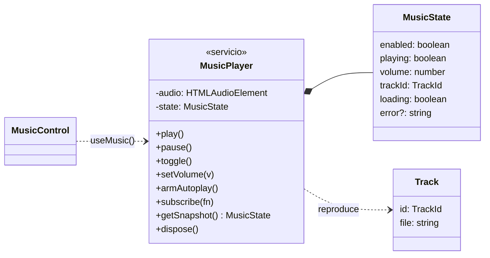

# Música de fondo

Música en bucle con fundidos, control en los ajustes del menú de opciones (ecualizador animado y volumen en un desplegable flotante al pasar el ratón; [../menu/README.md](../menu/README.md)) y atajo `M`. El botón ♪ de esos ajustes es el **silencio general**: calla los efectos y la música. La preferencia (activada o no, volumen y pista) se guarda **en cada equipo**.

---

## Dónde van los archivos de música

```
public/music/酒場.mp3      ← aquí se dejan las pistas
        │  (pnpm build / tauri build)
        ▼
dist/music/酒場.mp3        ← Vite las copia tal cual; la app las sirve en /music/…
```

**No dejes archivos en `dist/`**: esa carpeta se vacía y se regenera entera en cada build (y está en `.gitignore`). La primera pista se dejó en `dist/assets/Musica/` y se movió a `public/music/`; el siguiente build borró la carpeta original, como era de esperar.

### Añadir una pista

1. Copia el archivo a `public/music/`.
2. Añádela a `TRACKS` en `tracks.ts`: `{ id: "forest", file: "bosque.mp3" }`.
3. Añade su nombre en `i18n.ts` (`tracks.forest`) en español y en japonés. TypeScript avisará si falta.

---

## Decisiones de diseño

### Fuera del dominio y fuera de los eventos

La música no forma parte del juego: no da XP ni cambia quests, y cada equipo puede querer algo distinto. Por eso **no es un evento, no está en `GameState` y no se sincroniza**. Es una preferencia local, como el idioma o el silencio de los efectos.

### Aquí sí, una clase

El dominio usa tipos y funciones puras, porque su estado se reconstruye desde eventos. `MusicPlayer` es una **clase de verdad**, porque envuelve un recurso imperativo (`<audio>`) con su ciclo de vida: cargar, reproducir, fundir y liberar. Es una instancia única (`music`), y la interfaz se suscribe a ella con `useSyncExternalStore` mediante el hook `useMusic()`.

### Autoplay

Los navegadores (y los WebView de Tauri) no dejan sonar audio hasta que el usuario interactúa. Si la preferencia es «con música», `armAutoplay()` espera **al primer clic o tecla** y arranca entonces con un fundido de 1,5 s. Si ese primer gesto es el propio botón de música o la tecla `M`, deja que decida el botón, para no encender y apagar en el mismo gesto.

### Dos botones, dos significados

| Botón | Qué hace | Qué guarda |
|---|---|---|
| Música (ecualizador) o `M` | Enciende y apaga **solo la música** | `quests.music.enabled` |
| ♪ (arriba a la derecha) | **Silencio general**: efectos y música | `quests.muted` |

El silencio general no borra la preferencia de música: al quitarlo, la música vuelve si estaba encendida. Si todo está silenciado y pulsas el botón de música, se quita el silencio y suena. `lib/sfx.ts` avisa de los cambios de silencio (`onMutedChange`) y el reproductor reacciona.

### Volumen por Web Audio

`<audio>` → `MediaElementSource` → `GainNode` → altavoces. El volumen y los fundidos se aplican a la **ganancia**, no a `audio.volume`: algunos WebView ignoran `audio.volume`, y la ganancia permite rampas exactas (`linearRampToValueAtTime`) que no dependen de `requestAnimationFrame`.

### Cargar en memoria

La pista se descarga entera con `fetch` y se reproduce desde un `Blob` (4,7 MB en memoria). Así el `<audio>` no depende de las peticiones por rangos (`Range`) contra el protocolo interno de Tauri en la app empaquetada, que es donde los WebView suelen fallar con audio y vídeo.

### Robustez

- **Una sola carga**: dos `play()` seguidos comparten la misma promesa, así que nunca hay dos `<audio>` sonando.
- **Una sola instancia en `globalThis`**: aunque el módulo se evalúe dos veces (una recarga en caliente que falla a medias), todos comparten el mismo reproductor. Ese caso dejaba antes dos reproductores, uno sonando y otro recibiendo los clics y el volumen.
- **Recarga en caliente** (desarrollo): `import.meta.hot.dispose` libera el reproductor antiguo.
- **El volumen no mueve la cabecera**: es un desplegable flotante, así que el ♪ no se desplaza bajo el cursor.

---

## Diagrama



---

## Estructura

```
src/features/music/
├── README.md                    este documento
├── index.ts                     API pública
├── tracks.ts                    lista de pistas y su URL
├── player.ts                    clase MusicPlayer + instancia única `music`
├── useMusic.ts                  hook de React (useSyncExternalStore)
├── i18n.ts                      textos es / ja
├── music.css                    estilos del control
└── components/
    └── MusicControl.tsx         botón con ecualizador y volumen
```

**Integración fuera de la carpeta:**
- `public/music/`: los archivos.
- `src/components/Header.tsx`: `<MusicControl />`.
- `src/App.tsx`: tecla `M`.
- `src/i18n/locales/{es,ja}.ts`: clave `music`.

---

## Cómo se verificó

En el navegador integrado:
- El servidor sirve `/music/%E9%85%92%E5%A0%B4.mp3` (`200`, `audio/mpeg`, 4.742.929 bytes).
- Al cargar, el control espera la primera interacción y lo indica en su descripción emergente.
- Un clic en el tablón la arranca, con **una sola** descarga de la pista.
- `M` pausa y reanuda; la preferencia persiste en `localStorage`.
- El volumen cambia la **ganancia real** del audio (0,15 → 0,15; 0,8 → 0,8).
- ♪ silencia todo (ganancia 0 y pausa) y al quitarlo vuelve al volumen anterior; el botón de música estando silenciado quita el silencio; con la música apagada, ♪ no la enciende.
- `pnpm build` coloca la pista en `dist/music/`.

**No verificado:**
- Que suene de verdad: en la prueba no hay salida de audio audible; se comprobó el estado del reproductor.
- La app empaquetada (`tauri build`) en macOS y Windows.

---

## Posibles mejoras

- Selector de pista cuando haya varias, o lista con orden aleatorio.
- **Bajar el volumen durante la concentración del pomodoro** y subirlo en el descanso.
- Música distinta por categoría de quest, o una sintonía especial en «Quest Clear».
