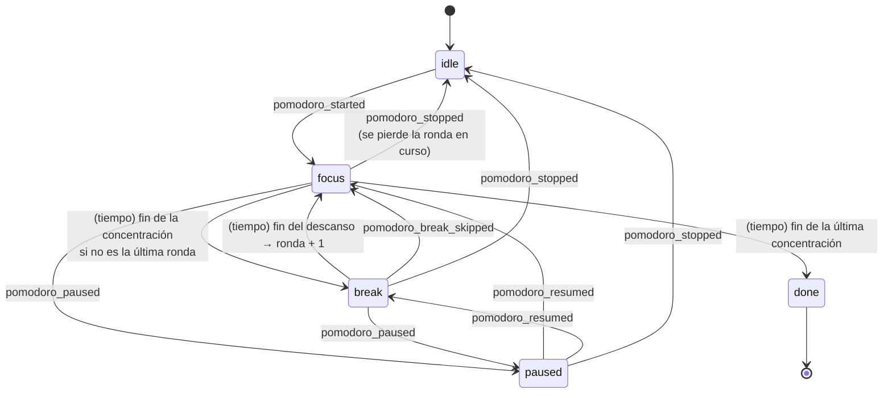

# Pomodoro

El pomodoro es un **tipo de objetivo** de una quest. En el formulario se añade con «+ Añadir pomodoro», junto a los contadores y las listas. El número del objetivo son las **rondas**: cada ronda es un tiempo de concentración seguido de su descanso, salvo **la última, que no tiene descanso porque la tarea ya ha terminado**.

```
4 rondas de 25 min con 5 min de descanso:

 concentración │ desc. │ concentración │ desc. │ concentración │ desc. │ concentración
     25 min    │ 5 min │     25 min    │ 5 min │     25 min    │ 5 min │     25 min      ✓
───────────────┴───────┴───────────────┴───────┴───────────────┴───────┴──────────────
 total = 4 × 25 + 3 × 5 = 115 min
```

El progreso son las **rondas completadas** («2 / 4»). La quest solo se reporta con todos sus objetivos cumplidos, pomodoros incluidos.

## Qué hace

| # | Requisito | Cómo se cumple |
|---|---|---|
| R1 | El pomodoro es un tipo de objetivo de la quest | `ConditionDef = CountConditionDef \| PomodoroConditionDef \| ChecklistConditionDef` |
| R2 | El número del objetivo son las rondas de concentración + descanso | `PomodoroConditionDef.target` = rondas |
| R3 | La última ronda no tiene descanso | Duración = N·concentración + (N − 1)·descanso |
| R4 | Se fija la concentración y el descanso | Campos por objetivo en el formulario; por defecto 90 / 15 min |
| R5 | Hay que completar todo el tiempo | Se cumple con `completedRounds ≥ target` |
| R6 | Si se termina antes, se muestra el tiempo hecho | «Ronda 2 interrumpida: 12:30 de 25:00» |

## Reglas y decisiones

### Un tipo de objetivo, no un objeto aparte

| | Contador | Pomodoro |
|---|---|---|
| Definición (`QuestDef.conditions`) | `{ kind: "count", label, target }` | `{ kind: "pomodoro", label, target, focusMinutes, breakMinutes }` |
| Estado (`QuestState`) | `progress[conditionId]: number` | `pomodoros[conditionId]: Pomodoro` |
| Cómo avanza | `+1` / `−1` (`progress_added`) | Con el tiempo (eventos `pomodoro_*`) |

Cada objetivo de pomodoro tiene **exactamente un** `Pomodoro` en `QuestState.pomodoros`. Una quest puede tener varios, pero **solo corre un pomodoro a la vez** en toda la app.

### Una sola línea de tiempo

La secuencia entera se trata como **una línea de tiempo continua** y el estado solo guarda cuánto se ha avanzado en ella:

```ts
interface Pomodoro {
  status: "idle" | "running" | "paused";
  offsetMs: number;        // avance antes del tramo actual
  runningSince?: number;   // cuándo empezó el tramo actual
  lastPartialMs?: number;  // concentración de la última ronda interrumpida
}
```

`viewPomodoro(p, plan, now)` calcula en qué ronda y tramo está, cuánto queda y cuántas rondas se completaron. Así funciona aunque cierres la app, pasar de concentración a descanso **no necesita eventos** y dos equipos con los mismos eventos calculan lo mismo.

```
F = concentración, B = descanso, N = rondas, ciclo = F + B
total            = N·F + (N − 1)·B
t                = offsetMs + (corriendo ? now − runningSince : 0)
ronda actual     = ⌊t / ciclo⌋ + 1
tramo            = (t mod ciclo) < F ? concentración : descanso
rondas completas = min(N, ⌊(t + B) / ciclo⌋)      (la ronda i termina en i·ciclo − B)
terminado        = t ≥ total
```

### Reglas ajustables

- La secuencia **avanza sola**: al acabar una concentración empieza el descanso y después la siguiente ronda.
- **Pausar** se puede en cualquier tramo, también en el descanso.
- **Terminar antes de tiempo** solo pierde la ronda en curso: las completadas se conservan, se muestra el tiempo hecho y al volver a empezar se continúa por esa ronda. Pide un segundo clic.
- **Saltar el descanso** pasa a la siguiente ronda.
- **Aceptar, abandonar o completar** la quest reinicia sus pomodoros.
- Límites (`clampPlan`): de 1 a 12 rondas, concentración de 1 a 240 min y descanso de 0 a 60 min. Con descanso 0, las rondas van seguidas.
- La recompensa sale de los minutos de concentración (valores en [rewards](../rewards/README.md)).

## Modelo



Las transiciones con nombre de evento se guardan; las marcadas *(tiempo)* se calculan. En TypeScript, `PomodoroConditionDef` y `Pomodoro` son datos planos y funciones puras (`viewPomodoro`, `applyPomodoroEvent`), como el resto del dominio.

## Eventos

Llevan `questId` y `conditionId`. Se aplican solo si la quest está activa, y cada uno se ignora si la fase, calculada en `e.ts`, no lo permite.

| Evento | Desde la fase | Efecto en la línea de tiempo |
|---|---|---|
| `pomodoro_started` | `idle` | Empieza a correr desde donde estaba (inicio de la ronda pendiente) |
| `pomodoro_paused` | `focus`, `break` | Congela el avance en `offsetMs` |
| `pomodoro_resumed` | `paused` | Vuelve a correr |
| `pomodoro_stopped` | `focus`, `break`, `paused` | Vuelve a `idle` al inicio de la ronda pendiente; guarda la concentración interrumpida |
| `pomodoro_break_skipped` | descanso (corriendo o en pausa) | Salta al inicio de la siguiente ronda |

**Datos antiguos** (`legacy.ts`): en la primera versión el pomodoro era un objeto único de la quest (`QuestDef.pomodoroConfig`) y sus eventos no llevaban `conditionId`. Al leerlos, `upcastQuestDef()` convierte `pomodoroConfig` en un objetivo de pomodoro de **1 ronda** con id estable `<questId>:pomodoro`, y un evento `pomodoro_*` sin `conditionId` se aplica al primer pomodoro de la quest. Esta conversión por forma es anterior a la versión de los eventos (`v`): un cambio de formato nuevo no se hace así, sino con `UPCASTERS` ([runbooks/migrar-evento.md](../../../docs/runbooks/migrar-evento.md)).

## Interfaz

- En el detalle, una fila por pomodoro con el temporizador, un anillo y marcadores de ronda (`PomodoroCondition`).
- En la tarjeta, el tiempo y la ronda (`PomodoroBadge`: «22:28 2/4»).
- `PomodoroWatcher` avisa con campana al acabar rondas, descansos y el pomodoro; con la app detrás, también el aviso del sistema ([notifications](../notifications/README.md)).
- `+1` y la tecla `+` no afectan a los pomodoros.

## Archivos

| Archivo | Contenido |
|---|---|
| `model.ts` | Tipos y funciones puras: `viewPomodoro`, `applyPomodoroEvent`, `planOf`, `planTotalMs`, `clampPlan`, `POMODORO_LIMITS`, `DEFAULT_POMODORO` |
| `events.ts` | Los 5 eventos |
| `legacy.ts` | Conversión de los datos de la primera versión |
| `actions.ts` | `startPomodoro`, `pausePomodoro`, `resumePomodoro`, `stopPomodoro`, `skipBreak` (`questId`, `conditionId`) y `activePomodoros` |
| `components/PomodoroCondition.tsx` | Fila del objetivo con el temporizador y los marcadores de ronda |
| `components/PomodoroConditionInputs.tsx` | Rondas, concentración y descanso en el formulario |
| `components/PomodoroBadge.tsx` | Tiempo y ronda en la tarjeta |
| `components/PomodoroWatcher.tsx` | Avisos y campana al acabar rondas, descansos y el pomodoro |
| `pomodoro.css`, `i18n.ts` | Estilos y textos es + ja |
| `model.test.ts`, `legacy.test.ts` | Fases, pausas, saltos, terminar antes; conversión de los datos antiguos |

## Integración

| Fuera de la carpeta | Cambio |
|---|---|
| `src/domain/types.ts` | `ConditionDef` incluye el pomodoro; `QuestState.pomodoros` |
| `src/domain/events.ts` | `EventBody` incluye `PomodoroEventBody` |
| `src/domain/projection.ts` | Conversión de datos antiguos; aplica los eventos por objetivo; `conditionProgress`, `conditionsMet(q, now)`, `countConditionsMet` |
| `src/domain/seed.ts` | «Asalto a la Torre del Proyecto»: pomodoro de 5 × 50 min (descanso de 10) |
| `src/store/actions.ts` | `+1` y la tecla `+` solo afectan a contadores |
| `src/components/QuestDetail.tsx` | `<PomodoroCondition>` en la lista de objetivos |
| `src/components/QuestCard.tsx` | `<PomodoroBadge>` |
| `src/components/CreateQuestModal.tsx` | «+ Añadir pomodoro» en el editor de objetivos |
| `src/App.tsx` | `<PomodoroWatcher>` |
| `src/i18n/locales/{es,ja}.ts` | Montan `pomodoro` |

## Dependencias

- No importa otras funcionalidades.
- **La usan:** `editing` (limpia los objetivos al editar) y `notifications` (las fases para avisar).

## Estado actual

- **Última verificación:** 2026-10-02, tests de `model.ts` y `legacy.ts`; la interfaz (temporizador, insignia, formulario y quests antiguas convertidas) se probó en el navegador al hacerla.
- **Tests:** `model.test.ts` y `legacy.test.ts`.
- **Sin verificar:** el sonido de la campana; la app nativa en Windows.
- **Historial:** [docs/history/verificacion/pomodoro.md](../../../docs/history/verificacion/pomodoro.md).

## Pendiente

- Estadísticas de tiempo de concentración por día y área, a partir de los eventos `pomodoro_*`.
