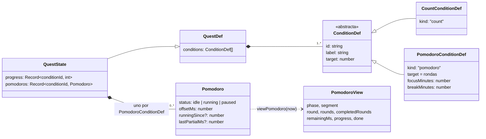
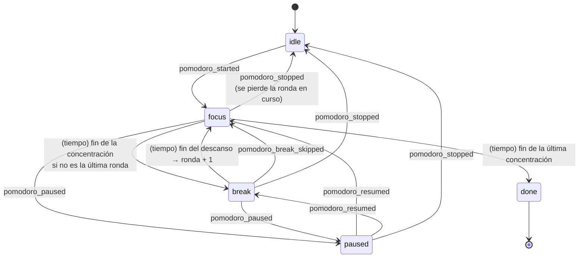

# Pomodoro

El pomodoro es un **tipo de condición (objetivo) de una quest**. En el formulario se añade con «+ Añadir pomodoro», junto a los objetivos de contador. El número de la condición son las **rondas**: cada ronda es un tiempo de concentración seguido de su descanso, salvo **la última, que no tiene descanso porque la tarea ya ha terminado**.

```
4 rondas de 25 min con 5 min de descanso:

 concentración │ desc. │ concentración │ desc. │ concentración │ desc. │ concentración
     25 min    │ 5 min │     25 min    │ 5 min │     25 min    │ 5 min │     25 min      ✓
───────────────┴───────┴───────────────┴───────┴───────────────┴───────┴──────────────
 total = 4 × 25 + 3 × 5 = 115 min
```

El progreso de la condición son las **rondas completadas** («2 / 4»). La quest solo se puede reportar cuando todas sus condiciones están cumplidas, pomodoros incluidos.

Sigue la convención del proyecto: **una carpeta por implementación** (`src/features/<nombre>/`).

---

## Requisitos

| # | Requisito | Cómo se cumple |
|---|---|---|
| R1 | El pomodoro es un tipo de condición de la quest | `ConditionDef = CountConditionDef \| PomodoroConditionDef` |
| R2 | El número de la condición son las rondas de concentración + descanso | `PomodoroConditionDef.target` = rondas |
| R3 | La última ronda no tiene descanso | Duración = N·concentración + (N − 1)·descanso; termina al acabar la última concentración |
| R4 | Se fija la concentración y el descanso | Campos por condición en el formulario; por defecto 90 / 15 min |
| R5 | Hay que completar todo el tiempo | La condición se cumple con `completedRounds ≥ target` |
| R6 | Si se termina antes, se muestra el tiempo hecho | «Ronda 2 interrumpida: 12:30 de 25:00» |

---

## Decisiones de diseño

### Un tipo de condición, no un objeto aparte

Una quest tiene una lista de condiciones de dos tipos. La de pomodoro **extiende** la idea de objetivo: tiene etiqueta y `target` como cualquier otra, más sus duraciones.

| | Condición de contador | Condición de pomodoro |
|---|---|---|
| Definición (en `QuestDef.conditions`) | `{ kind: "count", label, target }` | `{ kind: "pomodoro", label, target, focusMinutes, breakMinutes }` |
| Estado (en `QuestState`) | `progress[conditionId]: number` | `pomodoros[conditionId]: Pomodoro` |
| Cómo avanza | `+1` / `−1` (evento `progress_added`) | Con el tiempo (eventos `pomodoro_*`) |
| Progreso | El contador | Rondas completadas, calculadas en `now` |

Composición: cada condición de pomodoro tiene **exactamente un** `Pomodoro` en `QuestState.pomodoros`, que nace y muere con la quest. Una quest puede tener varias condiciones de pomodoro, pero **solo puede correr un pomodoro a la vez** en toda la app.

### Una sola línea de tiempo

Toda la secuencia (concentración, descanso, concentración…) se trata como **una línea de tiempo continua**. El estado solo guarda cuánto se ha avanzado en ella:

```ts
interface Pomodoro {
  status: "idle" | "running" | "paused";
  offsetMs: number;        // avance antes del tramo actual
  runningSince?: number;   // cuándo empezó el tramo actual
  lastPartialMs?: number;  // concentración de la última ronda interrumpida
}
```

`viewPomodoro(p, plan, now)` calcula en qué ronda y tramo está, cuánto queda y cuántas rondas se completaron. Por eso:

- funciona aunque cierres la app (al volver, el tiempo es correcto);
- pasar de concentración a descanso y de descanso a la siguiente ronda **no necesita eventos**;
- dos dispositivos con los mismos eventos calculan exactamente lo mismo.

### Reglas que he fijado (ajustables)

- La secuencia **avanza sola**: al acabar una concentración empieza el descanso, y después la siguiente ronda.
- **Pausar** se puede en cualquier tramo, también en el descanso.
- **Terminar antes de tiempo** solo pierde la ronda en curso: **las rondas completadas se conservan**, se muestra el tiempo hecho y al volver a empezar se continúa por esa ronda. Pide confirmación con un segundo clic.
- **Saltar el descanso** pasa directamente a la siguiente ronda.
- **Solo un pomodoro corriendo a la vez** (concentración o descanso). Los pausados no cuentan.
- **Aceptar, abandonar o completar** la quest reinicia sus pomodoros (cada ciclo de una repetible empieza limpio).
- Límites: de 1 a 12 rondas, concentración de 1 a 240 min y descanso de 0 a 60 min (`clampPlan`). Con descanso 0, las rondas van seguidas.

### En el código, tipos y funciones puras

En UML `PomodoroConditionDef` y `Pomodoro` son clases. En TypeScript son **datos planos** más **funciones puras** (`viewPomodoro`, `applyPomodoroEvent`), igual que el resto del dominio: se guardan como eventos JSON y se reconstruyen sin problemas. La música, en cambio, sí es una clase: ver `src/features/music/README.md`.

---

## Diagrama de clases



---

## Máquina de estados

Las fases que se ven en pantalla. Las transiciones con nombre de evento se guardan; las marcadas *(tiempo)* se calculan solas.



---

## Eventos

Se suman a `EventBody` (`src/domain/events.ts`) y llevan `questId` y `conditionId`. Se aplican solo si la quest está activa, y cada uno se ignora si la fase, calculada en `e.ts`, no lo permite.

| Evento | Desde la fase | Efecto en la línea de tiempo |
|---|---|---|
| `pomodoro_started` | `idle` | Empieza a correr desde donde estaba (inicio de la ronda pendiente) |
| `pomodoro_paused` | `focus`, `break` | Congela el avance en `offsetMs` |
| `pomodoro_resumed` | `paused` | Vuelve a correr |
| `pomodoro_stopped` | `focus`, `break`, `paused` | Vuelve a `idle` al inicio de la ronda pendiente; guarda la concentración interrumpida |
| `pomodoro_break_skipped` | descanso (corriendo o en pausa) | Salta al inicio de la siguiente ronda |

### Cálculo

```
F = concentración, B = descanso, N = rondas, ciclo = F + B
total            = N·F + (N − 1)·B
t                = offsetMs + (corriendo ? now − runningSince : 0)
ronda actual     = ⌊t / ciclo⌋ + 1
tramo            = (t mod ciclo) < F ? concentración : descanso
rondas completas = min(N, ⌊(t + B) / ciclo⌋)      (la ronda i termina en i·ciclo − B)
terminado        = t ≥ total
```

---

## Compatibilidad con la versión anterior (`legacy.ts`)

En la primera versión, el pomodoro era un objeto único de la quest (`QuestDef.pomodoroConfig`) y sus eventos no llevaban `conditionId`. Esos eventos ya están guardados en las bases de datos, y los eventos **no se reescriben nunca**. Por eso se convierten **al leerlos** (*upcasting*):

- `upcastQuestDef()` convierte `pomodoroConfig` en una condición de pomodoro de **1 ronda**, con id estable `<questId>:pomodoro`, para que todos los dispositivos coincidan.
- Un evento `pomodoro_*` sin `conditionId` se aplica a la primera condición de pomodoro de la quest.

Es el primer caso real del versionado de eventos señalado como deuda en el informe técnico. Se ha comprobado con datos antiguos reales: las quests se ven como condición de 1 ronda y conservan su estado, incluida una ronda interrumpida en 33:25.

---

## Estructura de la carpeta

```
src/features/pomodoro/
├── README.md                         este documento
├── index.ts                          API pública para la interfaz
├── model.ts                          tipos y funciones puras: viewPomodoro, applyPomodoroEvent, planOf…
├── events.ts                         los 5 eventos
├── legacy.ts                         conversión de los datos de la versión anterior
├── actions.ts                        start / pause / resume / stop / skipBreak (questId, conditionId)
├── i18n.ts                           textos es / ja
├── pomodoro.css                      estilos
└── components/
    ├── PomodoroCondition.tsx           fila de condición + temporizador con marcadores de ronda
    ├── PomodoroConditionInputs.tsx     rondas, concentración y descanso en el formulario
    ├── PomodoroBadge.tsx               tiempo y ronda en la tarjeta del tablón
    └── PomodoroWatcher.tsx             avisos y campana al acabar rondas, descansos y el pomodoro
```

**Regla de dependencias:** `src/domain` importa solo `model.ts`, `events.ts` y `legacy.ts`, nunca `index.ts` (crearía un ciclo con el store).

### Puntos de integración

| Archivo | Cambio |
|---|---|
| `src/domain/types.ts` | `ConditionDef` = contador \| pomodoro; `QuestState.pomodoros` |
| `src/domain/events.ts` | `EventBody` incluye `PomodoroEventBody` |
| `src/domain/projection.ts` | Conversión de datos antiguos; aplica los eventos por condición; `conditionProgress`, `conditionsMet(q, now)`, `countConditionsMet` |
| `src/domain/seed.ts` | «Asalto a la Torre del Proyecto»: pomodoro de 5 × 50 min (descanso de 10) |
| `src/store/actions.ts` | `+1` y la tecla `+` solo afectan a contadores |
| `src/components/QuestDetail.tsx` | Pinta `<PomodoroCondition>` en la lista de objetivos |
| `src/components/QuestCard.tsx` | `<PomodoroBadge>` |
| `src/components/CreateQuestModal.tsx` | Editor de objetivos con «+ Añadir pomodoro» |
| `src/App.tsx` | `<PomodoroWatcher>` |

---

## Cómo se verificó

Modelo (`model.ts` importado en el navegador, con marcas de tiempo fijas), plan de 4 × 25 min con 5 de descanso:

| Momento | Resultado |
|---|---|
| Total | 115:00 = 4 × 25 + 3 × 5 |
| t = 0 | Concentración, ronda 1/4, quedan 25:00 |
| t = 25 | Descanso tras la ronda 1, 1 completada, quedan 05:00 |
| t = 30 | Concentración, ronda 2/4 |
| t = 114 | Ronda 4/4, quedan 01:00 |
| t = 115 | Terminado, 4/4, **sin descanso final** |
| Pausa de 10 a 20 min | A los 30 quedan 05:00 de la ronda 1 |
| Pausa durante el descanso | El descanso también se congela |
| Saltar el descanso | Pasa a la ronda 2 con 25:00 |
| Terminar en la ronda 2 | Vuelve a reposo, conserva 1 ronda, parcial 10:00 |
| Volver a empezar | Continúa por la ronda 2 |
| 1 ronda de 90 + 15 | Termina a los 90 min |
| 3 × 10 sin descanso | Las rondas van seguidas |

Interfaz (navegador integrado):
- Quest de 4 rondas a mitad de la ronda 2: fila «1 / 4», anillo, marcadores e insignia «22:28 2/4».
- Quests con el pomodoro antiguo, convertidas.
- Formulario con contador y pomodoro de 3 × 45 + 10 («Total 2 h 35 min»), guardado con `kind` y rondas.

**No verificado**: el sonido de la campana y la app nativa en Windows.

---

## Posibles mejoras

- **Tests con Vitest** de `model.ts` y `legacy.ts`, con los casos de arriba.
- **Notificación del sistema** al terminar una ronda con la app en segundo plano (`tauri-plugin-notification`).
- **Bajar la música** durante la concentración y subirla en el descanso (integración con `features/music`).
- **Estadísticas** de tiempo de concentración por día y área, a partir de los eventos `pomodoro_*`.
