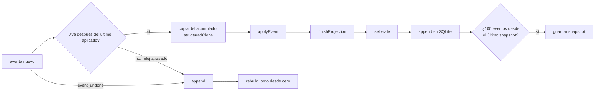
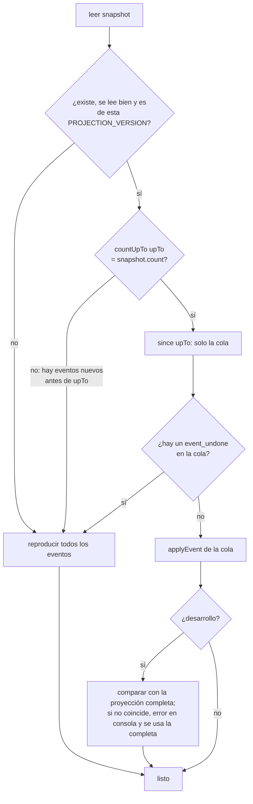

# Snapshot de la proyección

Dos cosas para que el coste no crezca con el historial:

1. **`dispatch` aplica solo el evento nuevo** sobre el estado anterior.
2. **Snapshot al arrancar:** la proyección se guarda cada 100 eventos; al abrir la app se carga y se aplican solo los eventos posteriores.

El snapshot es una **caché**: los eventos son la única verdad, y si el snapshot falta o no vale, la app lo recalcula sin perder nada. Aun así, en la base del propietario no se toca ([AGENTES §3](../../../docs/AGENTES.md#3-comandos)).

## Qué hace

- Mismo resultado, siempre: **snapshot + eventos posteriores = reproducir todos los eventos**, campo a campo.
- Ningún cambio en los eventos ni en su formato.
- Si el snapshot no vale (otra versión de la lógica, corrupto, eventos antiguos que llegan de otro equipo, reloj atrasado), se recalcula todo sin que se note.
- El estado anterior no se modifica al aplicar un evento: React ve objetos nuevos.

## Reglas y decisiones

### La proyección partida en tres

| Función (`src/domain/projection.ts`) | Qué hace |
|---|---|
| `newProjectionAcc()` | Acumulador vacío |
| `applyEvent(acc, e)` | El `switch` con sus guardas, para **un** evento (modifica `acc`) |
| `finishProjection(acc)` | Lo que depende del conjunto: nivel, rango, el encargo de cada quest (`temporalId`), las quests en reserva y la recompensa de los encargos pendientes. Lo recalcula entero (lo pone o lo quita) |
| `project(events)` | `newProjectionAcc` + `applyEvent` de todos (salvo lo deshecho) + `finishProjection` |

`ProjectionAcc` solo contiene datos serializables (`Map`, `Set` y objetos planos): se guarda tal cual y se copia con `structuredClone`.

### `dispatch`



- **Sobre una copia** (`cloneAcc`): el estado anterior no cambia. La copia cuesta O(tamaño del estado), no O(eventos).
- **Orden**: `nextTs` da a cada evento nuevo, como mínimo, el `ts` del último aplicado + 1 ms (reloj lógico híbrido con deriva máxima `MAX_DRIFT_MS`: [COMO-FUNCIONA.md](../../../docs/COMO-FUNCIONA.md#el-orden), [ADR-25](../../../docs/decisions/ADR-25-reloj-hibrido.md)). Así, los eventos que una acción emite en el mismo milisegundo no se reordenan por su `id` aleatorio.
- **Reloj muy atrasado** (más de `MAX_DRIFT_MS` por detrás del último evento aplicado): el evento cae en medio del historial y se recalcula todo (`rebuild()`). Mientras, los `dispatch` que lleguen esperan.
- **Deshacer** (`event_undone`, [undo](../undo/README.md)): cambia el pasado, así que también recalcula todo. `applyAll` salta los eventos deshechos dentro de la lista que recibe (`undoneIn`).

### Arranque



**Por qué el recuento:** el snapshot guarda cuántos eventos incluía (`count`) y hasta cuál llega (`upTo`). Si la base tiene otro número hasta ese punto, ha entrado alguno con fecha anterior (fusión de otro equipo, reloj atrasado) y el snapshot ya no vale. Como los eventos nunca se borran, contar basta: un `count(*)` sobre el índice `(ts, id)`.

### Cuándo y dónde se guarda

- Cada **100 eventos** (`SNAPSHOT_EVERY`) desde el anterior, tras escribir el evento; después de un `rebuild()`; y al arrancar si se recalculó todo con al menos 100 eventos. Los guardados van en cola, de uno en uno.
- **Tauri:** fila `snapshot` de la tabla `meta` de `quests.db`. **Navegador:** `localStorage["quests.snapshot"]`. Si no se puede leer o escribir, se avisa en la consola y la app arranca recalculando todo.

```ts
interface Snapshot {
  format: number;      // SNAPSHOT_FORMAT: la forma de este objeto
  projection: number;  // PROJECTION_VERSION con la que se calculó
  upTo: EventPos;      // { ts, id } del último evento incluido
  count: number;       // eventos incluidos
  acc: ProjectionAcc;
  savedAt: number;
}
```

JSON no conserva `Map`, `Set`, `NaN` ni `±Infinity`: se guardan marcados como `{ "__snap": "map" | "set" | "num", "v": … }` y se reconstruyen al leer.

### Norma: `PROJECTION_VERSION`

**Si cambias el resultado de `project()` para eventos ya guardados, sube `PROJECTION_VERSION`.** Cuenta cualquier `case` o guarda de `applyEvent`, un *upcaster* o un `apply*Event` de una funcionalidad. Si no, la app nativa usará un snapshot calculado con la lógica vieja. Dos redes de seguridad: en desarrollo, cada arranque desde un snapshot se compara con la proyección completa; y los tests comprueban que snapshot + cola = todo. Si solo cambias `finishProjection` (la curva de niveles, por ejemplo), no hace falta: se ejecuta en cada arranque. Procedimiento: [runbooks/migrar-evento.md](../../../docs/runbooks/migrar-evento.md).

### Decisiones

| Decisión | Alternativas descartadas | Motivo |
|---|---|---|
| Guardar el acumulador, no el `GameState` | Guardar `GameState` | El acumulador es lo que hace falta para seguir aplicando eventos; lo derivado se recalcula al cargar |
| Validar con versión + recuento hasta `upTo` | Hash de todos los eventos; fiarse solo de `ts` | Consulta barata con índice que detecta cualquier evento que entre en medio |
| Copiar el acumulador en cada `dispatch` | Actualizaciones inmutables a mano en cada `case` | Sin tocar el `switch` ni los modelos, y React ve objetos nuevos |
| Snapshot en `meta`, cada 100 eventos | Tabla o fichero aparte; en cada evento; al cerrar | Comparte la conexión; escribir todo el estado a cada clic sobra; cerrar no siempre avisa |

Ver [ADR-16](../../../docs/decisions/ADR-16-snapshot.md).

## Eventos

No tiene eventos. El snapshot es una caché local de cada equipo y **no se sincroniza**.

## Archivos

| Archivo | Contenido |
|---|---|
| `model.ts` | Formato, serialización, `applyAll`, `cloneAcc`, `goesAfter`, `canonical`, `decodeSnapshot`, `SNAPSHOT_EVERY`. Puro |
| `restore.ts` | `restore`, `rebuild`, `saveSnapshot`, `verifyAgainstFull` (usa `EventStore`) |
| `storage.ts` | Leer y escribir el snapshot (`meta` en SQLite, `localStorage`) |
| `index.ts` | API pública para el store |
| `snapshot.test.ts` | Formato y snapshot + cola = todo, con historiales aleatorios cortados en varios puntos |
| `restore.test.ts` | El arranque con un `EventStore` en memoria |

## Integración

| Fuera de la carpeta | Cambio |
|---|---|
| `src/domain/projection.ts` | `project()` partido en `newProjectionAcc` / `applyEvent` / `finishProjection`; `ProjectionAcc` y `PROJECTION_VERSION` |
| `src/domain/events.ts` | `EventPos`, `comparePos` y `nextTs` |
| `src/storage/eventStore.ts` | `EventStore.since(pos)` y `EventStore.countUpTo(pos)`, en SQLite y en `localStorage` |
| `src/store/game.ts` | `projected: Projected`; `dispatch` incremental; `rebuild()`; arranque con `restore()` |
| `src/test/streams.ts` | Historiales aleatorios con semilla (`randomStream`) |
| `package.json`, `vitest.config.ts` | Vitest y happy-dom (zona horaria fija: Europe/Madrid) |

## Dependencias

- **features/undo** (`model.ts`: `undoneIn`, `hasUndo`): saltar lo deshecho y recalcular si la cola trae un deshacer.
- **La usan:** el store (`src/store/game.ts`). Las funcionalidades que añaden campos al acumulador (agenda, chronicle) hacen que `decodeSnapshot` los exija.

## Estado actual

- **Última verificación:** 2026-10-06, tests (cortes y evento a evento con deshacer). En ejecución: navegador con 315 eventos y app nativa de macOS sobre la base real del propietario (copiada antes y restaurada idéntica), el 2026-10-02.
- **Tests:** `snapshot.test.ts`, `restore.test.ts`, `src/domain/projection.test.ts` y `src/store/game.test.ts`.
- **Sin verificar:** cuánto se ahorra al arrancar con un historial nativo grande; Windows.
- **Historial:** [docs/history/verificacion/snapshot.md](../../../docs/history/verificacion/snapshot.md).
