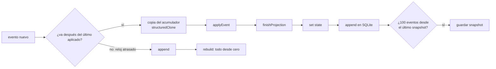
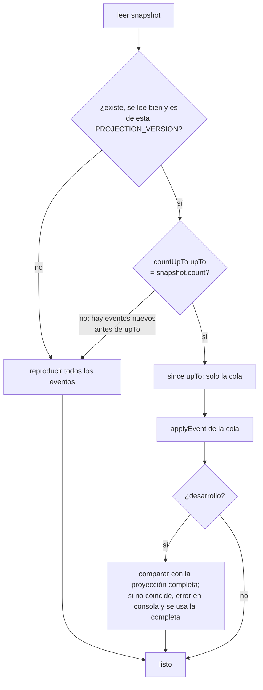

# Snapshot de la proyección

Hasta ahora, cada clic y cada arranque recalculaban el estado **desde cero**: `project()` reproducía todos los eventos guardados. Era correcto pero O(n): cuanto más largo el historial, más lento. Esta funcionalidad hace dos cosas:

1. **`dispatch` aplica solo el evento nuevo** sobre el estado anterior, en vez de reproducirlos todos.
2. **Snapshot al arrancar:** la proyección se guarda cada 100 eventos. Al abrir la app se carga ese estado y se aplican solo los eventos posteriores.

El snapshot es una **caché**. Los eventos siguen siendo la única verdad: se puede borrar el snapshot en cualquier momento y la app lo recalcula sin perder nada.

---

## Requisitos

- Mismo resultado, siempre: **snapshot + eventos posteriores = reproducir todos los eventos**, campo a campo.
- Ningún cambio en los eventos ni en su formato. Los datos antiguos se leen igual.
- Si el snapshot no vale (otra versión de la lógica, corrupto, eventos antiguos que llegan de otro dispositivo, reloj atrasado), se recalcula todo sin que el usuario note nada.
- El estado anterior no se modifica al aplicar un evento: React tiene que ver objetos nuevos, como antes.

---

## Cómo funciona

### La proyección partida en tres

`src/domain/projection.ts` ya no es un único bucle:

| Función | Qué hace |
|---|---|
| `newProjectionAcc()` | Acumulador vacío: quests, objetos, encargos, `xp`, `gold`, `completedCount` |
| `applyEvent(acc, e)` | El `switch` de siempre, con sus guardas, para **un** evento (modifica `acc`) |
| `finishProjection(acc)` | Lo que depende del conjunto: nivel, rango y el encargo de cada quest (`temporalId`) |
| `project(events)` | `newProjectionAcc` + `applyEvent` de todos + `finishProjection`. Mismo resultado que antes |

`ProjectionAcc` solo contiene datos serializables (`Map`, `Set` y objetos planos), y por eso se puede guardar.

`finishProjection` **recalcula** `temporalId` entero (lo pone o lo quita). Antes solo lo ponía, porque cada proyección empezaba de cero; aplicando eventos sobre un estado anterior, una quest desenlazada se quedaría con su encargo viejo.

### `dispatch`



- **Sobre una copia** (`cloneAcc`): el estado anterior no cambia y todos los objetos son nuevos, igual que cuando se recalculaba todo. La copia cuesta O(tamaño del estado), no O(eventos).
- **Mismo milisegundo:** los empates de `ts` se deshacen por `id`, que es aleatorio. Una acción que emite varios eventos seguidos (crear un encargo con sus quests, editarlo) los produce en el mismo milisegundo, y podían quedar al revés: un `quest_completed` antes de su `quest_accepted`, por ejemplo, y la guarda lo ignoraba. Ya pasaba antes del snapshot; lo destaparon los tests del store. Ahora `nextTs` (`src/domain/events.ts`) da a cada evento nuevo, como mínimo, el `ts` del último aplicado + 1 ms si el reloj no ha avanzado o va por detrás como mucho 1 minuto (`MAX_DRIFT_MS`; era 1 s hasta que pasó a ser un reloj lógico híbrido, ver «El orden» en COMO-FUNCIONA.md). Así, los eventos de un equipo quedan siempre en el orden en que se hicieron, también detrás de los fusionados de otros equipos.
- **Reloj muy atrasado** (más de 1 s): el evento cae en medio del historial y el orden de las guardas puede cambiar. Entonces se recalcula todo (`rebuild()`). Mientras tanto, los `dispatch` que lleguen esperan.

### Arranque



**Por qué el recuento:** el snapshot guarda cuántos eventos incluía (`count`) y hasta cuál llega (`upTo`). Si la base tiene otro número de eventos hasta ese punto, ha entrado alguno con fecha anterior (fusión de otro dispositivo en la fase 2, o un reloj atrasado) y el snapshot ya no vale. Como los eventos nunca se borran, contar basta. Es una consulta `count(*)` sobre el índice `(ts, id)`.

### Cuándo se guarda

- Cada **100 eventos** (`SNAPSHOT_EVERY`) desde el anterior, después de escribir el evento en SQLite. Como mucho, al arrancar se aplican 99 eventos.
- Después de un `rebuild()`.
- Al arrancar, si se recalculó todo y hay al menos 100 eventos.

Los guardados van en cola, de uno en uno, para que uno antiguo no pise a uno nuevo.

### Dónde se guarda

| Entorno | Lugar |
|---|---|
| Tauri | Fila `snapshot` de la tabla `meta` de `quests.db` (la misma conexión; sin plugins ni permisos nuevos) |
| Navegador (`pnpm dev`) | `localStorage["quests.snapshot"]` |

Si no se puede leer o escribir (por ejemplo, con el `localStorage` lleno), se avisa en la consola y la app sigue igual, solo que arranca recalculando todo.

### Formato

```ts
interface Snapshot {
  format: number;      // SNAPSHOT_FORMAT: la forma de este objeto
  projection: number;  // PROJECTION_VERSION con la que se calculó
  upTo: EventPos;      // { ts, id } del último evento incluido
  count: number;       // eventos incluidos
  acc: ProjectionAcc;
  savedAt: number;
}
```

JSON no conserva `Map`, `Set`, `NaN` ni `±Infinity`. Se guardan marcados como `{ "__snap": "map" | "set" | "num", "v": … }` y se reconstruyen al leer.

---

## Norma: `PROJECTION_VERSION`

**Si cambias el resultado de `project()` para eventos ya guardados, sube `PROJECTION_VERSION`** (`src/domain/projection.ts`). Cuenta como cambio cualquier `case` o guarda de `applyEvent`, un *upcaster* (`legacy.ts`) o un `apply*Event` de una funcionalidad. Si no la subes, la app nativa seguirá usando un snapshot calculado con la lógica vieja.

Hay dos redes de seguridad por si se olvida:
- **En desarrollo**, cada arranque desde un snapshot se compara con la proyección completa. Si no coinciden, sale un error en la consola que lo dice y se usa la completa.
- Los **tests** comprueban que snapshot + cola da lo mismo que reproducirlo todo.

Si solo cambias `finishProjection` (por ejemplo, la curva de niveles), no hace falta subirla: se ejecuta en cada arranque sobre el acumulador.

---

## Decisiones

| Decisión | Alternativas descartadas | Motivo |
|---|---|---|
| Guardar el acumulador (`ProjectionAcc`), no el `GameState` | Guardar `GameState` | El acumulador es lo que hace falta para seguir aplicando eventos; lo derivado (nivel, rango, `temporalId`) se recalcula al cargar |
| Validar con versión + recuento hasta `upTo` | Comparar un hash de todos los eventos; fiarse solo de `ts` | El recuento es una consulta barata con índice y detecta cualquier evento que entre en medio, porque los eventos nunca se borran |
| Copiar el acumulador entero en cada `dispatch` (`structuredClone`) | Actualizaciones inmutables a mano en cada `case`; mutar en el sitio | Sin tocar el `switch` ni los modelos de las funcionalidades, y React sigue viendo objetos nuevos |
| Snapshot en `meta` | Tabla nueva; fichero aparte (plugin `fs`) | Ya existe y comparte la conexión; es una sola fila |
| Cada 100 eventos | En cada evento; al cerrar la app | En cada evento escribiría todo el estado a cada clic; cerrar la app no siempre avisa |

---

## Eventos

Ninguno. El snapshot es una caché local de cada equipo y **no se sincroniza**: cada dispositivo calcula el suyo a partir de sus eventos.

---

## Puntos de integración

| Archivo | Cambio |
|---|---|
| `src/domain/projection.ts` | `project()` partido en `newProjectionAcc` / `applyEvent` / `finishProjection`; `ProjectionAcc` y `PROJECTION_VERSION`; `temporalId` se recalcula entero |
| `src/domain/events.ts` | `EventPos`, `comparePos` (`compareEvents` es el mismo) y `nextTs` (reloj lógico híbrido) |
| `src/storage/eventStore.ts` | `EventStore.since(pos)` y `EventStore.countUpTo(pos)`, en SQLite y en `localStorage` |
| `src/store/game.ts` | `events: GameEvent[]` se sustituye por `projected: Projected`; `dispatch` incremental; `rebuild()`; arranque con `restore()` |
| `package.json`, `vitest.config.ts` | Vitest, happy-dom y `pnpm test` (zona horaria fija: Europe/Madrid) |

## Archivos

```
src/features/snapshot/
├── README.md
├── index.ts          API pública para el store
├── model.ts          Formato, serialización, applyAll, cloneAcc, goesAfter, canonical (puro)
├── restore.ts        restore / rebuild / saveSnapshot / verifyAgainstFull (usa EventStore)
├── storage.ts        Leer y escribir el snapshot (meta en SQLite, localStorage)
├── snapshot.test.ts  Tests del formato y de snapshot + cola = todo
└── restore.test.ts   Tests del arranque con un EventStore en memoria
src/test/streams.ts   Historiales aleatorios con semilla para los tests
src/domain/projection.test.ts
```

---

## Verificación

**Tests** (`pnpm test`): esta funcionalidad trajo Vitest al proyecto, y con ella una batería de 231 tests en 13 archivos que cubre todo el dominio y el store. La lista completa está en [docs/COMO-FUNCIONA.md](../../../docs/COMO-FUNCIONA.md), sección 13. Los del snapshot:
- 25 historiales aleatorios de 400 eventos con todos los tipos, incluidos eventos imposibles, formatos antiguos (`item` de texto, pomodoro sin `conditionId`) y empates de `ts`. Cada uno se corta en 10 puntos (0, 1, 2, 37, 100, 199, 200, 333, 399, 400): snapshot → JSON → snapshot + cola tiene que coincidir con `project()` de todos.
- Los mismos historiales aplicados evento a evento sobre copias, como `dispatch`, sin modificar el estado anterior.
- `restore()` con un `EventStore` en memoria: sin snapshot, con uno válido (solo lee la cola), de otra versión y con un evento antiguo fusionado.
- El store entero en un navegador simulado (happy-dom): snapshot cada 100 eventos y su uso al volver a abrir, un snapshot falseado, el reloj atrasado, un `dispatch` durante un recálculo y las acciones de quests, encargos, objetos y pomodoro.

**Prueba de mutación:** se introdujeron 20 errores típicos en el código, uno a uno: cobrar una quest no activa, saltarse una guarda, pity mal contado, `since` que incluye el propio evento, `dispatch` que modifica el estado anterior… Los tests detectan 19. El que queda es una rama inalcanzable: al abandonar una quest, su espera ya ha vencido siempre, porque solo se acepta cuando vence. Por eso, cambiar `"cooldown"` por `"available"` en esa rama no altera nada. Sin el arreglo de `nextTs`, fallan 10 tests del store.

**En ejecución** (`pnpm dev`, navegador integrado, con 315 eventos):
- Primer arranque: guarda el snapshot (315 eventos, 8 KB, termina en el último evento) y la cabecera muestra lo mismo que `project()`.
- Segundo arranque: carga desde el snapshot sin errores.
- Snapshot falseado (+1.000 de oro): la verificación de desarrollo lo detecta, muestra el error y usa la proyección completa (355 G).
- Tres eventos con fecha anterior al snapshot (fusión simulada de otro dispositivo, +77 G): el recuento no cuadra, se recalcula todo (432 G) y se guarda un snapshot nuevo de 318 eventos.
- Aceptar una quest con el ratón, `dispatch` con el reloj atrasado a enero y 100 `dispatch` seguidos: el estado coincide con el completo y el snapshot pasa de 320 a 420 eventos justo al llegar a 100.

**App nativa** (`pnpm tauri dev`, macOS, sobre la base real del propietario con 165 eventos; antes se hizo una copia y al final se restauró idéntica, comprobada con SHA-256):

| Prueba | Qué se hizo | Resultado |
|---|---|---|
| A. Primer arranque | Abrir la app | Guarda el snapshot en `meta` a los ~6 s (116 KB, con las imágenes de los objetos). Coincide campo a campo con reproducir los 165 eventos (nivel 8, 5.770 XP, 3.010 G) |
| B. Snapshot + cola | Añadir un evento inocuo posterior y volver a abrir | 30 s abierta sin tocar el snapshot: lo usó, `since` devolvió el evento y la verificación de desarrollo coincidió (si no, lo habría reescrito) |
| C. Evento antiguo | Añadir un evento con fecha anterior al snapshot | A 1 s del arranque, `countUpTo` no cuadra, recalcula todo y guarda uno nuevo de 167 eventos |
| D. Snapshot falseado | +1.000 de oro en el snapshot | A 1 s del arranque lo detecta y lo reescribe con 3.010 G |

**Medido en el navegador** con 50.000 eventos sintéticos: reproducirlos todos tardó unos 29 ms (leer el JSON y `project()`), cargar el snapshot 0,2 ms y copiar el acumulador 0,01 ms. Ese historial solo tiene 6 quests, así que el estado es mucho más pequeño que uno real.

**No verificado:** cuánto se ahorra al arrancar con un historial nativo grande (la base real solo tiene 165 eventos), capturas de la ventana nativa (no hay permiso de grabación de pantalla) y Windows.
