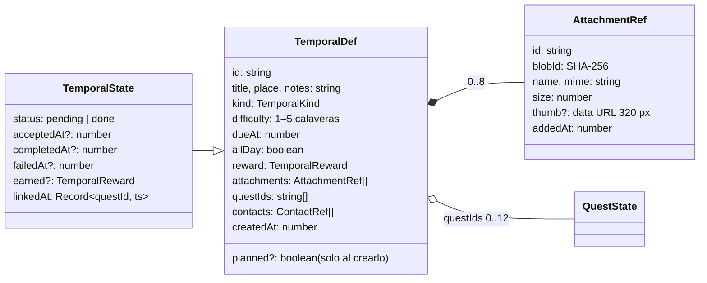

# Encargos temporales

Cosas que ocurren en una fecha: una cita con el médico, una entrega, un examen, un cumpleaños… Viven en **su propio tablón**, aparte del Quest Board: un tablón de roble con carteles de pergamino clavados, cada uno con **calaveras rojas según su dificultad** (de 1 a 5), como en la imagen de referencia («The Broken Spear Inn»). Se les **adjuntan PDF e imágenes**. Clavar uno y cumplirlo tienen dos animaciones que imitan dos vídeos de referencia (KonoSuba, episodio 2), con sonidos sintetizados que imitan los del vídeo.

Es lo que se planifica a largo plazo: un encargo se clava **sin aceptar** (sus quests esperan **en reserva**, fuera del Quest Board) y se **acepta** al empezarlo, con el sello «ACCEPTED». Puede llevar **quests enlazadas** que hay que terminar antes de cumplirlo. Se llega con el selector de la cabecera, la tecla `T`, la tarjeta «Bounties» del menú o «Encargos» en la barra del teléfono; también salen en el [calendario](../calendar/README.md), en su día. La app abre en el Quest Board.

## Qué hace

| # | Requisito del propietario | Cómo se cumple |
|---|---|---|
| R1 | Una sección aparte del Quest Board | `section: "temporal"` en el store; selector de la cabecera (`SectionSwitch`) y tecla `T` |
| R2 | Para eventos futuros (cita con el médico, cualquier evento) | `TemporalDef`: fecha y hora (o todo el día), lugar, notas y tipo de cartel; la urgencia se calcula |
| R3 | Adjuntar PDF o imágenes | Almacén de binarios + `AttachmentRef` en los eventos; botón, arrastrar y soltar, y visor |
| R4 | Presentado como la imagen, con calaveras rojas según la dificultad | Tablón de roble con volutas de cobre, carteles con bordes rasgados, «Kill Quest», «Delivery»…, cinta «Enquire within» y de 1 a 5 calaveras |
| R5 | Animaciones al crear y al cumplir, como los vídeos, con sus sonidos | `PostedOverlay` y `ClearedOverlay`; recetas de sonido medidas sobre el audio de los vídeos |
| R6 | Las calaveras se plasman en el encargo | Caen una a una y se estampan con su mancha de tinta, salpicadura, sacudida y sonido |
| R7 | Conectar, si se quiere, un encargo con quests, que se crean solas en el Quest Board | `TemporalDef.questIds`, `temporal_linked` / `temporal_unlinked`; el formulario crea quests nuevas o enlaza del tablón |
| R8 | Si no se terminan todas, no se cumple el encargo | Guarda en la proyección y en la acción; botón «Faltan N quests» |
| R9 | Distinguir los encargos comenzados de los no aceptados, sin que sus quests aparezcan todavía | `TemporalState.acceptedAt`, `temporal_accepted` / `temporal_postponed`, `TemporalDef.planned`; `QuestState.reserved` |
| R10 | Un sello de «aceptado» y elegir ver todos, aceptados o sin aceptar | Sello «ACCEPTED» de tinta azul; `AcceptFilter` con su número, que cada equipo recuerda |
| R11 | La app abre en las quests y se pueden crear quests sueltas | La app arranca en el Quest Board; las quests sueltas no tienen encargo |
| R12 | Al cumplirlo, una ilustración según el tipo de encargo, elegida al azar, impresa como la silueta del aventurero | Una carpeta por tipo en `public/temporal/<tipo>/`; `heroFor` elige una al azar y `ClearedOverlay` la imprime en sepia sobre el pergamino |

## Reglas y decisiones

### Una entidad y una sección propias

Un encargo no se acepta como una quest, no tiene objetivos ni reaparece: tiene una **fecha** y se cumple una vez. Por eso es su propia entidad (`TemporalDef` / `TemporalState`) y su propio tablón, no una cuarta categoría de quest ([ADR-12](../../../docs/decisions/ADR-12-encargos-entidad-propia.md)). Comparte con las quests la **recompensa** (suma XP y oro al jugador), no `completedCount` ni los drops.

| Calaveras | Nombre (es · ja) |
|---|---|
| 1 | Tranquilo · 安全 |
| 2 | Con cuidado · 注意 |
| 3 | Peligroso · 危険 |
| 4 | Muy peligroso · 高危険 |
| 5 | Mortal · 致命的 |

La recompensa **no se escribe a mano**: es una base por calaveras más un bono sobre lo que valen sus quests enlazadas, recalculada al enlazar o quitar quests. La tabla de valores está en [rewards](../rewards/README.md), que es su fuente.

| Tipo | Cabecera (en inglés, decorativa) | Nombre (es · ja) | Color |
|---|---|---|---|
| `summons` | Summons | Citación · 呼び出し | Rojo |
| `delivery` | Delivery | Entrega · 配達依頼 | Tinta |
| `hunt` | Kill Quest | Cacería · 討伐クエスト | Rojo |
| `scout` | Scout Quest | Expedición · 偵察クエスト | Rojo |
| `gathering` | Gathering | Reunión · 集会 | Tinta |

### Ilustraciones al cumplir

Al cumplir un encargo, la escena de «Encargo cumplido» enseña una **ilustración de su tipo**, elegida **al azar** entre las de su carpeta, en lugar de la silueta del aventurero. Son archivos de serie, como los personajes del [menú](../menu/README.md): no son eventos ni se sincronizan.

| Tipo | Carpeta | De serie |
|---|---|---|
| Citación | `public/temporal/summons/` | Subaru (Re:Zero) |
| Entrega | `public/temporal/delivery/` | — |
| Cacería | `public/temporal/hunt/` | Kazuma (Konosuba) |
| Expedición | `public/temporal/scout/` | — |
| Reunión | `public/temporal/gathering/` | — |

- **Para añadir una**, basta con dejar el archivo (`.webp` o `.png`, mejor con fondo transparente y de cuerpo entero) en la carpeta de su tipo. Como `import.meta.glob` no ve `public/`, el plugin `temporalHeroes` de `vite.config.ts` lista las carpetas como el módulo virtual `virtual:temporal-heroes`; con `pnpm dev`, añadir o quitar un archivo recarga la app. Lo que no está en la carpeta de un tipo se ignora.
- **Sin ninguna en su carpeta**, sale la silueta del aventurero de siempre.
- **Se elige una vez por escena** (`useState`), con `Math.random`: es interfaz, no dominio, y no se guarda cuál salió.
- **Impresa como la silueta:** en sepia (`grayscale` + `sepia`), con opacidad 0,55 y **multiplicada** sobre el pergamino, de modo que el degradado del papel se ve a través de ella y el blanco desaparece. Los pies y el lado del texto se funden con el papel (dos máscaras de degradado), para que la recompensa se lea aunque la ilustración sea ancha. Va a la derecha, a lo alto del pergamino (un 40 % del ancho).

### El tiempo se calcula, no se guarda

| Urgencia (`urgencyOf(t, now)`) | Cuándo | En el cartel |
|---|---|---|
| `overdue` | Ya pasó (los de todo el día, al acabar su día) | Papel oscurecido y más ladeado; «Hace 2 días» |
| `today` | Hoy y aún no ha pasado | Aura roja que late; «¡Hoy!», «Hoy, 10:00» o «Faltan 2 h» |
| `soon` | En los próximos 3 días | «Mañana, 10:00», «En 3 días» |
| `later` | Más adelante | «En 10 días» |
| `done` | Cumplido | Sello «CLEAR» y calaveras de oro |

`now` entra como parámetro. El inicio del día sale de `new Date(ms)` en la hora local (`startOfDay`) y los días se cuentan con redondeo (`daysUntil`) para que el cambio de hora no descuadre. Al acabar el día de su fecha sin cumplirlo, el cartel **se quema** ([failure](../failure/README.md)).

### Adjuntos: un almacén de binarios aparte

El evento lleva una referencia (`AttachmentRef`: nombre, tipo, tamaño, una miniatura de 320 px y el `blobId`) y el archivo vive en el almacén de binarios (`src/storage/blobStore.ts`) con su **SHA-256** como clave ([ADR-11](../../../docs/decisions/ADR-11-almacen-de-binarios.md)): un PDF de varios MB dentro del evento se leería en cada arranque y no cabe en el `localStorage` del navegador.

- **Tauri:** tabla `blobs` en el mismo `quests.db`, con la misma conexión que los eventos (`sqliteDb()`). **Navegador:** IndexedDB (`quests.blobs`).
- **Límites:** PDF e imágenes (PNG, JPEG, WebP, GIF, SVG, AVIF, BMP), hasta **20 MB** por archivo y **8** por encargo. Las imágenes de más de 2.400 px se reducen (WebP, o JPEG si el WebView no codifica WebP).
- **Miniatura en el evento**: el cartel pinta el «boceto» sin abrir el almacén, en sepia y a lápiz.
- **Limpieza:** al quitar un adjunto o retirar un encargo, se borran los binarios que no usa nadie (`liveBlobIds`, `gearBlobIds` y `characterBlobIds`). Los de un encargo retirado se borran **pasada la ventana de deshacer** ([undo](../undo/README.md)).
- **Visor:** imágenes a pantalla completa (clic para tamaño real); PDF con el visor del WebView en un `iframe` (`blob:`). Botón de descarga.
- La [sincronización](../sync/README.md) sube y baja los binarios en uso.

### Eventos como deltas

- `temporal_updated` lleva solo los campos que cambian; nunca toca el id, la fecha de creación, los adjuntos, las quests, el estado ni la aceptación.
- Adjuntos y enlaces tienen sus propios eventos: si dos equipos adjuntan o enlazan a la vez, se suman.
- Lo cumplido no se edita (su recompensa y su fecha son historia), pero admite adjuntos: el justificante suele llegar después.
- `temporal_completed` copia la recompensa: editar después no cambia lo ganado.

### Quests enlazadas

Un encargo puede llevar quests del Quest Board («Examen final» → «Repasar los temas», «Hacer simulacros ×3») y **hasta terminarlas todas no se puede cumplir** ([ADR-14](../../../docs/decisions/ADR-14-quests-enlazadas.md)). En el formulario, sección «Quests del encargo» (hasta 12):

- **+ Quest rápida:** título y cuántas veces. Se crea en el Quest Board como un **encargo** con un objetivo «título ×N», su recompensa calculada y el encargo como «Encargado por».
- **+ Quest completa…:** el formulario entero del Quest Board (`QuestFormModal` con `onCreate`, en un portal porque un `<form>` no puede ir dentro de otro), con el encargo como cliente y su lugar como área. Se crea al guardar el encargo, antes que las rápidas.
- **+ Enlazar una quest del tablón:** cualquiera sin terminar que no pertenezca a otro encargo pendiente.
- **En cadena:** cada quest nueva requiere la anterior ([complex](../complex/README.md)).
- **Quitar** una quest del encargo solo la desenlaza: sigue en el Quest Board. **Retirar el encargo** tampoco borra sus quests («¿Seguro? Sus quests se quedan»).

| Dónde se ve | Qué muestra |
|---|---|
| Cartel del tablón | Sello «⚔ 1/3» (terminadas / total); dorado si están todas |
| Cartel abierto | Lista con ✓ terminada, ◆ en curso, 🔒 bloqueada, ○ por aceptar, ◷ en espera, ◇ en reserva; cada una lleva a su quest. «Cumplir» pasa a «Faltan N quests» |
| Quest del Quest Board | Su plazo con una calavera (la fecha del encargo) y, en el detalle, un cartelito del encargo que lleva a él |
| Avisos | Al terminar la última: ««X» completada · ya puedes cumplir «Encargo»» |

- **Una quest pertenece a un solo encargo pendiente**; enlazarla a otro se ignora. `QuestState.temporalId` se calcula en `finishProjection` (`questOwners`).
- **¿Terminada?** (`linkedQuestDone`): si se completó del todo, sí; si es de las que vuelven, solo si se completó **después de enlazarla** (`lastCompletedAt ≥ linkedAt`); si se retiró, deja de contar; si se fracturó, no cuenta (hay que desenlazarla).
- **Guarda:** `temporal_completed` se ignora si alguna enlazada no está terminada en ese punto de la reproducción. `applyTemporalEvent` recibe `linkDone(questId, since)` de `project()`, que es quien conoce las quests; la acción `completeTemporal` lo comprueba antes y avisa.

### Aceptados y sin aceptar

| Estado | Cómo se ve | Sus quests | Se puede |
|---|---|---|---|
| **Sin aceptar** (`acceptedAt` vacío) | Cartel más pálido, sin sello; «Sin aceptar» | **En reserva**: no salen en el Quest Board ni se aceptan | Aceptar (`Enter`), editar, adjuntar, retirar |
| **Aceptado** (`acceptedAt` = ts) | Sello «ACCEPTED» azul; «Aceptado el 3 de octubre» | En el Quest Board | Cumplir (con sus quests terminadas), aplazar, editar, adjuntar, retirar |

- **Al clavarlo**, la casilla «Aceptarlo ya» viene **desmarcada** (`planned: true`): lo normal es clavar algo que empezarás más adelante ([ADR-38](../../../docs/decisions/ADR-38-encargos-aceptados.md)).
- **Aceptar** saca sus quests de la reserva («2 quests salen al Quest Board»). **Aplazar** las devuelve; no se aplaza con una quest en curso. Si llega un aplazamiento de otro equipo con una quest en curso, esa sigue a la vista hasta terminarla o abandonarla.
- **Sin aceptar no se cumple** (guarda de la proyección y aviso en la acción).
- **`QuestState.reserved`** se calcula en `finishProjection`: pertenece a un encargo pendiente sin aceptar y no está en curso ni terminada. El Quest Board la oculta y `quest_accepted` se ignora mientras tanto (`inReserve`).
- **El filtro** (`AcceptFilter`, en la fila de los plazos): **Todos · Aceptados · Sin aceptar**, con cuántos hay; por defecto «Todos», con los aceptados primero. Se recuerda en cada equipo (`quests.temporalAccept`). Al clavar uno o saltar a un encargo desde una quest, vuelve a «Todos» si lo dejaría fuera.

### Estado de interfaz y recordatorios

- Qué cartel está elegido, qué ventana o animación está abierta… vive en `ui.ts` (Zustand de la funcionalidad), sin eventos. En `src/store/game.ts` solo está `section`.
- `TemporalWatcher`: al abrir la app, si hay encargos para hoy o vencidos, lo avisa (y el selector de la cabecera enseña su número en rojo); 15 minutos antes de uno con hora, aviso con campana (sin interacción previa, solo el aviso: el WebView bloquea el audio). Los avisos del sistema son de [notifications](../notifications/README.md).

### Reglas ajustables

- Un encargo nuevo propone **mañana a las 10:00** y una calavera.
- Un encargo vencido se puede cumplir igual (hasta que se queme a medianoche), con su recompensa completa.
- Los cumplidos solo se ven con «Ver cumplidos»; al cumplir uno, recibe su sello y se descuelga.
- Clic en un cartel lo elige; un segundo clic (o doble clic) lo abre. En el teléfono, un toque lo abre.

## Modelo

`GameState.temporals` es un `Map<id, TemporalState>`. `QuestState` lleva `lastCompletedAt`, `temporalId` y `reserved` (los dos últimos, calculados). Los contactos son de [contacts](../contacts/README.md).

## Eventos

| Evento | Datos | Efecto en la proyección | Guarda |
|---|---|---|---|
| `temporal_created` | `temporal: TemporalDef` | Lo clava como `pending`; `linkedAt` de sus quests = ts; `acceptedAt` = ts salvo que traiga `planned: true` | Se ignora si el id existe o fue retirado; quita de `questIds` las que ya tiene otro encargo pendiente |
| `temporal_updated` | `temporalId`, `patch` | Mezcla los campos editables | Solo si está pendiente |
| `temporal_attached` | `temporalId`, `attachment` | Añade el adjunto | Si existe y el adjunto no está ya |
| `temporal_detached` | `temporalId`, `attachmentId` | Quita el adjunto | Si existe |
| `temporal_linked` | `temporalId`, `questId` | La añade al final de `questIds`; `linkedAt[questId]` = ts | Pendiente, la quest no está ya, no pasa de 12 y ningún otro encargo pendiente la tiene |
| `temporal_unlinked` | `temporalId`, `questId` | La quita de `questIds` y de `linkedAt` | Pendiente y la tiene |
| `temporal_accepted` | `temporalId` | `acceptedAt` = ts: sus quests salen de la reserva | Pendiente y sin aceptar (si dos equipos lo aceptan, cuenta el primero) |
| `temporal_postponed` | `temporalId` | Quita `acceptedAt`: sus quests que no estén en curso vuelven a la reserva | Pendiente y aceptado |
| `temporal_completed` | `temporalId`, `reward` (copia) | `done`, `completedAt`, `earned`; suma XP y oro | Pendiente, aceptado y con todas sus quests enlazadas terminadas (si dos equipos lo cumplen, cuenta el primero) |
| `temporal_deleted` | `temporalId` | Lo quita; el id queda retirado | Si existe |

- `quest_accepted` se ignora si la quest está en reserva (`inReserve`).
- Crear un encargo con quests nuevas emite un `quest_created` por cada quest y después `temporal_created` con todos los `questIds`. Al editarlo: `temporal_unlinked` por cada quitada, `quest_created` por cada nueva y `temporal_linked` por cada nueva o elegida.
- Clavar, editar, aceptar, aplazar, enlazar, desenlazar y retirar se pueden deshacer unos minutos; cumplir y adjuntar, no.
- **Datos tolerantes** (`normalize()`): corrige al leer, sin reescribir el evento, la dificultad fuera de 1–5, un tipo desconocido, una recompensa negativa y los adjuntos, quests o contactos ausentes o repetidos.
- **Datos antiguos:** los `temporal_created` sin `questIds` se leen como `[]`; los que no traen `planned` **nacen aceptados** (sus quests ya estaban en el Quest Board). No hace falta *upcaster*.

## Interfaz

### Teclado

| Tecla | En el tablón de encargos | Con el cartel abierto |
|---|---|---|
| `T` | Volver al Quest Board | — |
| `↑↓←→` | Moverse entre carteles (por su posición en pantalla) | — |
| `Enter` / `A` | Abrir el cartel elegido | Sin aceptar: aceptarlo. Aceptado: cumplirlo (si faltan quests, avisa). Con el foco en un botón, ese botón |
| `H` | Siguiente plazo (`Shift+H`, el anterior) | — |
| `N` | Clavar un encargo nuevo | — |
| `E` | — | Editar |
| `Esc` | — | Cerrar (el cartel vuelve a su sitio) |

Durante las animaciones, `Enter`, `Esc`, espacio o un clic saltan al final. El teclado del tablón espera mientras hay otra ventana abierta (personaje, mercader, crónica, edición, fallos o búsqueda).

### Al clavar un encargo · `PostedOverlay`

| Momento | En el vídeo | En la app |
|---|---|---|
| 0–0,25 s | Pergamino con bordes quemados y cabecera apagada | Velo oscuro; el pergamino (borde quemado, estable por encargo) aparece de 1,1 a 1 |
| 0,24–0,58 s | El texto llega gigante y desenfocado | Texto plateado de ×3,4 con 10 px de desenfoque a ×1, con tres copias que se cierran sobre él (estela de zoom). Silbido |
| 0,58 s | Golpe del texto | Bombo, palmada de papel y acorde de orquesta en do mayor; temblor, onda, destello y polvo |
| +0,3 s | Un destello recorre las letras | Barrido de luz recortado a las letras (`background-clip: text`). «Shing» agudo |
| +0,5 s | La cabecera se enciende en rojo | El tipo («Citación» / 「討伐クエスト」) pasa a rojo y se dibujan sus filetes |
| +0,95 s | (pedido) | **Cada calavera cae girando y se estampa**: mancha de tinta, salpicadura, sacudida y golpe húmedo |
| Después | — | La recompensa se escribe de izquierda a derecha, con tintineo de monedas |
| Final | La cámara se lanza contra el pergamino y se funde en blanco | Zoom ×2,7 con desenfoque, fundido a blanco y el cartel **cae en su sitio del tablón** con su chincheta |

Dura unos 4,5 s según las calaveras. Mientras, el cartel se pinta oculto en el tablón; el fogonazo llama a `land(id)` y cae entonces.

### Al cumplirlo · `ClearedOverlay`

| Momento | En el vídeo | En la app |
|---|---|---|
| 0–0,5 s | Texto dorado gigante que irrumpe | Texto dorado con estela de zoom. Silbido |
| 0,5 s | Fogonazo blanco con destellos horizontales | Luz blanca, tres destellos horizontales, rayos, chispas y estrellas. Estallido con crepitar y acorde en fa mayor |
| +0,7 s | Silueta del héroe saltando | La [ilustración de su tipo](#ilustraciones-al-cumplir), al azar e impresa en sepia (sin ninguna, la silueta del aventurero con la espada en alto); cabecera «Logro del día» (本日の成果) |
| +1,15 s | (añadido) | **Las calaveras se vuelven de oro una a una**, con campanilla que sube |
| Después | «icono × 2 = 10000 エリス», con los dígitos girando | «💀 × N = oro G»: los dígitos giran como una tragaperras y se detienen de izquierda a derecha; campanilla y melodía de cierre |
| Final | — | La XP cuenta hacia arriba y, si toca, «Level Up!» |

Primer `Enter` o clic: salta al final sin sonidos acumulados (`tl.seek("finale", true)` suprime los callbacks y `settle()` fija su estado final). El segundo cierra; el cartel recibe el sello «CLEAR» y se descuelga. Los bordes rasgados, la inclinación y dónde caen las calaveras salen de `look.ts` con el id como semilla: el mismo cartel se ve igual siempre.

### Animaciones del tablón

- Al entrar, los carteles caen en cascada; al pasar el ratón, el cartel se endereza y se levanta y las calaveras dan un saltito; el elegido tiene un marco dorado que respira.
- Hoy: aura roja que late. Vencido: papel oscurecido y más torcido.
- Abrir un cartel lo despliega desde su sitio (misma posición, tamaño e inclinación) y al cerrarlo vuelve. Retirar: se despega, gira y cae, con papel rasgado.
- El sello «ACCEPTED» sigue el patrón de `QuestCard` (estado anterior en un `useRef`, línea de tiempo solo en la transición, `gsap.set` en los demás casos); si el cartel está abierto en grande, lo estampa la vista grande y el del tablón solo se fija, para que no suene dos veces.
- Ambiente: luz de vela que respira y motas de polvo.
- Con **«reducir movimiento»**: sin sacudidas ni zoom final, partículas a un tercio y sin motas, vela ni parpadeos.

### Sonidos

Sintetizados con Web Audio en `src/lib/sfx.ts`; las recetas salen de medir el audio de los vídeos con un espectrograma (vídeo 1: silbido y golpe sobre do mayor; vídeo 2: estallido, tic-tic de unas 30 pulsaciones por segundo, melodía re-fa-mi-fa-sol-mi-fa y campanilla en do7).

| Sonido | Receta | Imita |
|---|---|---|
| `posterWhoosh` | Ruido filtrado que barre de 260 a 3.200 Hz mientras crece, con un grave que sube | El texto que se acerca |
| `posterSlam` | Seno de 120 a 40 Hz, palmada de papel y acorde de orquesta en do mayor | El golpe del vídeo 1 |
| `glint` | Siseo agudo y cinco notas de mi7 a do8 | El destello |
| `skullStamp(i)` | Golpe húmedo y una nota menor que sube con cada calavera | Las calaveras |
| `clearBurst` | Ruido brillante con 34 chasquidos al azar y un acorde de fa mayor | El estallido del vídeo 2 |
| `slotRoll`, `slotStop`, `slotDing` | Pulsos cuadrados de 12 ms; clic seco; campana en do7 y do6 | El contador y la campanilla |
| `clearMelody` | Celesta re-fa-mi-fa-sol-mi-fa, do5+do6 y acorde de fa mayor | La melodía de cierre |
| `purify(i)` | Campanilla de si5 a la6 | Las calaveras que se vuelven de oro |
| `pin`, `paperRip`, `unfold` | Clic y golpe en madera; ráfagas de ruido; ruido que barre | Chincheta, papel rasgado y cartel que se despliega |

En el teléfono: el cartel abierto ocupa casi todo el ancho, los datos en una columna y los botones en dos filas.

## Archivos

| Archivo | Contenido |
|---|---|
| `model.ts` | Tipos, ilustraciones por tipo (`heroesByKind`, `pickHero`), urgencia, orden, recompensas, recordatorios, aceptación (`isAccepted`, `matchesAccept`, `countAccept`, `inReserve`), quests enlazadas (`linkedQuestDone`, `pendingLinks`, `questOwners`, `linkCandidates`), quemados (`finishedAt`, `isBurned`), `liveBlobIds` y el acumulador (`applyTemporalEvent`). Puro |
| `links.ts` | Estado de cada quest enlazada para la interfaz. Usa la proyección (`effectiveStatus`), por eso no va en `model.ts` |
| `events.ts` | `TemporalEventBody` |
| `look.ts` | Aspecto estable de cada cartel: forma, inclinación, bordes y calaveras. Puro |
| `heroes.ts` | Las ilustraciones de «Encargo cumplido» (`virtual:temporal-heroes`) y `heroFor`, que elige una al azar |
| `actions.ts` | Crear (con sus quests), editar, adjuntar, quitar, aceptar, aplazar, cumplir y retirar; `copyDraft` (volver a clavar); borrado de binarios huérfanos; `goToQuest` / `goToTemporal` |
| `files.ts` | Comprobación y preparación de archivos (reducción y miniatura con canvas) |
| `format.ts` | Fechas y cuentas atrás en el idioma activo |
| `ui.ts` | Estado de interfaz propio (Zustand); `temporalBusy` |
| `components/TemporalBoard.tsx` | El tablón: carteles, teclado, avisos y ambiente |
| `components/Poster.tsx`, `PosterView.tsx`, `PosterQuests.tsx` | El cartel del tablón, el cartel en grande (con adjuntos, acciones y sellos) y sus quests |
| `components/Skull.tsx` | La calavera roja (y de oro) y la mancha de tinta |
| `components/SectionSwitch.tsx` | Selector de sección de la cabecera, con el número de encargos para hoy |
| `components/TemporalForm.tsx`, `TemporalQuestsField.tsx` | Formulario de crear y editar; «Quests del encargo» |
| `components/QuestEventLink.tsx` | El encargo de una quest, en su detalle |
| `components/AcceptFilter.tsx` | Filtro Todos · Aceptados · Sin aceptar |
| `components/AttachmentViewer.tsx` | Visor de imágenes y PDF |
| `components/PostedOverlay.tsx`, `ClearedOverlay.tsx` | Las dos animaciones grandes |
| `components/TemporalWatcher.tsx`, `TemporalOverlays.tsx` | Recordatorios; monta ventanas, animaciones y recordatorios |
| `temporal.css`, `i18n.ts` | Estilos (con su bloque de teléfono) y textos es + ja |
| `model.test.ts` | Urgencias, guardas, aceptación, reserva, quests enlazadas, datos mal formados y antiguos, e ilustraciones por tipo |

### Dónde está cada cosa

| Concepto | Símbolo |
|---|---|
| Guardas de los eventos de encargos | [`applyTemporalEvent`](model.ts) |
| Urgencia y días naturales | [`urgencyOf`](model.ts) y [`daysUntil`](model.ts) |
| Aceptado o sin aceptar, y quests en reserva | [`isAccepted`](model.ts), [`inReserve`](model.ts); [`acceptTemporal`](actions.ts) y [`postponeTemporal`](actions.ts) |
| Quests enlazadas: terminadas, dueño, pendientes y su estado en pantalla | [`linkedQuestDone`](model.ts), [`questOwners`](model.ts), [`pendingLinks`](model.ts); [`linkState`](links.ts) |
| Crear y editar con sus quests | [`createTemporal`](actions.ts), [`updateTemporal`](actions.ts) y [`createDraftQuests`](actions.ts) |
| Cumplir (con sus comprobaciones y avisos) | [`completeTemporal`](actions.ts) |
| Binarios en uso (antes de borrar un adjunto) | [`liveBlobIds`](model.ts) |
| Saltar de un tablón a otro | [`goToQuest`](actions.ts) y [`goToTemporal`](actions.ts) |
| Volver a clavar un cartel quemado | [`copyDraft`](actions.ts) |
| Aspecto estable de cada cartel (bordes, inclinación, calaveras) | [`posterLook`](look.ts), [`tornEdge`](look.ts) y [`skullSpots`](look.ts) |
| El tablón y moverse por posición en pantalla | [`TemporalBoard`](components/TemporalBoard.tsx) y [`neighbour`](components/TemporalBoard.tsx) |
| «Cartel clavado»: la escena y la caída en el tablón | [`PostedOverlay`](components/PostedOverlay.tsx) (etiqueta `"finale"` de la línea de tiempo) y `land` de [`useTemporalUi`](ui.ts) |
| «Encargo cumplido»: la escena y el estado final al saltar | [`ClearedOverlay`](components/ClearedOverlay.tsx) y su `settle` |
| Ilustración de «Encargo cumplido» según el tipo | [`heroFor`](heroes.ts), [`heroesByKind`](model.ts) y [`pickHero`](model.ts); el plugin [`temporalHeroes`](../../../vite.config.ts); su aspecto, `.tco-art` en [`temporal.css`](temporal.css) |

## Integración

| Fuera de la carpeta | Cambio |
|---|---|
| `src/domain/types.ts` | `GameState.temporals`; `QuestState.lastCompletedAt`, `temporalId` y `reserved` |
| `src/domain/events.ts` | `TemporalEventBody` en la unión |
| `src/domain/projection.ts` | `applyTemporalEvent` con `linkDone`; XP y oro de `temporal_completed`; `temporalId` y `reserved` al final; guarda `inReserve` en `quest_accepted` |
| `src/storage/eventStore.ts` | Conexión SQLite compartida (`sqliteDb()`) e `isTauri` exportado |
| `src/storage/blobStore.ts` | Almacén de binarios (SQLite `blobs` / IndexedDB) |
| `src/store/game.ts` | `section` y `setSection` |
| `src/store/actions.ts` | Al reportar la última quest de un encargo, avisa; `acceptQuest` rechaza las quests en reserva |
| `src/App.tsx` | Tablón según la sección, tecla `T` y `<TemporalOverlays />`; el Quest Board oculta las quests en reserva |
| `src/components/Header.tsx` | `<SectionSwitch />` |
| `src/components/Footer.tsx` | Pie del tablón de encargos |
| `src/components/QuestDetail.tsx` | El aviso también con el tablón vacío; sección «Encargo» con `<QuestEventLink>` |
| `src/components/QuestCard.tsx` | Calavera en el plazo de las quests de un encargo |
| `src/components/CreateQuestModal.tsx` | `QuestFormModal` con `onCreate`: el formulario completo desde el encargo |
| `src/lib/sfx.ts` | `hiss`, `stab`, `celesta`, `chime`, ataque en `tone` y los sonidos de la tabla |
| `src/styles/theme.css` | Tokens `--skull*`, `--parchment*`, `--oak*`, `--copper`, `--ink*` (con `--ink-blue`) |
| `src/i18n/locales/{es,ja}.ts` | Montan `temporal` |
| `src/test/streams.ts` | `temporalDef` y los eventos de encargos en `randomStream` |
| `vite.config.ts`, `src/vite-env.d.ts` | Plugin `temporalHeroes` (con `publicList`, que comparte con los personajes del menú) y el tipo de `virtual:temporal-heroes` |
| `public/temporal/` | Las ilustraciones de «Encargo cumplido», una carpeta por tipo |

## Dependencias

- **features/rewards** (`model.ts`, `RewardPreview`): la recompensa del encargo y su vista previa en el formulario. Para cambiar la fórmula, lee su README.
- **features/contacts** (`model.ts`, `ContactsField`, `ContactList`): los contactos del encargo.
- **features/complex** (`model.ts`, `QuestRequirements`): el estado de las quests enlazadas (bloqueadas, en cadena).
- **features/horizon** (`HorizonFilter`, `ui.ts`): el filtro de plazos del tablón y su vuelta a «Todo».
- **features/failure** (`actions.ts`, `ui.ts`): «Volver a clavar» un cartel quemado.
- **features/undo** (`actions.ts`, `model.ts`): «Deshacer» y el borrado diferido de adjuntos.
- **features/merchant**, **features/menu** (`model.ts`: `gearBlobIds`, `characterBlobIds`): no borrar binarios que usan otros.
- **features/calendar** (`CalendarIcon`): el calendario en el selector de la cabecera.
- **features/mobile** (`KeyHint`, `isPhone`): pistas y toques en el teléfono.
- **features/chronicle**, **features/editing**, **features/equipment**, **features/search** (sus `ui.ts`): solo para que el teclado del tablón espere con sus ventanas abiertas.
- **La usan:** `calendar`, `failure`, `horizon`, `menu`, `mobile`, `notifications`, `rewards`, `search`, `sync` y `today`.

## Estado actual

- **Última verificación:** 2026-10-08, ilustraciones al cumplir: tests y navegador a 1.024 px y 402 × 874 (Kazuma en una cacería, Subaru en una citación, la silueta en una entrega; añadir un archivo a una carpeta con `pnpm dev`). Aceptados y sin aceptar, el 2026-10-03: tests (con prueba de mutación) y navegador a 800 × 600 y 402 × 874. El tablón, los adjuntos, las animaciones y las quests enlazadas, el 2026-10-02 (dominio en tres zonas horarias, datos antiguos idénticos, sonido grabado con `OfflineAudioContext`).
- **Tests:** `model.test.ts`, `src/domain/projection.test.ts` y `src/store/game.test.ts`.
- **Sin verificar:** las ilustraciones en la app nativa (WKWebView: `mask-composite` y el multiplicado) y en Windows; la app nativa con la tabla `blobs` de SQLite y archivos grandes en base64; el visor de PDF dentro del WebView de Tauri (en Chromium sin interfaz sale en blanco); la descarga de adjuntos en Tauri; Windows; escuchar los sonidos de verdad; el rendimiento de los textos gigantes con filtros en el WKWebView.
- **Historial:** [docs/history/verificacion/temporal.md](../../../docs/history/verificacion/temporal.md).
