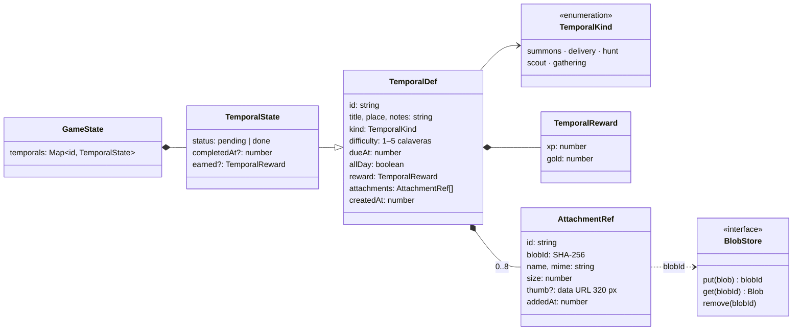

# Encargos temporales

Los **encargos temporales** son cosas que ocurren en una fecha: una cita con el médico, una entrega, un examen, un cumpleaños… Viven en **su propio tablón**, aparte del Quest Board: un tablón de roble con carteles de pergamino clavados, cada uno con **calaveras rojas según su dificultad** (de 1 a 5), como en la imagen de referencia («The Broken Spear Inn»). Se les pueden **adjuntar PDF e imágenes**. Al clavar uno y al cumplirlo hay dos animaciones que imitan los dos vídeos de referencia (KonoSuba, episodio 2), con sonidos sintetizados que imitan los del vídeo.

Se cambia de tablón con el selector de la cabecera o con la tecla `T`.

Sigue la convención del proyecto: **una carpeta por implementación** (`src/features/<nombre>/`).

---

## Requisitos

| # | Requisito | Cómo se cumple |
|---|---|---|
| R1 | Una sección aparte del Quest Board | `section: "board" \| "temporal"` en el store; selector en la cabecera (`SectionSwitch`) y tecla `T` |
| R2 | Sirve para eventos futuros (cita con el médico, cualquier evento) | `TemporalDef`: fecha y hora (o todo el día), lugar, notas y tipo de cartel; la urgencia (hoy, pronto, vencido) se calcula |
| R3 | Adjuntar PDF o imágenes | Almacén de binarios (`src/storage/blobStore.ts`) + `AttachmentRef` en los eventos; botón, arrastrar y soltar, y visor |
| R4 | Se llama «Encargos temporales» | `temporal.section.temporal`; en japonés, 期限付き依頼 |
| R5 | Presentado como la imagen, con calaveras rojas según la dificultad | Tablón de roble con volutas de cobre, carteles de pergamino con bordes rasgados, «Kill Quest», «Delivery»…, cinta «Enquire within» y de 1 a 5 calaveras pisando el borde |
| R6 | Animación al crear, como el primer vídeo | `PostedOverlay` (tabla de fases más abajo) |
| R7 | Animación al terminar, como el segundo vídeo | `ClearedOverlay` (tabla de fases más abajo) |
| R8 | Las calaveras se plasman en el encargo | Caen una a una y se estampan con su mancha de tinta, salpicadura, sacudida y sonido |
| R9 | Que se sienta dinámico, con animaciones no pedidas | Ver «Animaciones añadidas» |
| R10 | Imitar los sonidos del vídeo | `lib/sfx.ts`: recetas medidas sobre el audio de los vídeos (tabla «Sonidos») |

---

## Decisiones de diseño

### Una entidad y una sección propias, no una categoría de quest

Un encargo temporal no se acepta, no ocupa huecos, no tiene objetivos ni reaparece: tiene una **fecha** y se cumple una vez. Meterlo en `QuestDef` como cuarta categoría llenaría las quests de campos opcionales y de excepciones en las reglas (huecos, esperas, objetivos). Por eso es su propia entidad (`TemporalDef` / `TemporalState`) y su propio tablón.

Lo que comparte con las quests es la **recompensa**: cumplir un encargo suma su XP y su oro al jugador, así que cuenta para el nivel. No cuenta en `completedCount` (quests completadas) ni da objetos.

| Calaveras | Nombre (es · ja) | XP sugerida | Oro sugerido |
|---|---|---|---|
| 1 | Tranquilo · 安全 | 60 | 30 |
| 2 | Con cuidado · 注意 | 120 | 60 |
| 3 | Peligroso · 危険 | 200 | 100 |
| 4 | Muy peligroso · 高危険 | 320 | 160 |
| 5 | Mortal · 致命的 | 500 | 250 |

La recompensa sugerida sigue a las calaveras hasta que se toca a mano (como en el formulario de quests).

### Tipos de cartel

| Tipo | Cabecera (decorativa, en inglés) | Nombre (es · ja) | Color de la cabecera |
|---|---|---|---|
| `summons` | Summons | Citación · 呼び出し | Rojo |
| `delivery` | Delivery | Entrega · 配達依頼 | Tinta |
| `hunt` | Kill Quest | Cacería · 討伐クエスト | Rojo |
| `scout` | Scout Quest | Expedición · 偵察クエスト | Rojo |
| `gathering` | Gathering | Reunión · 集会 | Tinta |

En el tablón la cabecera va en inglés, como en la imagen de referencia; en las animaciones grandes va el nombre traducido, como el «討伐クエスト» del vídeo.

### El tiempo se calcula, no se guarda

La urgencia sale de `urgencyOf(t, now)`, sin eventos (norma 5.2):

| Urgencia | Cuándo | En el cartel |
|---|---|---|
| `overdue` | Ya pasó (los de todo el día, al acabar su día) | Papel oscurecido y más ladeado; «Hace 2 días» |
| `today` | Hoy y aún no ha pasado | Aura roja que late; «¡Hoy!», «Hoy, 10:00» o «Faltan 2 h» |
| `soon` | En los próximos 3 días | «Mañana, 10:00», «En 3 días» |
| `later` | Más adelante | «En 10 días» |
| `done` | Cumplido | Sello «CLEAR» y calaveras de oro |

El dominio no llama a `Date.now()`: `now` entra como parámetro. Para saber dónde empieza el día se usa `new Date(ms)` en la zona horaria local (`startOfDay`), y los días se cuentan con redondeo para que el cambio de hora no descuadre la cuenta.

### Adjuntos: un almacén de binarios aparte

El **contenido** de los archivos no va en los eventos. El evento lleva una referencia (`AttachmentRef`) y el archivo vive en un almacén de binarios (`BlobStore`, en `src/storage/blobStore.ts`) con su **SHA-256** como clave.

| Alternativa | Por qué no |
|---|---|
| El archivo dentro del evento (data URL, como las imágenes de los objetos) | Un PDF de varios MB se leería y se proyectaría en cada arranque, y el `localStorage` del navegador tiene unos 5 MB |
| Ficheros en la carpeta de la app (plugin `fs`) | Plugin y permisos nuevos (ADR-10 ya lo descartó para las imágenes) |
| IndexedDB también en la app nativa | El almacén del WebView no es la fuente de verdad (SQLite) y el sistema puede vaciarlo |

Lo elegido:

- **Tauri:** tabla `blobs` en el mismo `quests.db` (`id`, `mime`, `size`, `data` en base64, `created`, `synced`). Usa la misma conexión que los eventos (`sqliteDb()`), así que **no hay plugins ni permisos nuevos**.
- **Navegador (`pnpm dev`):** IndexedDB (`quests.blobs`), que sí admite archivos grandes.
- **Direccionado por contenido:** el mismo archivo tiene el mismo id en todos los dispositivos; guardarlo dos veces no ocupa el doble. La fase 2 podrá sincronizarlos sin duplicados (la tabla ya tiene `synced`; faltará `unsynced()` / `markSynced()` en la interfaz).
- **Límites:** PDF e imágenes (PNG, JPEG, WebP, GIF, SVG, AVIF, BMP), hasta **20 MB** por archivo y **8** por encargo. Las imágenes de más de 2.400 px se reducen (WebP, o JPEG si el WebView no codifica WebP).
- **Miniatura en el evento:** de cada imagen se guarda una miniatura de 320 px (unos 10–20 KB) en la referencia. Con ella el cartel pinta el «boceto» sin abrir el almacén, en sepia y a lápiz, como los dibujos de la imagen de referencia.
- **Limpieza:** al quitar un adjunto o retirar un encargo, se borran del almacén los binarios que ya no usa ningún encargo (`liveBlobIds`).
- **Visor:** las imágenes se ven a pantalla completa (clic para ver a tamaño real); los PDF, con el visor del propio WebView en un `iframe`. Botón de descarga.

### Eventos como deltas

- `temporal_updated` lleva solo los campos que cambian (`patch`). El parche nunca toca el id, la fecha de creación, los adjuntos ni el estado.
- Los adjuntos tienen sus propios eventos (`temporal_attached` / `temporal_detached`): si dos dispositivos adjuntan archivos a la vez, se suman en vez de pisarse (norma 5.1).
- Lo cumplido no se edita (su recompensa y su fecha son historia), pero sí admite adjuntos: el justificante suele llegar después.
- `temporal_completed` copia la recompensa (norma 5.1): editar el encargo después no cambia lo ganado.

### Estado de interfaz propio

Qué cartel está elegido, qué ventana o animación está abierta… vive en `ui.ts`, un store de Zustand de la funcionalidad. No genera eventos ni se guarda. En `store/game.ts` solo se añade `section`, porque la cabecera, el pie y `App` lo necesitan. Así el store común no engorda (el informe técnico recomienda separar el estado de UI por funcionalidad).

### Recordatorios dentro de la app

`TemporalWatcher` no pinta nada:

- Al abrir la app, si hay encargos para hoy o vencidos, lo avisa («Tienes 2 encargos para hoy o vencidos (T para verlos)»). El selector de la cabecera muestra además su número en rojo, en los dos tablones.
- **15 minutos antes** de un encargo con hora, aviso con campana, una vez por encargo y sesión. Sin una interacción previa el WebView bloquea el audio, así que entonces solo sale el aviso.

No hay notificaciones del sistema: en Tauri necesitarían `tauri-plugin-notification` y su permiso. Queda como posible mejora.

### Teclado

| Tecla | En el tablón de encargos | En el cartel abierto |
|---|---|---|
| `T` | Volver al Quest Board | — |
| `↑↓←→` | Moverse entre carteles (por su posición en pantalla) | — |
| `Enter` / `A` | Abrir el cartel elegido | Cumplir el encargo (si el foco está en un botón, pulsa ese botón) |
| `N` | Clavar un encargo nuevo | — |
| `E` | — | Editar |
| `Esc` | — | Cerrar (el cartel vuelve a su sitio) |
| `I`, `L`, `M` | Objetos, idioma y música, como en el Quest Board | — |

Durante las animaciones, `Enter`, `Esc`, espacio o un clic saltan al final.

### Reglas que he fijado (ajustables)

- Un encargo nuevo propone **mañana a las 10:00** y una calavera.
- Un encargo vencido **se puede cumplir** igual, con su recompensa completa.
- Los cumplidos **no se ven** en el tablón salvo con «Ver cumplidos»; al cumplir uno, recibe su sello y se descuelga.
- Clic en un cartel lo elige; un segundo clic (o doble clic) lo abre.

---

## Animaciones

Las dos animaciones son líneas de tiempo de GSAP con capas a pantalla completa. Se estudiaron fotograma a fotograma los vídeos (`ffmpeg` a 6 y 20 fps).

### Al clavar un encargo (primer vídeo) · `PostedOverlay`

| Momento | En el vídeo | En la app |
|---|---|---|
| 0–0,25 s | Pergamino con bordes quemados y cabecera apagada | Velo oscuro; el pergamino (borde quemado irregular, estable por encargo) aparece de 1,1 a 1; cabecera a medio tono |
| 0,24–0,58 s | El texto llega gigante y desenfocado | Texto plateado en relieve que pasa de ×3,4 con 10 px de desenfoque a ×1, con tres copias más grandes que se cierran sobre él (estela de zoom). Silbido |
| 0,58 s | Golpe del texto | Bombo, palmada de papel y acorde de orquesta en do mayor; la escena tiembla, sale una onda, un destello y polvo |
| +0,3 s | Un destello recorre las letras | Barrido de luz recortado a las letras y estrellitas. «Shing» agudo |
| +0,5 s | La cabecera se enciende en rojo | El tipo (por ejemplo «Citación» / 「討伐クエスト」) pasa a rojo y se dibujan sus filetes |
| +0,95 s | (pedido) | **Cada calavera cae girando desde ×3,4 y se estampa**: mancha de tinta, salpicadura roja, sacudida y golpe húmedo con una nota que sube una a una |
| Después | — | La recompensa se escribe de izquierda a derecha, con tintineo de monedas |
| Final | La cámara se lanza contra el pergamino con desenfoque y se funde en blanco | Zoom ×2,7 con desenfoque y brillo, fundido a blanco y, al aclararse, el cartel **cae en su sitio del tablón** con su chincheta, rebote y polvo |

Dura unos 4,5 s según las calaveras. `Enter` o un clic saltan al zoom final.

### Al cumplirlo (segundo vídeo) · `ClearedOverlay`

| Momento | En el vídeo | En la app |
|---|---|---|
| 0–0,5 s | Texto dorado gigante que irrumpe | Texto dorado (degradado y halo) con estela de zoom. Silbido |
| 0,5 s | Fogonazo blanco con destellos horizontales | El pergamino se cubre de luz blanca, tres destellos horizontales, rayos que giran, chispas y estrellas. Estallido brillante con crepitar y acorde en fa mayor |
| +0,7 s | La luz se retira; silueta del héroe saltando | Silueta del aventurero con la espada en alto, calavera en sombra al fondo, cabecera «Logro del día» (本日の成果, como en el vídeo) y destello sobre el oro |
| +1,15 s | (añadido) | **Las calaveras se vuelven de oro una a una**: el peligro, vencido. Campanilla que sube |
| Después | «icono × 2 = 10000 エリス», con los dígitos girando | «💀 × N = oro G»: los dígitos giran como una tragaperras (tic-tic), se detienen de izquierda a derecha y suena la campanilla con monedas. Melodía de cierre |
| Final | — | La XP cuenta hacia arriba y, si toca, «Level Up!» |

Primer `Enter` o clic: salta al final (sin sonidos acumulados). El segundo cierra; en el tablón el cartel recibe el sello «CLEAR» y se descuelga.

### Animaciones añadidas

- **Al entrar en el tablón**, los carteles caen en cascada.
- **Al pasar el ratón**, el cartel se endereza, se levanta y su sombra crece; las calaveras dan un saltito. El elegido tiene un marco dorado que respira.
- **Hoy**: aura roja que late detrás del cartel y etiqueta parpadeante. **Vencido**: papel oscurecido y más torcido.
- **Abrir un cartel**: se despliega desde su sitio del tablón (misma posición, tamaño e inclinación al empezar) y al cerrarlo vuelve a él. Las calaveras saltan una a una.
- **Retirar**: el cartel se despega, gira y cae, con sonido de papel rasgado.
- **Ambiente**: luz de vela que respira y motas de polvo flotando sobre el tablón.
- **Formulario**: las calaveras del selector se encienden al pasar el ratón y suenan al elegirlas; los adjuntos entran con un pequeño giro.

Con **«reducir movimiento»** activado en el sistema no hay sacudidas ni zoom final, las partículas se reducen a un tercio (`calm()` de `lib/fx.ts`) y desaparecen las motas, la luz de vela y los parpadeos.

---

## Sonidos

Todos sintetizados con Web Audio en `src/lib/sfx.ts` y sujetos al silencio general. Para imitar el vídeo se midió su audio con un espectrograma y la nota dominante cada 50 ms:

- **Vídeo 1**: silbido y golpe al principio (0,2–0,5 s) sobre música en do mayor (do, mi, sol) y un brillo agudo hacia 1,3 s.
- **Vídeo 2**: estallido brillante (0–0,5 s), tic-tic agudo de unas 30 pulsaciones por segundo (1,6–2,9 s), melodía re5-fa5-mi5-fa5-sol5-mi5-fa5, campanilla en do7 (2.093 Hz) a los 2,8 s, y cierre en do5/do6 y la5.

| Sonido | Receta | Imita |
|---|---|---|
| `posterWhoosh` | Ruido filtrado que barre de 260 a 3.200 Hz mientras crece, con un grave que sube | El texto que se acerca |
| `posterSlam` | Seno de 120 a 40 Hz, palmada de papel (ruido en 1,5 kHz) y acorde de orquesta en do mayor (sierras con un filtro que se cierra) | El golpe del vídeo 1 |
| `glint` | Siseo agudo y cinco notas de mi7 a do8 | El destello |
| `skullStamp(i)` | Golpe húmedo (seno de 105 a 44 Hz y ruido grave) y una nota menor que sube con cada calavera | Las calaveras (pedido) |
| `clearBurst` | Ruido brillante de 1,5 s con 34 chasquidos agudos al azar y un acorde de fa mayor que crece | El estallido del vídeo 2 |
| `slotRoll` | Pulsos cuadrados de 12 ms cada 34 ms | El tic-tic del contador |
| `slotStop` / `slotDing` | Clic seco / campana en do7 y do6 con parciales de campana | La campanilla del vídeo |
| `clearMelody` | Celesta: re-fa-mi-fa-sol-mi-fa (0,17 s por nota), do5+do6 y acorde de fa mayor | La melodía de cierre |
| `purify(i)` | Campanilla de si5 a la6 | Las calaveras que se vuelven de oro |
| `pin`, `paperRip`, `unfold` | Clic y golpe en madera; ráfagas de ruido; ruido que barre | Chincheta, papel rasgado y cartel que se despliega |

Para revisarlos sin altavoces, el audio de las dos animaciones se grabó con un `OfflineAudioContext` (ver «Verificación»).

---

## Diagrama de clases

---

## Eventos

| Evento | Datos | Efecto en la proyección | Guarda |
|---|---|---|---|
| `temporal_created` | `temporal: TemporalDef` | Lo clava como `pending` | Se ignora si el id existe o fue retirado |
| `temporal_updated` | `temporalId`, `patch` (campos que cambian) | Mezcla los campos editables | Solo si está pendiente; nunca toca id, adjuntos ni estado |
| `temporal_attached` | `temporalId`, `attachment: AttachmentRef` | Añade el adjunto | Si existe y el adjunto no está ya |
| `temporal_detached` | `temporalId`, `attachmentId` | Quita el adjunto | Si existe |
| `temporal_completed` | `temporalId`, `reward` (copia) | `done`, `completedAt` = ts del evento, `earned`; suma XP y oro al jugador | Solo si está pendiente: si dos dispositivos lo cumplen sin conexión, solo cuenta el primero |
| `temporal_deleted` | `temporalId` | Lo quita; el id queda retirado | Si existe |

Al leer, `normalize()` corrige lo mal formado sin reescribir el evento: dificultad fuera de 1–5, tipo desconocido, recompensa negativa o adjuntos ausentes.

### Compatibilidad con datos antiguos

No cambia la forma de ningún evento existente, así que no hace falta *upcaster*. Los datos anteriores no tienen eventos `temporal_*`: `GameState.temporals` sale vacío y todo lo demás se proyecta igual (comprobado con datos reales de la versión anterior, ver «Verificación»).

---

## Archivos

| Archivo | Contenido |
|---|---|
| `model.ts` | Tipos, urgencia, orden, recompensas, recordatorios y el acumulador de la proyección (`applyTemporalEvent`). Puro |
| `events.ts` | `TemporalEventBody` |
| `look.ts` | Aspecto estable de cada cartel: forma, inclinación, bordes rasgados y dónde caen las calaveras. Puro |
| `actions.ts` | Crear, editar, adjuntar, quitar, cumplir y retirar; borrado de binarios huérfanos |
| `files.ts` | Comprobación y preparación de archivos (reducción y miniatura con canvas). DOM |
| `format.ts` | Fechas y cuentas atrás en el idioma activo |
| `ui.ts` | Estado de interfaz propio (Zustand) |
| `i18n.ts` | Textos es + ja |
| `temporal.css` | Estilos propios |
| `components/TemporalBoard.tsx` | El tablón de roble: carteles, teclado, avisos y ambiente |
| `components/Poster.tsx` | El cartel del tablón y sus animaciones de llegada y despedida |
| `components/Skull.tsx` | La calavera roja (y de oro) y la mancha de tinta |
| `components/SectionSwitch.tsx` | Selector de tablón de la cabecera, con el número de encargos para hoy |
| `components/TemporalForm.tsx` | Formulario de crear y editar, con el selector de calaveras y los adjuntos |
| `components/PosterView.tsx` | El cartel en grande, con sus adjuntos y acciones |
| `components/AttachmentViewer.tsx` | Visor de imágenes y PDF |
| `components/PostedOverlay.tsx` | Animación de «cartel clavado» |
| `components/ClearedOverlay.tsx` | Animación de «encargo cumplido» |
| `components/TemporalWatcher.tsx` | Recordatorios |
| `components/TemporalOverlays.tsx` | Monta las ventanas, animaciones y recordatorios |

## Puntos de integración

| Fuera de la carpeta | Cambio |
|---|---|
| `domain/types.ts` | `GameState.temporals` |
| `domain/events.ts` | `TemporalEventBody` en la unión |
| `domain/projection.ts` | `applyTemporalEvent`; la recompensa de `temporal_completed` suma XP y oro |
| `storage/eventStore.ts` | Conexión SQLite compartida (`sqliteDb()`) y `isTauri` exportado |
| `storage/blobStore.ts` | **Nuevo**: almacén de binarios (SQLite `blobs` / IndexedDB) |
| `store/game.ts` | `section` y `setSection` |
| `App.tsx` | Tablón según la sección, tecla `T` (y teclas comunes a los dos tablones) y `<TemporalOverlays />` |
| `components/Header.tsx` | `<SectionSwitch />` |
| `components/Footer.tsx` | Pie del tablón de encargos y tecla `T` |
| `components/QuestDetail.tsx` | El aviso (`Toast`) también con el tablón vacío: si no, los recordatorios no se veían |
| `i18n/locales/{es,ja}.ts` | Montan `temporal` |
| `lib/sfx.ts` | `hiss`, `stab`, `celesta`, `chime`, ataque en `tone` y los sonidos de la tabla |
| `styles/theme.css` | Tokens `--skull*`, `--parchment*`, `--oak*`, `--copper`, `--ink*` |
| `styles/app.css` | `.app` con `minmax(0, 1fr)` (una cabecera que no cabe ya no ensancha toda la ventana) y cabecera más compacta por debajo de 1.180 px |

---

## Verificación

Hecho el 2026-10-02 con `pnpm dev` en Chromium (Playwright), ventanas de 1.280 × 780 y 1.024 × 700.

- **Tipos y build**: `npx tsc --noEmit` y `pnpm build` correctos.
- **Dominio** (32 comprobaciones con marcas de tiempo fijas, importando los módulos puros en el navegador; repetidas en Madrid, Tokio y Ciudad de México, con el cambio de hora del 25 de octubre): urgencias en los bordes del día, encargos de todo el día, guardas de la proyección (creado dos veces, parche que intenta tocar estado y adjuntos, adjunto repetido, cumplido dos veces, edición tras cumplir, retirado que no resucita, cumplir antes de crear), XP y oro sumados al jugador sin duplicar, datos mal formados, mismo estado con los eventos reordenados, orden del tablón, aspecto estable y formulario (ida y vuelta de fecha y hora).
- **Datos antiguos**: con la versión anterior (`main`) se generaron datos reales (sembrado, aceptar, progresar y reportar con botín, 22 eventos). La versión nueva los proyecta **idénticos** (XP, oro, nivel, inventario, pity y estados) y el tablón de encargos sale vacío, sin errores.
- **Interfaz**: crear con imagen y PDF (también con `Ctrl+Enter`), tablón con 8 encargos de todas las urgencias, navegación con flechas, abrir y cerrar el cartel, visor de imagen, editar (parche + adjunto quitado), retirar en dos pasos, «Ver cumplidos», japonés, ventana mínima de 1.024 px y «reducir movimiento».
- **Almacén**: los binarios se guardan en IndexedDB y se borran al quitar el adjunto o retirar el encargo; los eventos solo llevan la referencia y la miniatura (unos 15 KB con una imagen).
- **Animaciones**: capturadas fase a fase pausando el reloj global de GSAP y avanzándolo a mano.
- **Sonido**: el audio de las dos animaciones se grabó redirigiendo Web Audio a un `OfflineAudioContext` con el mismo reloj, y se comparó su espectrograma con el de los vídeos (golpe, destello, tic-tic, melodía y campanilla en su sitio).

**No verificado**: la app nativa (`pnpm tauri dev`) con la tabla `blobs` de SQLite y el puente de archivos grandes en base64; Windows; el visor de PDF dentro del WebView de Tauri (en Chromium sin interfaz el visor sale en blanco, así que tampoco se vio en el navegador); la descarga de adjuntos en Tauri; escuchar los sonidos de verdad (solo se analizaron); y el rendimiento de los textos gigantes con filtros en el WKWebView de macOS.
